# Modelo ER de datos sin normalizar (0FN)

> **Proyecto:** Red regional de bancos de sangre y donación de órganos — Equipo 01.  
> **Fecha:** 7 de septiembre de 2026.  
> **Estado:** propuesta para revisión, previa al proceso de normalización.  
> **Cobertura:** proyecto completo, con implementación gradual por parciales.

## 1. Base documental y criterio de modelado

Esta propuesta se deriva de las necesidades, operaciones y restricciones de los siguientes documentos:

| Fuente | Información utilizada |
| --- | --- |
| [Análisis del problema](../markdowns/Analisis_del_problema.md) | Actores, procesos, información necesaria, alcance inicial y diferencias entre sangre y órganos; especialmente apartados 7 a 15. |
| [Requerimientos consolidados](<../markdowns/Requerimientos_funcionales_y_no_funcionales.md>) | Registros y operaciones que deben persistirse, seguridad y distribución general de datos. |
| [Historias de usuario consolidadas](<../markdowns/Historias_de_usuario.md>) | Identificadores, datos e historiales necesarios para cumplir los criterios de aceptación. |
| [Reglas de negocio consolidadas](<../markdowns/Reglas_de_negocio.md>) | Acceso institucional, estados, responsabilidad humana, versiones y conservación de evidencia. |
| [Casos de uso principales](<../markdowns/Casos_de_uso.md>) | Inicio, resultado y seguimiento de cada operación de negocio. |
| [Matriz de perfiles y permisos](<../markdowns/Matriz_de_perfiles_y_permisos.md>) | Diferencia entre cuenta, perfil, persona registrada y ámbito autorizado. |
| [Matriz de trazabilidad integral](<../markdowns/Matriz_de_trazabilidad.md>) | Correspondencia entre requisitos, historias, reglas y casos de uso. |
| [Diseño arquitectónico](<../markdowns/Diseno_arquitectonico.md>) | Fronteras de PostgreSQL, MongoDB, Redis y Storage, especialmente el apartado 10.1. |

Los modelos de bases de datos, diagramas y ejercicios de normalización anteriores no se utilizan como fuentes de esta propuesta. Los nombres, agrupaciones y cardinalidades siguientes son decisiones de modelado propuestas a partir de la documentación funcional; no son un esquema ya aprobado por ella.

Se propone una tabla amplia cuando la documentación exige identificar y seguir un hecho del negocio: una institución, una cuenta, una cita, una unidad, una solicitud, una evaluación o una operación. Dentro de cada tabla permanecen datos compuestos y grupos repetitivos. Por ejemplo, una cita mantiene su historial dentro de la misma fila y una evaluación contiene la lista de candidatos con sus factores y revisiones.

## 2. Lectura de la 0FN

Se utiliza **0FN** para indicar que todavía no se exige que cada celda contenga un único valor atómico. Las estructuras conservan listas, registros anidados, repetición de nombres y datos dependientes de otros atributos.

- Los nombres de tablas, atributos y relaciones están en inglés.
- `object` representa un dato compuesto y `array` un grupo repetitivo. Son tipos descriptivos, no una decisión de usar JSONB ni arreglos de PostgreSQL.
- Los campos `*_reference` y `*_code` permiten identificar hechos y conservar trazabilidad; sus tipos físicos y claves se definirán después.
- Los datos `*_details` pueden repetir el código, nombre y otros datos permitidos de una institución, persona o recurso. La futura revisión deberá distinguir redundancia de una copia histórica que deba conservarse.
- Las líneas del ER muestran asociaciones lógicas propuestas. No representan claves foráneas implementadas. `||` significa uno, `o|` cero o uno y `o{` cero o varios; las cardinalidades se revisarán junto con los flujos.
- Tener tablas relacionadas no implica estar en 1FN: cada estructura conserva grupos no atómicos y todavía no se han analizado claves candidatas ni dependencias funcionales o multivaluadas.

## 3. Justificación de las tablas

La cantidad resulta de los hechos que deben conservarse y no de una cantidad predeterminada de tablas o microservicios.

| Tabla | Significado de una fila y motivo de separación | Base funcional |
| --- | --- | --- |
| `INSTITUTION` | Una institución con sus sedes, contactos y capacidades. Existe aunque aún no tenga personas o inventario registrados. | RF-WEB-005; HU-WEB-005; CU-03; RN-ACC-005. |
| `USER_ACCOUNT` | Una cuenta con sus asignaciones de perfil, permisos y ámbitos. La cuenta no equivale al expediente de un donante o receptor. | RF-WEB-003; RF-SEC-002; HU-WEB-003; CU-02; RN-ACC-001 a RN-ACC-003. |
| `REFERENCE_CATALOG` | Un catálogo o conjunto de parámetros con todos sus valores agrupados. Se administra sin depender de una unidad concreta. | RF-WEB-004; HU-WEB-004; CU-03; RN-ACC-006. |
| `DONOR` | Un expediente preliminar o autorizado con consentimientos, evaluaciones y participación en procesos de donación. Puede existir sin una donación confirmada. | RF-WEB-006; RF-MOV-002; HU-WEB-006; HU-MOV-002; CU-05; RN-PER-001 y RN-PER-002. |
| `CAMPAIGN` | Una campaña publicada o en preparación con sus lugares, periodos y horarios disponibles. Puede existir sin citas. | RF-MOV-003; HU-MOV-003; CU-05; RN-PER-005. |
| `APPOINTMENT` | Una cita con folio, estado vigente e historial propio. Se conserva aunque se cancele o cambie la campaña relacionada. | RF-MOV-003; HU-MOV-003, criterios 3 a 6; CU-05; RN-PER-005. |
| `RECIPIENT` | Un expediente protegido con necesidades, instituciones de atención y estudios diferenciados. No crea una cuenta de acceso. | RF-WEB-007; RF-WEB-011; HU-WEB-007; CU-06 y CU-07; RN-PER-004. |
| `BLOOD_UNIT` | Una unidad sanguínea identificable con pruebas, movimientos e impresiones agrupados. El inventario se obtiene al consultar las unidades de las instituciones autorizadas. | RF-WEB-008; RF-DESK-002; RF-DESK-003; RF-DESK-005; HU-WEB-008; CU-04 y CU-07; RN-INV-001 y RN-INV-002. |
| `ORGAN_AVAILABILITY` | La disponibilidad documentada de un órgano identificado, con su proceso, estudios y autorizaciones específicos. | RF-WEB-009; RF-MS-002; HU-WEB-009; CU-04; RN-GOB-004 y RN-INV-003. |
| `RESOURCE_REQUEST` | Una solicitud para un receptor, con necesidad, urgencia autorizada y seguimiento. Puede existir antes de obtener candidatos. | RF-WEB-010; HU-WEB-010; CU-06; RN-SOL-001 y RN-SOL-002. |
| `CANDIDATE_ASSESSMENT` | Una ejecución de evaluación de una solicitud, con varios candidatos, factores y revisiones. Una reevaluación produce otro registro y conserva el anterior. | RF-WEB-012; RF-MS-003; RF-MS-004; RF-DESK-004; HU-MS-001; CU-08; RN-GOB-005 y RN-SOL-004 a RN-SOL-006. |
| `ALLOCATION` | Una operación de reserva o asignación de un recurso a una solicitud, con autorización y cambios. Se distingue del cálculo que la apoya. | RF-WEB-013; HU-WEB-012; CU-09; RN-LOG-001 y RN-LOG-002. |
| `TRANSFER_ORDER` | Una orden de traslado con responsables, alternativas de ruta, escaneos, incidencias y eventos de custodia agrupados. | RF-WEB-014; RF-MS-005; RF-MS-006; RF-MOV-005 a RF-MOV-007; RF-DESK-006; CU-10 y CU-11; RN-LOG-003 a RN-LOG-007. |
| `INVENTORY_ANALYSIS` | Una ejecución de pronóstico o sugerencia de balanceo sobre varios recursos y periodos. No necesita una solicitud individual para existir. | RF-MS-009; HU-MS-004; CU-12; RN-INV-005. |
| `ALERT` | Una alerta con origen, destinatarios, canales y atención. Puede surgir de un proceso, una inconsistencia o un análisis. | RF-MS-007; RF-MOV-004; HU-MS-003; HU-MOV-004; CU-12; RN-COM-001. |
| `DOCUMENT_RECORD` | Un documento o reporte identificado con metadatos, relaciones, versiones y accesos. El archivo binario se conserva fuera de la base. | RF-WEB-016; RF-WEB-017; RF-DESK-007; RF-DAT-004; CU-13; RN-COM-003 y RN-COM-004. |
| `AUDIT_EVENT` | Un evento de acceso, cambio o decisión, con actor, resultado y detalle mínimo autorizado. Se registra aunque la operación haya sido rechazada. | RF-WEB-018; RF-MS-008; RF-DAT-005; RF-SEC-003; CU-14; RN-COM-005. |
| `MOBILE_DEVICE` | Un dispositivo registrado, con sus vínculos autorizados, permisos y seguimiento de sincronización. No almacena credenciales de las bases de datos. | RF-MOV-007; RNF-MOV-002; HU-MOV-007; HE-MOV-001; CU-11; RN-LOG-007. |

## 4. Diagrama ER general con atributos

```mermaid
erDiagram
    direction LR

    INSTITUTION {
        string institution_code
        string institution_name
        string institution_type
        string region_name
        string participation_status
        object main_address "Address and authorized coordinates"
        array contacts "Names, functions and contact methods"
        array sites "Site details with contacts and schedules"
        array declared_capabilities "Services, resource types and validity"
        array administrative_settings "Parameter values and change history"
        array participation_history "Changes, dates, actors and reasons"
        datetime registered_at
    }

    USER_ACCOUNT {
        string account_reference
        string display_name
        string login_email
        string password_hash
        string account_status
        object contact_details "Authorized contact information"
        array role_assignments "Each role with permissions and scopes"
        array account_changes "Affected assignment, actor, date and reason"
        array notification_preferences "Channels and permitted purposes"
        datetime registered_at
    }

    REFERENCE_CATALOG {
        string catalog_reference
        string catalog_name
        string catalog_purpose
        string catalog_version
        string catalog_status
        object administrative_scope "Regional or institutional scope"
        array entries "Codes, labels, grouped values and states"
        array parameter_definitions "Value, unit, scope and DEMO marker"
        array change_history "Entry, previous data, date and author"
    }

    DONOR {
        string donor_reference
        string registration_status
        object identity_details "Minimum authorized identity information"
        array contact_methods "Authorized contact methods and purposes"
        array institution_details "Institutions and local record references"
        array consents "Purpose, version, evidence and validity"
        array preliminary_evaluations "Captured information and human review"
        array eligibility_decisions "Decision, process, source and reviewer"
        array blood_donation_history "Blood donation episodes and related resources"
        array organ_donation_history "Organ donation processes and authorizations"
        array blood_studies "Blood studies with results and revisions"
        array organ_studies "Organ studies and HLA when applicable"
        array record_changes "Date, responsible person and reason"
        datetime registered_at
    }

    CAMPAIGN {
        string campaign_reference
        string campaign_name
        string donation_process
        string publication_status
        text description
        object organizing_institution "Institution code, name and contacts"
        object campaign_period "Published start and end dates"
        array available_slots "Site, date, time, capacity and availability"
        array published_conditions "Information, source and version"
        array publication_changes "Date, responsible person and changes"
    }

    APPOINTMENT {
        string appointment_reference
        string current_status
        object donor_details "Donor reference and permitted contact data"
        object institution_details "Institution, site and location"
        object campaign_details "Campaign reference and published information"
        datetime scheduled_at
        array status_history "Previous and new status, date, actor and reason"
        array schedule_changes "Previous slot, new slot and confirmation"
        array notice_history "Notice reference, recipient and result"
        datetime created_at
    }

    RECIPIENT {
        string recipient_reference
        string record_status
        object identity_details "Minimum authorized identity information"
        array contact_methods "Authorized contact information"
        array care_institutions "Institution, local reference and care period"
        array authorized_professionals "Person, responsibility and scope"
        array consents "Purpose, version, evidence and validity"
        array blood_needs "Components, quantities and authorized context"
        array organ_waiting_processes "Organ process, dates and authorized states"
        array blood_studies "Samples, results, sources and revisions"
        array organ_studies "Organ studies and HLA when applicable"
        array care_history "Authorized changes, dates and responsible persons"
    }

    BLOOD_UNIT {
        string unit_reference
        string traceability_code
        string current_status
        object institution_details "Current institution and site"
        object component_details "Component code, name and declared attributes"
        object donation_origin "Authorized origin and donation references"
        object blood_classification "Recorded blood information and source"
        object location_details "Authorized current storage location"
        datetime collected_at
        datetime expires_at
        object expiry_parameter "Applied value, unit, version and DEMO marker"
        array test_results "Tests, sources, review states and corrections"
        array movement_history "Movement, status change, actor, date and reason"
        array label_prints "Template, version, actor, date and reprint reason"
    }

    ORGAN_AVAILABILITY {
        string organ_reference
        string traceability_code
        string organ_type
        string availability_status
        object institution_details "Responsible institution and site"
        object donation_process_details "Specific process and authorized origin"
        object location_details "Authorized current location"
        object viability_information "Recorded conditions, source and update time"
        array required_authorizations "Decision, authority, date and evidence"
        array test_results "Organ studies, HLA, source and review state"
        array availability_history "Previous state, new state, actor and reason"
        array related_documents "Document references and authorized purposes"
        datetime last_updated_at
    }

    RESOURCE_REQUEST {
        string request_reference
        string resource_kind
        string current_status
        string recorded_urgency
        object recipient_details "Recipient reference and permitted information"
        object requesting_institution "Institution code, name and contact"
        object requesting_professional "Person, accreditation reference and scope"
        array blood_requirements "Required components with their quantities"
        object organ_requirement "Specific organ need and authorized context"
        array supporting_studies "Identified results used for this request"
        array urgency_history "Authorized value, date, actor and reason"
        array status_history "Changes, dates, actors and reasons"
        datetime requested_at
    }

    CANDIDATE_ASSESSMENT {
        string assessment_reference
        string assessment_status
        string resource_kind
        object request_details "Request reference and information evaluated"
        object requesting_user "Account, role and authorized scope"
        array applied_rules "Source, version, validity, approval and scope"
        array input_information "Value, source, date and related record"
        array candidates "Resources with compatibility, rank and explanations"
        array human_reviews "Exact result, reviewer, decision and reason"
        array missing_information "Missing or contradictory information"
        datetime generated_at
    }

    ALLOCATION {
        string allocation_reference
        string operation_type
        string allocation_status
        string resource_kind
        object request_details "Request and recipient references"
        object selected_blood_unit "Selected blood unit when applicable"
        object selected_organ "Selected organ when applicable"
        object assessment_details "Exact assessment and candidate reviewed"
        object reservation_period "Recorded start and end when applicable"
        array human_authorizations "Person, decision, date, reason and evidence"
        array decision_history "Reservation, assignment, release and correction"
        array operation_attempts "Operation identity, date and confirmed result"
        datetime created_at
    }

    TRANSFER_ORDER {
        string transfer_reference
        string transfer_status
        object allocation_details "Authorized allocation and selected resource"
        object origin_details "Institution, site and operational contact"
        object destination_details "Institution, site and operational contact"
        object transfer_schedule "Planned and recorded collection and delivery"
        array staff_assignments "Person, responsibility and authorized period"
        array route_options "Source, date, distance, duration and limitations"
        object selected_route "Chosen option and responsible coordinator"
        array scan_checks "Resource, expected event, actor, time and result"
        array custody_events "Sequence, custodians, time, condition and evidence"
        array incidents "Incident, actions, responsible persons and outcome"
        array evidence_references "Document, custody event and capture authority"
        array synchronization_results "Operation identity, confirmation or conflict"
        datetime created_at
    }

    INVENTORY_ANALYSIS {
        string analysis_reference
        string analysis_type
        string analysis_status
        object regional_scope "Authorized institutions and period"
        object method_details "Method version, purpose and limitations"
        object dataset_description "Source, period and synthetic data marker"
        array resource_inputs "Resources with recorded availability and demand"
        array expiry_forecasts "Resources, horizon, result and explanation"
        array balancing_proposals "Origins, destinations, factors and explanation"
        array human_reviews "Reviewer, decision, date and reason"
        datetime generated_at
    }

    ALERT {
        string alert_reference
        string alert_type
        string operational_priority
        string alert_status
        object origin_details "Process, record, event and responsible component"
        object trigger_details "Rule or authorized decision with its version"
        array recipients "Recipient, scope, channels, attempts and receipts"
        array repeated_occurrences "Related occurrence, date and frequency"
        array attention_history "Actor, action, time and result"
        datetime created_at
    }

    DOCUMENT_RECORD {
        string document_reference
        string document_purpose
        string document_status
        object owner_details "Responsible user and institution"
        object storage_metadata "Object key, type, size, hash and date"
        object privacy_details "Classification, authorized scope and retention"
        object report_parameters "Template, version, period, filters and sources"
        array related_records "Process, record reference and relationship"
        array version_history "Object version, author, date and reason"
        array access_history "Actor, purpose, date and authorized result"
        datetime recorded_at
    }

    AUDIT_EVENT {
        string event_reference
        string correlation_reference
        string source_component
        string action
        string result
        object actor_details "Human or service identity, role and scope"
        array affected_records "Record type, reference and permitted context"
        array authorized_change_details "Affected fields and minimized details"
        array related_events "Original event or related correction reference"
        datetime occurred_at
    }

    MOBILE_DEVICE {
        string device_reference
        string registration_status
        object device_details "Operating system and application versions"
        array account_registrations "Account, role, scope and authorized period"
        array granted_capabilities "Camera, scan, location or other permitted use"
        array synchronized_operations "Operation identity, state and confirmation"
        array synchronization_conflicts "Operation, reason and recorded resolution"
        array credential_cleanup_events "Date and local removal result only"
        datetime registered_at
        datetime last_activity_at
    }

    INSTITUTION }o..o{ USER_ACCOUNT : authorizes
    INSTITUTION }o..o{ REFERENCE_CATALOG : uses
    INSTITUTION ||..o{ CAMPAIGN : organizes
    INSTITUTION ||..o{ APPOINTMENT : receives
    DONOR ||..o{ APPOINTMENT : schedules
    CAMPAIGN o|..o{ APPOINTMENT : associated_with
    INSTITUTION }o..o{ RECIPIENT : provides_care
    INSTITUTION ||..o{ BLOOD_UNIT : holds
    INSTITUTION ||..o{ ORGAN_AVAILABILITY : reports
    REFERENCE_CATALOG }o..o{ BLOOD_UNIT : supplies_values
    RECIPIENT ||..o{ RESOURCE_REQUEST : needs
    INSTITUTION ||..o{ RESOURCE_REQUEST : submits
    RESOURCE_REQUEST ||..o{ CANDIDATE_ASSESSMENT : evaluated_by
    RESOURCE_REQUEST ||..o{ ALLOCATION : receives
    CANDIDATE_ASSESSMENT o|..o{ ALLOCATION : supports
    BLOOD_UNIT o|..o{ ALLOCATION : selected_blood_resource
    ORGAN_AVAILABILITY o|..o{ ALLOCATION : selected_organ_resource
    ALLOCATION ||..o{ TRANSFER_ORDER : leads_to
    BLOOD_UNIT }o..o{ INVENTORY_ANALYSIS : included_in
    INVENTORY_ANALYSIS o|..o{ ALERT : originates
    TRANSFER_ORDER o|..o{ ALERT : originates
    USER_ACCOUNT }o..o{ ALERT : receives
    USER_ACCOUNT }o..o{ MOBILE_DEVICE : registers
    USER_ACCOUNT o|..o{ AUDIT_EVENT : performs
    USER_ACCOUNT o|..o{ DOCUMENT_RECORD : requests
    TRANSFER_ORDER }o..o{ DOCUMENT_RECORD : documents
```

### 4.1 Alcance de las relaciones

- Las relaciones representan los flujos principales; los campos de origen y referencias permiten vincular documentos, alertas y auditoría con los demás procesos sin dibujar una línea hacia cada tabla.
- En `ALLOCATION`, `selected_blood_unit` y `selected_organ` son alternativas excluyentes según `resource_kind`. Una reserva o asignación confirmada identifica exactamente un recurso; una solicitud puede requerir varias operaciones sobre recursos distintos.
- Un recurso puede aparecer en distintas operaciones históricas. Esto no permite más de una reserva o asignación activa incompatible al mismo tiempo: sigue aplicándose RN-LOG-002.
- La asociación opcional entre `CAMPAIGN` y `APPOINTMENT` refleja que HU-MOV-003 conserva la campaña cuando corresponde. Las citas ofrecidas por una campaña requieren que esta esté publicada y vigente.
- La relación de `INSTITUTION` con `BLOOD_UNIT` expresa la institución que lo custodia actualmente. Los movimientos anteriores permanecen agrupados en `movement_history`.
- Una cuenta puede disponer de permisos en varios ámbitos. Cada permiso conserva su asociación con el perfil e institución correspondientes; no se combinan todos los permisos y todas las instituciones indiscriminadamente.
- Los eventos automáticos pueden tener un servicio como actor; por eso no todo `AUDIT_EVENT` exige una cuenta humana asociada.

## 5. Contenido de los grupos repetitivos

Los siguientes grupos siguen dentro de las tablas. Sus subcampos se indican para que la 0FN conserve información útil al revisarla; todavía no se convierten en tablas separadas.

| Grupo | Contenido general de cada elemento |
| --- | --- |
| `INSTITUTION.sites` | `site_code`, `site_name`, `address`, `contacts[]`, `schedules[]`, `capabilities[]` y `status`. |
| `USER_ACCOUNT.role_assignments` | `role_code`, `role_name`, `permissions[]`, `institution_scopes[]`, `validity` y `assigned_by`. Cada ámbito incluye la institución y sus sedes permitidas. |
| `REFERENCE_CATALOG.entries` | `entry_code`, `entry_name`, `grouped_values[]`, `status` y `change_history[]`. Los nombres pueden repetirse en los registros que utilicen esos valores. |
| `DONOR.consents` y `RECIPIENT.consents` | `consent_reference`, `purpose`, `document_version`, `granted_at`, `withdrawn_at`, `evidence_reference` y `recorded_by`. |
| `DONOR.blood_donation_history` | `donation_reference`, `institution_details`, `recorded_at`, `responsible_person`, `sample_references[]`, `resource_references[]`, `status` y `incidents[]`. |
| `DONOR.organ_donation_history` | `process_reference`, `institution_details`, `authorizations[]`, `organ_references[]`, `review_references[]` y `status_history[]`. No aplica automáticamente el esquema de una donación sanguínea. |
| `CAMPAIGN.available_slots` | `site_details`, `date`, `time`, `capacity`, `availability` y `published_conditions[]`. |
| `APPOINTMENT.status_history` | `previous_status`, `new_status`, `changed_at`, `changed_by` y `reason`. `current_status` sigue siendo un único estado vigente. |
| Grupos de estudios y `test_results` | `test_reference`, `subject_reference`, `sample_reference`, `test_type`, `result`, `source`, `recorded_at`, `responsible_person`, `review_status` y `corrections[]`. Los estudios sanguíneos y los de órganos conservan esquemas específicos. |
| `BLOOD_UNIT.movement_history` | `movement_reference`, `previous_status`, `new_status`, `origin`, `destination`, `occurred_at`, `responsible_person` y `reason`. |
| `BLOOD_UNIT.label_prints` | `template_reference`, `template_version`, `traceability_code`, `printed_at`, `printed_by`, `destination`, `result` y `reprint_reason`. |
| `RESOURCE_REQUEST.blood_requirements` | `component_code`, `component_name`, `quantity`, `measurement_unit` y `authorized_context`. |
| `CANDIDATE_ASSESSMENT.candidates` | `candidate_reference`, `resource_kind`, `blood_resource_details` u `organ_resource_details`, `compatibility_results[]`, `factors[]`, `geographic_result`, `ranking_position`, `missing_data[]` y `explanation`. |
| `CANDIDATE_ASSESSMENT.applied_rules` | `rule_reference`, `source`, `version`, `validity`, `application_scope`, `approved_by` y `demonstration_marker`. |
| Factores y resultados geográficos del candidato | Cada factor conserva `factor_name`, `value`, `unit`, `authorized_weight` y `source`; el cálculo geográfico conserva `origin`, `destination`, `distance`, `estimated_duration`, `source`, `calculated_at` y `limitations`. |
| `CANDIDATE_ASSESSMENT.human_reviews` | `assessment_reference`, `candidate_reference`, `reviewer`, `decision`, `reason`, `reviewed_at` y `evidence_references[]`. |
| `ALLOCATION.human_authorizations` | `authorized_person`, `institution`, `competence_reference`, `decision`, `decided_at`, `reason` y `evidence_references[]`. |
| `TRANSFER_ORDER.custody_events` | `event_reference`, `operation_reference`, `sequence`, `resource_reference`, `event_type`, `occurred_at`, `previous_custodian`, `new_custodian`, `condition`, `authorized_location`, `evidence_references[]` y `corrected_event_reference`. |
| `ALERT.recipients` | `recipient_reference`, `authorized_scope`, `channels[]`, `delivery_attempts[]`, `receipts[]` y `attention_state`. Los intentos y acuses quedan ligados al destinatario concreto. |
| `DOCUMENT_RECORD.storage_metadata` | `object_identifier`, `object_path`, `media_type`, `size_bytes`, `content_hash`, `object_version` y `created_at`. La fila conserva además propietario, privacidad, estado y relaciones. |
| `AUDIT_EVENT.authorized_change_details` | `field_name`, `permitted_previous_value`, `permitted_new_value` y `redaction_state`, únicamente cuando ese detalle esté autorizado. |
| `MOBILE_DEVICE.synchronized_operations` | `operation_reference`, `operation_type`, `related_record`, `submitted_at`, `result` y `confirmation_reference`. El contenido de la cola temporal no se copia indiscriminadamente a un historial permanente. |

## 6. Decisiones que mantienen el modelo en 0FN

1. **Los grupos permanecen anidados.** Contactos, sedes, asignaciones de perfil, resultados, candidatos y eventos se conservan como listas dentro de una fila.
2. **Se repiten datos de referencia.** Una solicitud y una cita pueden conservar el código y nombre de una institución; varios recursos pueden repetir el nombre de su componente.
3. **Los datos actuales conviven con historiales agrupados.** La cita, la unidad y la solicitud contienen su estado vigente y una lista de cambios, sin descomponerla todavía.
4. **No se han creado tablas puente.** Las relaciones de varios perfiles, ámbitos o destinatarios permanecen en grupos repetitivos.
5. **No se han demostrado dependencias.** Las claves candidatas, dependencias funcionales y multivaluadas, así como las descomposiciones sin pérdida, pertenecen al proceso posterior.

La inmutabilidad lógica sigue aplicándose dentro de esos grupos: una corrección conserva el hecho anterior, una reevaluación genera otro resultado y un evento confirmado de custodia o auditoría no se sobrescribe. La 0FN describe cómo se agrupan los datos, no concede permiso para alterar su historia.

## 7. Cobertura y fronteras del modelo

| Necesidad | Representación en esta propuesta |
| --- | --- |
| Identidad, ámbitos, instituciones y catálogos del primer parcial | `USER_ACCOUNT`, `INSTITUTION` y `REFERENCE_CATALOG`; las instituciones se consultan desde su entidad y no se duplican como otro catálogo administrable. |
| Inventario sanguíneo y auditoría inicial | `BLOOD_UNIT` y `AUDIT_EVENT`, con datos ficticios y parámetro de caducidad demostrativo. |
| Registro, campañas, citas y avisos del donante | `DONOR`, `CAMPAIGN`, `APPOINTMENT` y `ALERT`. |
| Receptor, estudios, solicitud y evaluación | `RECIPIENT`, los estudios agrupados en sus sujetos o recursos, `RESOURCE_REQUEST` y `CANDIDATE_ASSESSMENT`. |
| Asignación, traslado y custodia | `ALLOCATION` y `TRANSFER_ORDER`, con autorizaciones y eventos agrupados. |
| Pronóstico y balanceo regional | `INVENTORY_ANALYSIS`, separado de la disponibilidad real de los recursos y de la decisión de transferirlos. |
| Paneles y reportes | Consultas autorizadas sobre los hechos registrados; `DOCUMENT_RECORD` conserva los reportes materializados y sus metadatos. |
| Etiquetas, archivos y evidencia | Impresiones agrupadas en `BLOOD_UNIT`; metadatos y relaciones en `DOCUMENT_RECORD`. |
| Dispositivo y sincronización | `MOBILE_DEVICE` y referencias idempotentes en los procesos; el cliente continúa comunicándose exclusivamente mediante las API. |
| Salud técnica, telemetría extensa y resultados documentales | Frontera conceptual posterior de MongoDB o del almacenamiento justificado por el propietario. Este ER no diseña colecciones ni convierte automáticamente estos datos en tablas relacionales. |
| Sesiones, revocaciones, caché y bloqueos temporales | Frontera conceptual de Redis desde el segundo parcial; no se almacenan JWT completos ni se diseñan claves Redis en estas tablas. |
| Binarios y acceso privado | Google Cloud Storage conserva los archivos. Las tablas conservan referencias y metadatos; no guardan el binario ni URLs firmadas reutilizables. |

La documentación técnica puede asignar posteriormente una explicación extensa a MongoDB. Los grupos de esta 0FN representan la información que debe conservarse, sin imponer que toda ella termine en PostgreSQL ni duplicar su fuente autoritativa.

Los datos clínicos solo representan información capturada y autorizaciones documentadas. La propuesta no fija reglas de compatibilidad, conservación, elegibilidad, prioridad o asignación. La siguiente etapa será la revisión y normalización mediante el procedimiento que se indique; no se ha generado SQL ni aplicado una forma normal posterior.
