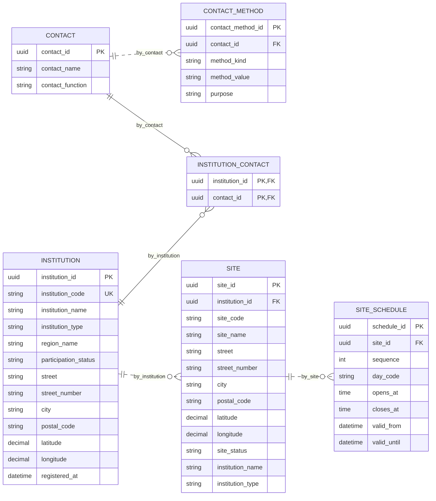

# Modelo en primera forma normal (1FN)

> Estado: normalización lógica desarrollada para el ejercicio académico, bajo las dependencias y decisiones declaradas. No es una base instalada, un modelo físico aprobado ni una validación clínica.

Ruta: [0FN de partida](./Modelo_0FN.md), [1FN](./Modelo_1FN.md), [2FN](./Modelo_2FN.md), [3FN](./Modelo_3FN.md), [4FN](./Modelo_4FN.md) y [trazabilidad completa](./Trazabilidad_0FN_4FN.md).

## Procedencia y decisiones frente al Mermaid anterior

La entrada es exclusivamente el **modelo recién creado de 18 tablas**, no el Excel anterior. La nueva solicitud permite consultar el diagrama anterior basado en HU, conservado como antecedente en el repositorio de origen, como referencia de relaciones. Se mantiene intacta la 0FN para que la transformación sea verificable.

| Aspecto observado en la referencia | Decisión en esta normalización |
| --- | --- |
| Recurso común con detalle sanguíneo y de órgano | `RESOURCE` concentra solo identidad, código y clase; `BLOOD_UNIT` y `ORGAN_AVAILABILITY` conservan ciclos y datos separados. No se unifican reglas clínicas. |
| Donación, pruebas y evidencia separadas | Se extraen los episodios, muestras, pruebas, revisiones, observaciones y vínculos con versiones documentales que ya estaban anidados en la 0FN. |
| Candidato vinculado con solicitud y recurso | Se conserva una ejecución `CANDIDATE_ASSESSMENT` con varios `ASSESSMENT_CANDIDATE`; una reevaluación no sobrescribe la anterior. |
| Usuario con una institución y asignaciones de rol | Se conserva el alcance más amplio de la nueva 0FN: rol, permiso y ámbito quedan unidos por `ACCESS_GRANT`. No se restringe una cuenta a una institución ni se conceden permisos por productos cartesianos. |
| Alerta con un destinatario | Se conserva la lista original mediante destinatarios, entregas por canal, intentos y acuses separados, sin perder sus asociaciones. |
| Campos como alelo_1 y alelo_2 | `HLA_CALL` conserva una llamada por locus y posición; no se introduce una cantidad fija ni una interpretación clínica. |
| Antes/después o referencia de resultado como texto amplio | Se separan observaciones y cambios por campo. Los binarios y explicaciones documentales extensas mantienen sus fronteras de almacenamiento. |

La distribución en diecisiete dominios es documental: no determina la cantidad de microservicios ni autoriza tablas compartidas con varios escritores.

## Transformación de 0FN a 1FN

Las 18 estructuras iniciales contenían listas dentro de filas. Se conserva cada registro padre aunque su lista esté vacía; cada elemento pasa a una fila hija identificada por su propia referencia o por la clave del padre más un ordinal. Los subgrupos se extraen recursivamente: por ejemplo, destinatario → entrega → intento → acuse, y evaluación → candidato → factor.

El resultado tiene **169 relaciones lógicas**. La cantidad responde al desarrollo de los grupos e historiales del alcance semestral; no es el mínimo de tablas del primer parcial. Muchas relaciones ya satisfacen formas superiores después de esta extracción: no es necesario degradarlas para hacer el ejercicio.

Se conservan deliberadamente **ocho casos de dependencia parcial** y **cuatro de dependencia transitiva** en este esquema 1FN. Son descriptores de referencia actualmente repetidos, no copias históricas inmutables. Los demás atributos ya se sitúan en la relación correspondiente al hecho que describen.

### Ejemplo DEMO de extracción

Una institución puede tener contactos [C1, C2] y ninguna sede todavía. Se conserva su fila en `INSTITUTION`, dos pertenencias en `INSTITUTION_CONTACT` y ninguna fila en `SITE`. No se crea una sede ficticia, ni se elimina la institución por un join sin coincidencias. Cada método de C1 se conserva en `CONTACT_METHOD` con su identidad; si dos eventos tienen el mismo contenido, sus identidades u ordinales permiten conservar ambos.




## Convenciones y límites

- Nombres de tablas y atributos en inglés. PK es la clave primaria escogida; CK identifica otra clave candidata y UK se dibuja solo cuando la unicidad corresponde a un atributo individual. Una CK compuesta **no** significa que cada columna sea única por separado.
- Los identificadores técnicos permiten distinguir hechos, pero no demuestran una forma normal. Se examinan también las claves candidatas compuestas, por ejemplo `(appointment_id, sequence)` y `(catalog_id, version_no)`.
- `uuid`, `string`, `decimal` y los demás tipos son dominios lógicos, no decisiones de longitud, motor, índices ni DDL. `version_no` admite rótulos de versión; `sequence`, `revision_no` y posiciones de elementos son ordinales enteros.
- Cada `scalar_value`, `scalar_result` o respuesta contiene un único valor del dominio indicado por su código. No se permiten JSON, arreglos, objetos, listas separadas por comas ni varios resultados clínicos ocultos en una cadena. Una nota narrativa es un dato textual; no sustituye una lista de hechos consultables.
- Los nombres, fechas de nacimiento y componentes de dirección son una atomización mínima propuesta de los objetos abiertos de la 0FN; no se afirma que la documentación haya aprobado un formulario clínico definitivo. No se impone un identificador nacional, una regla médica ni una equivalencia automática entre donante, receptor y cuenta.
- Los objetos `*_details` de referencia se resuelven por relaciones. Las entradas de una evaluación, el destino usado al enviar una alerta y el contexto de auditoría son hechos históricos: conservan el valor observado, no se reemplazan por el valor actual de otra tabla.
- Una ausencia opcional se representa mediante ausencia de la fila asociativa, cuando existe una relación específica; las FK opcionales restantes se señalan en el catálogo. No se usan filas ficticias, identificadores vacíos ni NULL dentro de claves candidatas. La traducción de opcionalidad a restricciones físicas sigue pendiente.
- Las listas con identidad propia conservan esa identidad. Las listas ordenadas o con repeticiones significativas conservan un ordinal, evento o versión; las relaciones de pertenencia sin orden tienen semántica de conjunto. No se emparejan listas independientes por su posición.

## Catálogo completo de 1FN

Este catálogo define todas las relaciones de la etapa, no solo un ejemplo. Las FK se conservan a lo largo de las etapas y se detallan en las vistas finales. Los atributos retirados en 2FN y 3FN aparecen explícitamente aquí. La [matriz de trazabilidad](./Trazabilidad_0FN_4FN.md) vincula cada atributo de 0FN con sus destinos.

### 01 — Instituciones y sedes

| Relación | Claves candidatas | Atributos completos |
| --- | --- | --- |
| `INSTITUTION` | `PK: (institution_id); CK1: (institution_code)` | `institution_id, institution_code, institution_name, institution_type, region_name, participation_status, street, street_number, city, postal_code, latitude, longitude, registered_at` |
| `SITE` | `PK: (site_id); CK1: (institution_id, site_code)` | `site_id, institution_id, site_code, site_name, street, street_number, city, postal_code, latitude, longitude, site_status, institution_name, institution_type` |
| `CONTACT` | `PK: (contact_id)` | `contact_id, contact_name, contact_function` |
| `CONTACT_METHOD` | `PK: (contact_method_id)` | `contact_method_id, contact_id, method_kind, method_value, purpose` |
| `INSTITUTION_CONTACT` | `PK: (institution_id, contact_id)` | `institution_id, contact_id` |
| `SITE_CONTACT` | `PK: (site_id, contact_id)` | `site_id, contact_id` |
| `SITE_SCHEDULE` | `PK: (schedule_id); CK1: (site_id, sequence)` | `schedule_id, site_id, sequence, day_code, opens_at, closes_at, valid_from, valid_until` |
| `CAPABILITY` | `PK: (capability_id); CK1: (capability_code)` | `capability_id, capability_code, capability_name, resource_kind` |
| `INSTITUTION_CAPABILITY` | `PK: (institution_capability_id)` | `institution_capability_id, institution_id, capability_id, valid_from, valid_until` |
| `SITE_CAPABILITY` | `PK: (site_capability_id)` | `site_capability_id, site_id, capability_id, valid_from, valid_until` |
| `INSTITUTION_SETTING` | `PK: (setting_id)` | `setting_id, institution_id, parameter_version_id, scalar_value, changed_at, changed_by, reason` |
| `INSTITUTION_EVENT` | `PK: (event_id); CK1: (institution_id, sequence)` | `event_id, institution_id, sequence, previous_status, new_status, occurred_at, actor_id, reason` |

### 02 — Identidad, permisos y ámbitos

| Relación | Claves candidatas | Atributos completos |
| --- | --- | --- |
| `PARTY` | `PK: (party_id)` | `party_id, party_name, party_kind` |
| `USER_ACCOUNT` | `PK: (account_id); CK1: (account_reference); CK2: (login_email); CK3: (party_id)` | `account_id, account_reference, party_id, login_email, password_hash, account_status, registered_at` |
| `ACCOUNT_CONTACT` | `PK: (account_id, contact_id)` | `account_id, contact_id` |
| `ROLE` | `PK: (role_id); CK1: (role_code)` | `role_id, role_code, role_name` |
| `PERMISSION` | `PK: (permission_id); CK1: (permission_code)` | `permission_id, permission_code, permission_name` |
| `ACCOUNT_ROLE` | `PK: (account_role_id)` | `account_role_id, account_id, role_id, valid_from, valid_until, assigned_by, role_name, role_code` |
| `ACCESS_SCOPE` | `PK: (scope_id)` | `scope_id, scope_kind` |
| `INSTITUTION_SCOPE` | `PK: (scope_id); CK1: (institution_id)` | `scope_id, institution_id` |
| `SITE_SCOPE` | `PK: (scope_id); CK1: (site_id)` | `scope_id, site_id` |
| `REGIONAL_SCOPE` | `PK: (scope_id); CK1: (region_name)` | `scope_id, region_name` |
| `ACCESS_GRANT` | `PK: (grant_id)` | `grant_id, account_role_id, permission_id, scope_id, valid_from, valid_until, assigned_by` |
| `ACCOUNT_EVENT` | `PK: (event_id); CK1: (account_id, sequence)` | `event_id, account_id, sequence, affected_grant_id, occurred_at, actor_id, reason` |
| `NOTIFICATION_PREFERENCE` | `PK: (account_id, channel_code, purpose)` | `account_id, channel_code, purpose, is_enabled` |
| `PROFESSIONAL_AUTHORIZATION` | `PK: (authorization_id)` | `authorization_id, party_id, institution_id, credential_reference, authorized_purpose, valid_from, valid_until, document_id` |

### 03 — Catálogos y reglas versionadas

| Relación | Claves candidatas | Atributos completos |
| --- | --- | --- |
| `REFERENCE_CATALOG` | `PK: (catalog_id); CK1: (catalog_reference)` | `catalog_id, catalog_reference, catalog_name, catalog_purpose` |
| `CATALOG_VERSION` | `PK: (catalog_version_id); CK1: (catalog_id, version_no)` | `catalog_version_id, catalog_id, version_no, catalog_status, scope_id, catalog_name, catalog_purpose` |
| `CATALOG_ENTRY` | `PK: (entry_id); CK1: (catalog_version_id, entry_code)` | `entry_id, catalog_version_id, entry_code, entry_name, entry_status, catalog_version_no, catalog_status` |
| `CATALOG_ENTRY_VALUE` | `PK: (entry_id, value_no)` | `entry_id, value_no, value_name, scalar_value` |
| `CATALOG_CHANGE` | `PK: (change_id)` | `change_id, catalog_version_id, occurred_at, actor_id, reason` |
| `CATALOG_CHANGED_ENTRY` | `PK: (change_id, entry_id)` | `change_id, entry_id` |
| `CATALOG_CHANGE_FIELD` | `PK: (change_id, field_name)` | `change_id, field_name, previous_value, new_value` |
| `PARAMETER_VERSION` | `PK: (parameter_version_id); CK1: (parameter_code, version_no)` | `parameter_version_id, parameter_code, version_no, scalar_value, measurement_unit, scope_id, is_demo, source_reference, approved_by, valid_from, valid_until` |
| `CATALOG_PARAMETER` | `PK: (catalog_version_id, parameter_version_id)` | `catalog_version_id, parameter_version_id` |
| `RULE_VERSION` | `PK: (rule_version_id); CK1: (rule_reference, version_no)` | `rule_version_id, rule_reference, version_no, resource_kind, application_process, source_reference, scope_id, approved_by, valid_from, valid_until, is_demo` |

### 04 — Donantes y episodios de donación

| Relación | Claves candidatas | Atributos completos |
| --- | --- | --- |
| `DONOR` | `PK: (donor_id); CK1: (donor_reference)` | `donor_id, donor_reference, full_name, birth_date, registration_status, registered_at` |
| `DONOR_CONTACT` | `PK: (donor_id, contact_id)` | `donor_id, contact_id` |
| `DONOR_INSTITUTION` | `PK: (donor_id, institution_id); CK1: (institution_id, local_record_reference)` | `donor_id, institution_id, local_record_reference` |
| `DONOR_CONSENT` | `PK: (consent_id)` | `consent_id, donor_id, purpose, document_version_id, granted_at, withdrawn_at, recorded_by` |
| `PRELIMINARY_EVALUATION` | `PK: (evaluation_id)` | `evaluation_id, donor_id, occurred_at, reviewer_id, review_status, review_note` |
| `PRELIMINARY_ANSWER` | `PK: (evaluation_id, question_code)` | `evaluation_id, question_code, scalar_answer` |
| `ELIGIBILITY_DECISION` | `PK: (decision_id)` | `decision_id, donor_id, donation_process, rule_version_id, reviewer_id, decided_at, decision, reason, document_id` |
| `BLOOD_DONATION` | `PK: (donation_id); CK1: (donation_reference)` | `donation_id, donation_reference, donor_id, institution_id, recorded_at, responsible_party_id, donation_status` |
| `BLOOD_DONATION_SAMPLE` | `PK: (donation_id, sample_id)` | `donation_id, sample_id` |
| `DONATION_INCIDENT` | `PK: (incident_id)` | `incident_id, donation_id, occurred_at, description, outcome` |
| `ORGAN_DONATION_PROCESS` | `PK: (process_id); CK1: (process_reference)` | `process_id, process_reference, donor_id, institution_id, process_status` |
| `ORGAN_PROCESS_AUTHORIZATION` | `PK: (process_authorization_id)` | `process_authorization_id, process_id, authorization_id, decision, decided_at, reason, document_id` |
| `ORGAN_PROCESS_EVENT` | `PK: (event_id); CK1: (process_id, sequence)` | `event_id, process_id, sequence, previous_status, new_status, occurred_at, actor_id, review_reference, reason` |
| `DONOR_EVENT` | `PK: (event_id); CK1: (donor_id, sequence)` | `event_id, donor_id, sequence, occurred_at, actor_id, reason` |

### 05 — Campañas y citas

| Relación | Claves candidatas | Atributos completos |
| --- | --- | --- |
| `CAMPAIGN` | `PK: (campaign_id); CK1: (campaign_reference)` | `campaign_id, campaign_reference, institution_id, campaign_name, donation_process, publication_status, description, starts_at, ends_at` |
| `CAMPAIGN_SLOT` | `PK: (slot_id)` | `slot_id, campaign_id, site_id, starts_at, ends_at, capacity, slot_status` |
| `CAMPAIGN_CONDITION` | `PK: (condition_id)` | `condition_id, campaign_id, condition_text, source_reference, version_no` |
| `SLOT_CONDITION` | `PK: (slot_id, condition_id)` | `slot_id, condition_id` |
| `CAMPAIGN_EVENT` | `PK: (event_id); CK1: (campaign_id, sequence)` | `event_id, campaign_id, sequence, occurred_at, actor_id, previous_status, new_status, reason` |
| `APPOINTMENT` | `PK: (appointment_id); CK1: (appointment_reference)` | `appointment_id, appointment_reference, donor_id, site_id, scheduled_at, current_status, created_at` |
| `APPOINTMENT_CAMPAIGN` | `PK: (appointment_id)` | `appointment_id, slot_id` |
| `APPOINTMENT_STATUS_EVENT` | `PK: (event_id); CK1: (appointment_id, sequence); CK2: (sequence, appointment_reference)` | `event_id, appointment_id, sequence, previous_status, new_status, changed_at, changed_by, reason, appointment_reference, scheduled_at` |
| `APPOINTMENT_RESCHEDULE` | `PK: (reschedule_id)` | `reschedule_id, appointment_id, previous_slot_id, new_slot_id, previous_scheduled_at, new_scheduled_at, confirmed_at, confirmed_by, reason` |
| `APPOINTMENT_NOTICE` | `PK: (appointment_id, delivery_id)` | `appointment_id, delivery_id` |

### 06 — Receptores y necesidades

| Relación | Claves candidatas | Atributos completos |
| --- | --- | --- |
| `RECIPIENT` | `PK: (recipient_id); CK1: (recipient_reference)` | `recipient_id, recipient_reference, full_name, birth_date, record_status` |
| `RECIPIENT_CONTACT` | `PK: (recipient_id, contact_id)` | `recipient_id, contact_id` |
| `CARE_EPISODE` | `PK: (care_id)` | `care_id, recipient_id, institution_id, local_record_reference, starts_at, ends_at` |
| `CARE_PROFESSIONAL` | `PK: (care_id, authorization_id)` | `care_id, authorization_id, responsibility, valid_from, valid_until` |
| `RECIPIENT_CONSENT` | `PK: (consent_id)` | `consent_id, recipient_id, purpose, document_version_id, granted_at, withdrawn_at, recorded_by` |
| `RECIPIENT_BLOOD_NEED` | `PK: (need_id)` | `need_id, recipient_id, component_id, quantity, measurement_unit, authorized_context` |
| `ORGAN_WAITING_PROCESS` | `PK: (waiting_id)` | `waiting_id, recipient_id, organ_type, started_at, current_status, authorized_context` |
| `WAITING_EVENT` | `PK: (event_id); CK1: (waiting_id, sequence)` | `event_id, waiting_id, sequence, previous_status, new_status, occurred_at, actor_id, reason` |
| `CARE_EVENT` | `PK: (event_id); CK1: (recipient_id, sequence)` | `event_id, recipient_id, sequence, occurred_at, actor_id, reason` |

### 07 — Estudios, muestras y resultados

| Relación | Claves candidatas | Atributos completos |
| --- | --- | --- |
| `STUDY_SUBJECT` | `PK: (subject_id)` | `subject_id, subject_kind` |
| `DONOR_SUBJECT` | `PK: (subject_id); CK1: (donor_id)` | `subject_id, donor_id` |
| `RECIPIENT_SUBJECT` | `PK: (subject_id); CK1: (recipient_id)` | `subject_id, recipient_id` |
| `RESOURCE_SUBJECT` | `PK: (subject_id); CK1: (resource_id)` | `subject_id, resource_id` |
| `SAMPLE` | `PK: (sample_id); CK1: (institution_id, sample_reference)` | `sample_id, institution_id, sample_reference, collected_at` |
| `CLINICAL_TEST` | `PK: (test_id); CK1: (source_institution_id, test_reference)` | `test_id, test_reference, subject_id, study_kind, test_type, source_institution_id` |
| `TEST_SAMPLE` | `PK: (test_id, sample_id)` | `test_id, sample_id` |
| `TEST_REVISION` | `PK: (revision_id); CK1: (test_id, revision_no)` | `revision_id, test_id, revision_no, source_reference, recorded_at, responsible_party_id, review_status, corrects_revision_id` |
| `BLOOD_OBSERVATION` | `PK: (revision_id, observation_no)` | `revision_id, observation_no, observation_code, scalar_result, measurement_unit` |
| `ORGAN_OBSERVATION` | `PK: (revision_id, observation_no)` | `revision_id, observation_no, observation_code, scalar_result, measurement_unit` |
| `HLA_CALL` | `PK: (revision_id, locus_code, call_no)` | `revision_id, locus_code, call_no, allele_code, method_reference` |
| `TEST_DOCUMENT` | `PK: (revision_id, document_version_id)` | `revision_id, document_version_id, purpose` |

### 08 — Recursos sanguíneos y órganos

| Relación | Claves candidatas | Atributos completos |
| --- | --- | --- |
| `RESOURCE` | `PK: (resource_id); CK1: (traceability_code)` | `resource_id, traceability_code, resource_kind` |
| `BLOOD_COMPONENT` | `PK: (component_id); CK1: (component_code)` | `component_id, component_code, component_name` |
| `COMPONENT_ATTRIBUTE` | `PK: (component_id, attribute_name)` | `component_id, attribute_name, scalar_value` |
| `STORAGE_LOCATION` | `PK: (location_id); CK1: (site_id, location_code)` | `location_id, site_id, location_code, location_description` |
| `BLOOD_UNIT` | `PK: (resource_id); CK1: (unit_reference)` | `resource_id, unit_reference, donation_id, component_id, location_id, collected_at, expires_at, expiry_parameter_version_id, current_status, component_name, component_code` |
| `BLOOD_ORIGIN` | `PK: (resource_id)` | `resource_id, source_institution_id, source_reference` |
| `BLOOD_CLASSIFICATION` | `PK: (resource_id)` | `resource_id, recorded_group_code, source_reference, recorded_at, revision_id` |
| `BLOOD_MOVEMENT` | `PK: (movement_id); CK1: (resource_id, sequence)` | `movement_id, resource_id, sequence, previous_status, new_status, origin_location_id, destination_location_id, occurred_at, actor_id, reason` |
| `DOCUMENT_TEMPLATE_VERSION` | `PK: (template_version_id); CK1: (template_reference, version_no)` | `template_version_id, template_reference, version_no, template_purpose, document_id` |
| `LABEL_PRINT` | `PK: (print_id)` | `print_id, resource_id, template_version_id, printed_at, printed_by, destination, result, reprint_reason` |
| `ORGAN_AVAILABILITY` | `PK: (resource_id); CK1: (organ_reference)` | `resource_id, organ_reference, process_id, organ_type, location_id, availability_status, last_updated_at` |
| `ORGAN_VIABILITY_RECORD` | `PK: (viability_id)` | `viability_id, resource_id, recorded_condition, source_reference, recorded_at, responsible_party_id` |
| `ORGAN_CURRENT_VIABILITY` | `PK: (resource_id); CK1: (viability_id)` | `resource_id, viability_id` |
| `ORGAN_AUTHORIZATION` | `PK: (organ_authorization_id)` | `organ_authorization_id, resource_id, authorization_id, decision, decided_at, document_id, reason` |
| `ORGAN_EVENT` | `PK: (event_id); CK1: (resource_id, sequence)` | `event_id, resource_id, sequence, previous_status, new_status, occurred_at, actor_id, reason` |
| `ORGAN_DOCUMENT` | `PK: (resource_id, document_id)` | `resource_id, document_id, purpose` |

### 09 — Solicitudes

| Relación | Claves candidatas | Atributos completos |
| --- | --- | --- |
| `RESOURCE_REQUEST` | `PK: (request_id); CK1: (request_reference)` | `request_id, request_reference, recipient_id, requesting_institution_id, resource_kind, current_status, recorded_urgency, requested_at, recipient_reference, recipient_full_name` |
| `REQUEST_AUTHORSHIP` | `PK: (request_id)` | `request_id, authorization_id` |
| `BLOOD_REQUIREMENT` | `PK: (requirement_id); CK1: (request_id, line_no); CK2: (line_no, request_reference)` | `requirement_id, request_id, line_no, component_id, quantity, measurement_unit, authorized_context, request_reference, requested_at` |
| `ORGAN_REQUIREMENT` | `PK: (request_id)` | `request_id, organ_type, authorized_context` |
| `REQUEST_STUDY` | `PK: (request_id, revision_id)` | `request_id, revision_id, purpose` |
| `REQUEST_URGENCY_EVENT` | `PK: (event_id); CK1: (request_id, sequence)` | `event_id, request_id, sequence, previous_urgency, new_urgency, changed_at, authorization_id, reason` |
| `REQUEST_STATUS_EVENT` | `PK: (event_id); CK1: (request_id, sequence)` | `event_id, request_id, sequence, previous_status, new_status, changed_at, actor_id, reason` |

### 10 — Evaluaciones reproducibles

| Relación | Claves candidatas | Atributos completos |
| --- | --- | --- |
| `CANDIDATE_ASSESSMENT` | `PK: (assessment_id); CK1: (assessment_reference)` | `assessment_id, assessment_reference, request_id, requesting_grant_id, assessment_status, generated_at` |
| `ASSESSMENT_RULE` | `PK: (assessment_id, rule_version_id)` | `assessment_id, rule_version_id` |
| `ASSESSMENT_INPUT` | `PK: (input_id); CK1: (assessment_id, input_no)` | `input_id, assessment_id, input_no, input_name, scalar_value, measurement_unit, source_record_type, source_record_reference, source_version, captured_at` |
| `ASSESSMENT_ISSUE` | `PK: (issue_id); CK1: (assessment_id, issue_no)` | `issue_id, assessment_id, issue_no, field_name, issue_kind, explanation` |
| `ASSESSMENT_CANDIDATE` | `PK: (candidate_id); CK1: (assessment_id, candidate_no); CK2: (assessment_id, resource_id)` | `candidate_id, assessment_id, candidate_no, resource_id, ranking_position, explanation, assessment_status, generated_at` |
| `CANDIDATE_COMPATIBILITY` | `PK: (candidate_id, criterion_code)` | `candidate_id, criterion_code, scalar_result, source_revision_id, explanation` |
| `CANDIDATE_FACTOR` | `PK: (candidate_id, factor_name)` | `candidate_id, factor_name, factor_value, measurement_unit, applied_weight, source_reference, rule_version_id` |
| `CANDIDATE_GEOGRAPHY` | `PK: (candidate_id)` | `candidate_id, origin_site_id, destination_site_id, distance_km, duration_minutes, source_reference, calculated_at, limitations` |
| `CANDIDATE_ISSUE` | `PK: (candidate_id, issue_no)` | `candidate_id, issue_no, field_name, explanation` |
| `CANDIDATE_REVIEW` | `PK: (review_id)` | `review_id, candidate_id, authorization_id, decision, reason, reviewed_at` |
| `REVIEW_EVIDENCE` | `PK: (review_id, document_version_id)` | `review_id, document_version_id` |

### 11 — Reserva y asignación humana

| Relación | Claves candidatas | Atributos completos |
| --- | --- | --- |
| `ALLOCATION` | `PK: (allocation_id); CK1: (allocation_reference)` | `allocation_id, allocation_reference, request_id, resource_id, operation_type, allocation_status, reservation_starts_at, reservation_ends_at, created_at` |
| `ALLOCATION_ASSESSMENT` | `PK: (allocation_id)` | `allocation_id, candidate_id` |
| `ALLOCATION_AUTHORIZATION` | `PK: (allocation_authorization_id)` | `allocation_authorization_id, allocation_id, authorization_id, decision, decided_at, reason` |
| `ALLOCATION_EVIDENCE` | `PK: (allocation_authorization_id, document_version_id)` | `allocation_authorization_id, document_version_id` |
| `ALLOCATION_EVENT` | `PK: (event_id); CK1: (allocation_id, sequence)` | `event_id, allocation_id, sequence, previous_status, new_status, occurred_at, actor_id, reason` |
| `ALLOCATION_OPERATION` | `PK: (operation_id)` | `operation_id, allocation_id` |
| `ALLOCATION_ATTEMPT` | `PK: (attempt_id); CK1: (operation_id, attempt_no)` | `attempt_id, operation_id, attempt_no, attempted_at, attempt_result` |

### 12 — Traslado y cadena de custodia

| Relación | Claves candidatas | Atributos completos |
| --- | --- | --- |
| `TRANSFER_ORDER` | `PK: (transfer_id); CK1: (transfer_reference)` | `transfer_id, transfer_reference, allocation_id, origin_site_id, destination_site_id, transfer_status, planned_collection_at, planned_delivery_at, collected_at, delivered_at, created_at, origin_site_name` |
| `TRANSFER_STAFF` | `PK: (assignment_id)` | `assignment_id, transfer_id, party_id, responsibility, valid_from, valid_until` |
| `ROUTE_OPTION` | `PK: (route_id); CK1: (transfer_id, option_no)` | `route_id, transfer_id, option_no, origin_latitude, origin_longitude, destination_latitude, destination_longitude, distance_km, duration_minutes, source_reference, calculated_at, limitations` |
| `ROUTE_SELECTION` | `PK: (selection_id)` | `selection_id, route_id, selected_at, selected_by, reason` |
| `SCAN_CHECK` | `PK: (scan_id)` | `scan_id, transfer_id, expected_event, scanned_code, actor_id, occurred_at, result` |
| `CUSTODY_EVENT` | `PK: (event_id); CK1: (transfer_id, sequence); CK2: (operation_id)` | `event_id, transfer_id, sequence, operation_id, event_type, occurred_at, previous_custodian_id, new_custodian_id, recorded_by, condition_report, latitude, longitude, corrects_event_id` |
| `CAPTURE_AUTHORIZATION` | `PK: (capture_authorization_id)` | `capture_authorization_id, transfer_id, party_id, purpose, valid_from, valid_until, authorized_by` |
| `CUSTODY_EVIDENCE` | `PK: (event_id, document_version_id)` | `event_id, document_version_id, capture_authorization_id, captured_at` |
| `TRANSFER_INCIDENT` | `PK: (incident_id)` | `incident_id, transfer_id, occurred_at, description, outcome` |
| `INCIDENT_ACTION` | `PK: (action_id)` | `action_id, incident_id, actor_id, acted_at, action_note, result` |
| `TRANSFER_SYNC` | `PK: (operation_id)` | `operation_id, transfer_id` |
| `TRANSFER_CONTACT` | `PK: (transfer_id, contact_id, contact_purpose)` | `transfer_id, contact_id, contact_purpose` |

### 13 — Pronóstico y balanceo

| Relación | Claves candidatas | Atributos completos |
| --- | --- | --- |
| `METHOD_VERSION` | `PK: (method_version_id); CK1: (method_reference, version_no)` | `method_version_id, method_reference, version_no, purpose, limitations` |
| `INVENTORY_ANALYSIS` | `PK: (analysis_id); CK1: (analysis_reference)` | `analysis_id, analysis_reference, analysis_type, analysis_status, method_version_id, period_starts_at, period_ends_at, source_reference, is_synthetic, generated_at` |
| `ANALYSIS_INSTITUTION` | `PK: (analysis_id, institution_id)` | `analysis_id, institution_id` |
| `INVENTORY_INPUT` | `PK: (input_id); CK1: (analysis_id, input_no)` | `input_id, analysis_id, input_no, resource_id, recorded_availability, recorded_demand, captured_at, source_reference` |
| `EXPIRY_FORECAST` | `PK: (forecast_id)` | `forecast_id, input_id, forecast_horizon, predicted_value, explanation` |
| `BALANCING_PROPOSAL` | `PK: (proposal_id)` | `proposal_id, analysis_id, resource_id, origin_site_id, destination_site_id, explanation` |
| `BALANCING_FACTOR` | `PK: (proposal_id, factor_name)` | `proposal_id, factor_name, factor_value, measurement_unit, applied_weight, source_reference` |
| `ANALYSIS_REVIEW` | `PK: (review_id)` | `review_id, analysis_id, reviewer_id, decision, reviewed_at, reason` |

### 14 — Alertas y entregas

| Relación | Claves candidatas | Atributos completos |
| --- | --- | --- |
| `ALERT` | `PK: (alert_id); CK1: (alert_reference)` | `alert_id, alert_reference, alert_type, operational_priority, alert_status, source_component, origin_record_type, origin_record_reference, origin_event_reference, rule_version_id, trigger_decision_reference, created_at` |
| `ALERT_RECIPIENT` | `PK: (recipient_id); CK1: (alert_id, party_id, scope_id)` | `recipient_id, alert_id, party_id, scope_id, attention_state` |
| `ALERT_DELIVERY` | `PK: (delivery_id); CK1: (recipient_id, channel_code, destination_snapshot)` | `delivery_id, recipient_id, channel_code, destination_snapshot` |
| `DELIVERY_ATTEMPT` | `PK: (attempt_id); CK1: (delivery_id, attempt_no)` | `attempt_id, delivery_id, attempt_no, attempted_at, result, channel_code, destination_snapshot` |
| `DELIVERY_RECEIPT` | `PK: (receipt_id)` | `receipt_id, attempt_id, received_at, receipt_result` |
| `ALERT_OCCURRENCE` | `PK: (occurrence_id)` | `occurrence_id, alert_id, related_event_reference, occurred_at` |
| `ALERT_ATTENTION` | `PK: (attention_id)` | `attention_id, recipient_id, actor_id, acted_at, action, result` |

### 15 — Documentos y reportes

| Relación | Claves candidatas | Atributos completos |
| --- | --- | --- |
| `DOCUMENT_RECORD` | `PK: (document_id); CK1: (document_reference)` | `document_id, document_reference, document_purpose, document_status, owner_party_id, owner_institution_id, privacy_classification, retention_policy_reference, recorded_at` |
| `DOCUMENT_VERSION` | `PK: (document_version_id); CK1: (document_id, version_no); CK2: (object_identifier)` | `document_version_id, document_id, version_no, object_identifier, object_path, media_type, size_bytes, content_hash, created_at, author_id, reason, document_purpose, document_status` |
| `DOCUMENT_CURRENT_VERSION` | `PK: (document_id); CK1: (document_version_id)` | `document_id, document_version_id` |
| `DOCUMENT_SCOPE` | `PK: (document_id, scope_id)` | `document_id, scope_id` |
| `DOCUMENT_RELATION` | `PK: (document_id, record_type, record_reference, relation_kind)` | `document_id, record_type, record_reference, relation_kind` |
| `DOCUMENT_ACCESS` | `PK: (access_id)` | `access_id, document_version_id, actor_id, purpose, accessed_at, result` |
| `REPORT_DEFINITION` | `PK: (document_id)` | `document_id, template_version_id, period_starts_at, period_ends_at, requested_by` |
| `REPORT_FILTER` | `PK: (document_id, filter_name, value_no)` | `document_id, filter_name, value_no, scalar_value` |
| `REPORT_SOURCE` | `PK: (document_id, source_no)` | `document_id, source_no, source_reference, source_version` |

### 16 — Auditoría y cambios mínimos

| Relación | Claves candidatas | Atributos completos |
| --- | --- | --- |
| `AUDIT_EVENT` | `PK: (event_id); CK1: (event_reference)` | `event_id, event_reference, correlation_reference, source_component, actor_id, performed_role_code, performed_scope_reference, action, result, occurred_at` |
| `AUDIT_RECORD` | `PK: (event_id, record_no)` | `event_id, record_no, record_type, record_reference, permitted_context` |
| `AUDIT_FIELD_CHANGE` | `PK: (event_id, record_no, field_name)` | `event_id, record_no, field_name, permitted_previous_value, permitted_new_value, redaction_state` |
| `AUDIT_RELATION` | `PK: (event_id, related_event_id, relation_kind)` | `event_id, related_event_id, relation_kind` |

### 17 — Dispositivos y sincronización

| Relación | Claves candidatas | Atributos completos |
| --- | --- | --- |
| `MOBILE_DEVICE` | `PK: (device_id); CK1: (device_reference)` | `device_id, device_reference, registration_status, operating_system, application_version, registered_at, last_activity_at` |
| `DEVICE_REGISTRATION` | `PK: (registration_id)` | `registration_id, device_id, account_role_id, scope_id, registered_at, revoked_at` |
| `DEVICE_CAPABILITY_GRANT` | `PK: (capability_grant_id)` | `capability_grant_id, registration_id, capability_code, purpose, valid_from, valid_until` |
| `SYNC_OPERATION` | `PK: (operation_id); CK1: (operation_reference)` | `operation_id, operation_reference, operation_type, target_record_type, target_record_reference, submitted_at, result, confirmation_reference` |
| `DEVICE_OPERATION` | `PK: (registration_id, operation_id)` | `registration_id, operation_id` |
| `SYNC_CONFLICT` | `PK: (conflict_id)` | `conflict_id, operation_id, reason, detected_at, resolved_at, resolution, resolved_by` |
| `CREDENTIAL_CLEANUP` | `PK: (cleanup_id)` | `cleanup_id, registration_id, cleaned_at, local_removal_result` |


## Verificación reproducible

Desde la raíz del proyecto:

```sh
node documentation/database-diagrams/normalization/validate.mjs
```

El verificador comprueba los cuatro esquemas, claves declaradas y su minimalidad respecto de las DF proporcionadas, FK y tipos, redundancias parciales y transitivas, trazabilidad de los 208 atributos iniciales, cobertura de todas las tablas finales, reconstrucciones de ejemplo y sintaxis Mermaid. También detecta divergencias entre la especificación y los Markdown.

Las pruebas usan datos DEMO sin significado clínico. No descubren dependencias de negocio, no prueban todas las instancias posibles y no sustituyen la justificación algebraica ni la revisión funcional. Una DF o DMV nueva obliga a volver a evaluar la forma normal. El analizador Mermaid se carga de la instalación local de VS Code; en otro entorno se puede indicar un módulo ya instalado mediante `NORMALIZATION_MERMAID_MODULE`, sin instalar dependencias automáticamente.
