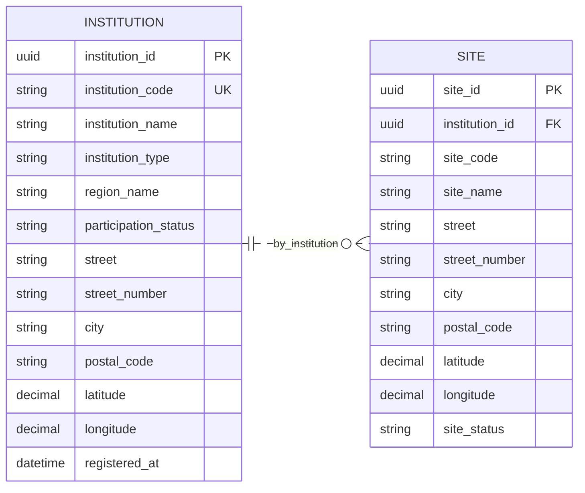
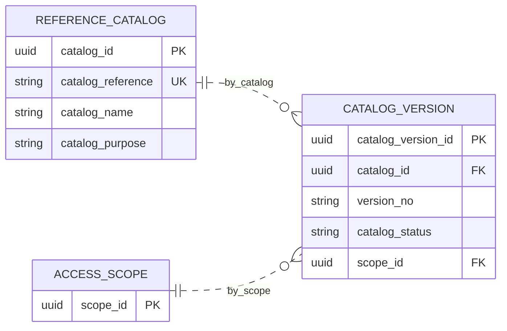
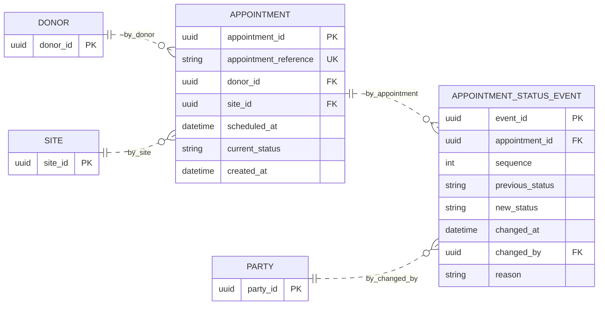
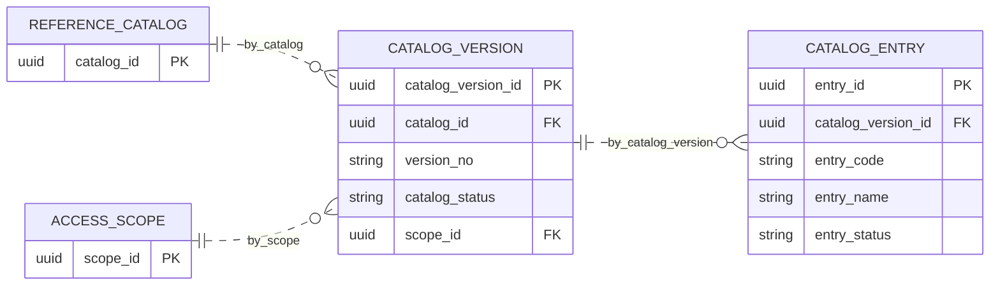
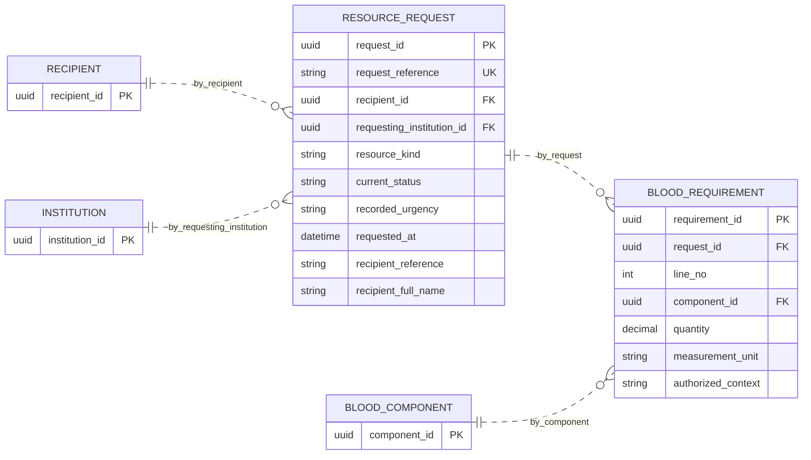
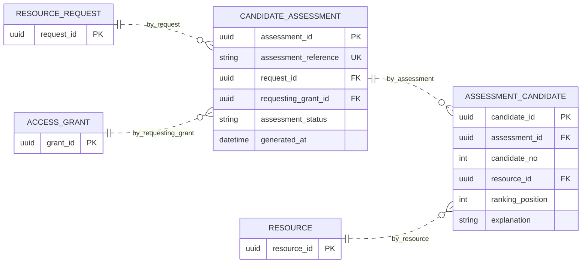
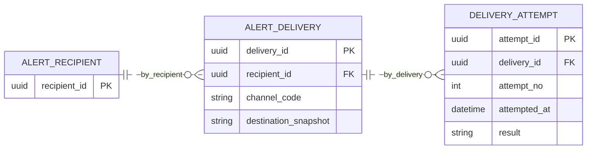
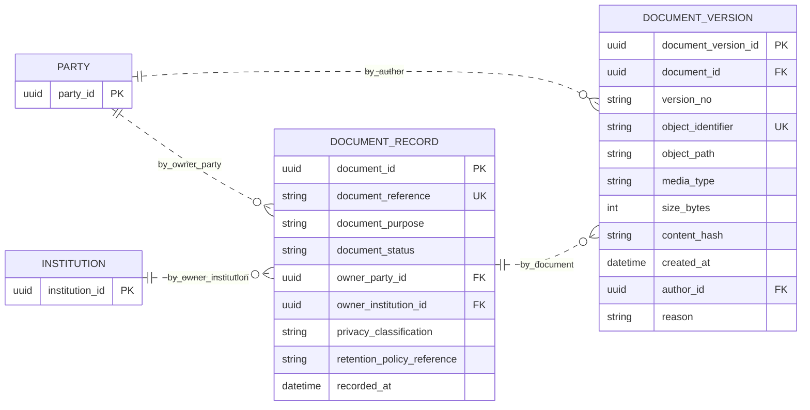

# Modelo en segunda forma normal (2FN)

> Estado: normalización lógica desarrollada para el ejercicio académico, bajo las dependencias y decisiones declaradas. No es una base instalada, un modelo físico aprobado ni una validación clínica.

Ruta: [0FN de partida](./Modelo_0FN.md), [1FN](./Modelo_1FN.md), [2FN](./Modelo_2FN.md), [3FN](./Modelo_3FN.md), [4FN](./Modelo_4FN.md) y [trazabilidad completa](./Trazabilidad_0FN_4FN.md).

## Criterio formal

Se parte del catálogo completo de 1FN. Una relación está en 2FN si está en 1FN y ningún atributo no primo depende funcionalmente de un subconjunto propio de una clave candidata. Se revisan **todas** las claves candidatas, no solo la PK elegida.

En particular, `SITE` tiene la CK `(institution_id, site_code)`: copiar el nombre institucional genera una dependencia parcial aunque exista `site_id` como PK. Análogamente, `CATALOG_VERSION` tiene la CK `(catalog_id, version_no)`; sus descriptores de catálogo se separan aquí, no se posponen erróneamente a 3FN.

## Esquema completo por transformación

El esquema 2FN es exactamente el catálogo completo de [1FN](./Modelo_1FN.md) con las ocho sustituciones siguientes. **Todas las relaciones no mencionadas conservan íntegramente sus atributos, claves y FK.** No se retiran filas padre, grupos ni hechos. Quedan 169 relaciones porque los propietarios de los descriptores ya existen en 1FN.

### 1. SITE

- Relación de entrada: `SITE(site_id, institution_id, site_code, site_name, street, street_number, city, postal_code, latitude, longitude, site_status, institution_name, institution_type)`.
- Claves candidatas: `PK: (site_id); CK1: (institution_id, site_code)`.
- DF que provoca la separación: `institution_id → institution_name, institution_type`.
- Atributos retirados de la fila hija: `institution_name`, `institution_type`. Se conservan en `INSTITUTION`, bajo `institution_id`; los alias `institution_name → INSTITUTION.institution_name`, `institution_type → INSTITUTION.institution_type` preservan su significado.
- Relación resultante: `SITE(site_id, institution_id, site_code, site_name, street, street_number, city, postal_code, latitude, longitude, site_status)`. Las claves y referencias válidas se mantienen.



### 2. CATALOG_VERSION

- Relación de entrada: `CATALOG_VERSION(catalog_version_id, catalog_id, version_no, catalog_status, scope_id, catalog_name, catalog_purpose)`.
- Claves candidatas: `PK: (catalog_version_id); CK1: (catalog_id, version_no)`.
- DF que provoca la separación: `catalog_id → catalog_name, catalog_purpose`.
- Atributos retirados de la fila hija: `catalog_name`, `catalog_purpose`. Se conservan en `REFERENCE_CATALOG`, bajo `catalog_id`; los alias `catalog_name → REFERENCE_CATALOG.catalog_name`, `catalog_purpose → REFERENCE_CATALOG.catalog_purpose` preservan su significado.
- Relación resultante: `CATALOG_VERSION(catalog_version_id, catalog_id, version_no, catalog_status, scope_id)`. Las claves y referencias válidas se mantienen.



### 3. APPOINTMENT_STATUS_EVENT

- Relación de entrada: `APPOINTMENT_STATUS_EVENT(event_id, appointment_id, sequence, previous_status, new_status, changed_at, changed_by, reason, appointment_reference, scheduled_at)`.
- Claves candidatas: `PK: (event_id); CK1: (appointment_id, sequence); CK2: (sequence, appointment_reference)`.
- DF que provoca la separación: `appointment_id → appointment_reference, scheduled_at`.
- Atributos retirados de la fila hija: `appointment_reference`, `scheduled_at`. Se conservan en `APPOINTMENT`, bajo `appointment_id`; los alias `appointment_reference → APPOINTMENT.appointment_reference`, `scheduled_at → APPOINTMENT.scheduled_at` preservan su significado.
- Relación resultante: `APPOINTMENT_STATUS_EVENT(event_id, appointment_id, sequence, previous_status, new_status, changed_at, changed_by, reason)`. Las claves y referencias válidas se mantienen.



### 4. CATALOG_ENTRY

- Relación de entrada: `CATALOG_ENTRY(entry_id, catalog_version_id, entry_code, entry_name, entry_status, catalog_version_no, catalog_status)`.
- Claves candidatas: `PK: (entry_id); CK1: (catalog_version_id, entry_code)`.
- DF que provoca la separación: `catalog_version_id → catalog_version_no, catalog_status`.
- Atributos retirados de la fila hija: `catalog_version_no`, `catalog_status`. Se conservan en `CATALOG_VERSION`, bajo `catalog_version_id`; los alias `catalog_version_no → CATALOG_VERSION.version_no`, `catalog_status → CATALOG_VERSION.catalog_status` preservan su significado.
- Relación resultante: `CATALOG_ENTRY(entry_id, catalog_version_id, entry_code, entry_name, entry_status)`. Las claves y referencias válidas se mantienen.



### 5. BLOOD_REQUIREMENT

- Relación de entrada: `BLOOD_REQUIREMENT(requirement_id, request_id, line_no, component_id, quantity, measurement_unit, authorized_context, request_reference, requested_at)`.
- Claves candidatas: `PK: (requirement_id); CK1: (request_id, line_no); CK2: (line_no, request_reference)`.
- DF que provoca la separación: `request_id → request_reference, requested_at`.
- Atributos retirados de la fila hija: `request_reference`, `requested_at`. Se conservan en `RESOURCE_REQUEST`, bajo `request_id`; los alias `request_reference → RESOURCE_REQUEST.request_reference`, `requested_at → RESOURCE_REQUEST.requested_at` preservan su significado.
- Relación resultante: `BLOOD_REQUIREMENT(requirement_id, request_id, line_no, component_id, quantity, measurement_unit, authorized_context)`. Las claves y referencias válidas se mantienen.



### 6. ASSESSMENT_CANDIDATE

- Relación de entrada: `ASSESSMENT_CANDIDATE(candidate_id, assessment_id, candidate_no, resource_id, ranking_position, explanation, assessment_status, generated_at)`.
- Claves candidatas: `PK: (candidate_id); CK1: (assessment_id, candidate_no); CK2: (assessment_id, resource_id)`.
- DF que provoca la separación: `assessment_id → assessment_status, generated_at`.
- Atributos retirados de la fila hija: `assessment_status`, `generated_at`. Se conservan en `CANDIDATE_ASSESSMENT`, bajo `assessment_id`; los alias `assessment_status → CANDIDATE_ASSESSMENT.assessment_status`, `generated_at → CANDIDATE_ASSESSMENT.generated_at` preservan su significado.
- Relación resultante: `ASSESSMENT_CANDIDATE(candidate_id, assessment_id, candidate_no, resource_id, ranking_position, explanation)`. Las claves y referencias válidas se mantienen.



### 7. DELIVERY_ATTEMPT

- Relación de entrada: `DELIVERY_ATTEMPT(attempt_id, delivery_id, attempt_no, attempted_at, result, channel_code, destination_snapshot)`.
- Claves candidatas: `PK: (attempt_id); CK1: (delivery_id, attempt_no)`.
- DF que provoca la separación: `delivery_id → channel_code, destination_snapshot`.
- Atributos retirados de la fila hija: `channel_code`, `destination_snapshot`. Se conservan en `ALERT_DELIVERY`, bajo `delivery_id`; los alias `channel_code → ALERT_DELIVERY.channel_code`, `destination_snapshot → ALERT_DELIVERY.destination_snapshot` preservan su significado.
- Relación resultante: `DELIVERY_ATTEMPT(attempt_id, delivery_id, attempt_no, attempted_at, result)`. Las claves y referencias válidas se mantienen.



### 8. DOCUMENT_VERSION

- Relación de entrada: `DOCUMENT_VERSION(document_version_id, document_id, version_no, object_identifier, object_path, media_type, size_bytes, content_hash, created_at, author_id, reason, document_purpose, document_status)`.
- Claves candidatas: `PK: (document_version_id); CK1: (document_id, version_no); CK2: (object_identifier)`.
- DF que provoca la separación: `document_id → document_purpose, document_status`.
- Atributos retirados de la fila hija: `document_purpose`, `document_status`. Se conservan en `DOCUMENT_RECORD`, bajo `document_id`; los alias `document_purpose → DOCUMENT_RECORD.document_purpose`, `document_status → DOCUMENT_RECORD.document_status` preservan su significado.
- Relación resultante: `DOCUMENT_VERSION(document_version_id, document_id, version_no, object_identifier, object_path, media_type, size_bytes, content_hash, created_at, author_id, reason)`. Las claves y referencias válidas se mantienen.




## Conservación de información

Para cada DF `X → Y` utilizada, se descompone la relación de entrada R en `R1 = X ∪ Y` y `R2 = R − (Y − X)`. La intersección contiene X y X determina R1; por ello el join de esas proyecciones no introduce tuplas espurias en una instancia que satisfaga la DF. La DF eliminada queda comprobable en su relación propietaria.

En este ejercicio la relación propietaria ya puede existir desde la extracción de 1FN. En ese caso se conserva una única copia de sus atributos y se valida la FK, no se crea una segunda tabla del mismo catálogo. Las filas propietarias sin hijos permanecen: no se reconstruyen mediante un inner join que las elimine.

Si dos copias actuales del mismo determinante contienen valores distintos, la entrada viola la DF. No se elige una de forma arbitraria: debe corregirse con evidencia, o reconocerse que se trata de versiones históricas distintas y conservar su identificador de versión. Las pruebas incluyen este contraejemplo.

## Anomalías eliminadas y pendiente de 3FN

Una referencia candidata copiada conserva sus dependencias: por ejemplo, `appointment_reference → appointment_id` induce la CK (appointment_reference, sequence) en el evento aplanado de 1FN. Al retirar esa copia, la hija mantiene su clave canónica; la clave alternativa basada en el alias se recupera al unir con APPOINTMENT, no se conserva una columna redundante solo para mantenerla materializada. La especificación incluye estas DF inversas y claves inducidas.

Una modificación del estado de un catálogo o del descriptor actual de una cita ya no exige modificar cada entrada o evento. Los datos propios del evento —estado anterior/nuevo, fecha, actor y motivo— permanecen en su fila histórica.

Todavía se repiten descriptores de rol en `ACCOUNT_ROLE`, de componente en `BLOOD_UNIT`, de receptor en `RESOURCE_REQUEST` y de sede de origen en `TRANSFER_ORDER`. Sus determinantes no son subconjuntos de las claves candidatas de esas relaciones, pero producen dependencias transitivas: se resuelven en la siguiente etapa.

## Verificación reproducible

Desde la raíz del proyecto:

```sh
node documentation/database-diagrams/normalization/validate.mjs
```

El verificador comprueba los cuatro esquemas, claves declaradas y su minimalidad respecto de las DF proporcionadas, FK y tipos, redundancias parciales y transitivas, trazabilidad de los 208 atributos iniciales, cobertura de todas las tablas finales, reconstrucciones de ejemplo y sintaxis Mermaid. También detecta divergencias entre la especificación y los Markdown.

Las pruebas usan datos DEMO sin significado clínico. No descubren dependencias de negocio, no prueban todas las instancias posibles y no sustituyen la justificación algebraica ni la revisión funcional. Una DF o DMV nueva obliga a volver a evaluar la forma normal. El analizador Mermaid se carga de la instalación local de VS Code; en otro entorno se puede indicar un módulo ya instalado mediante `NORMALIZATION_MERMAID_MODULE`, sin instalar dependencias automáticamente.
