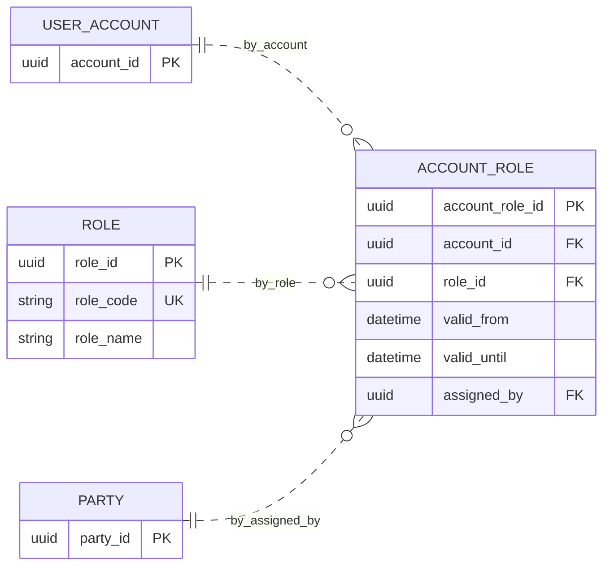
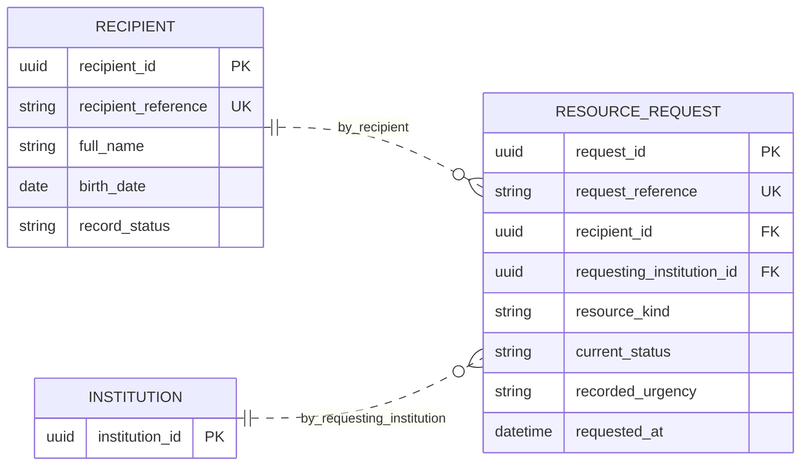
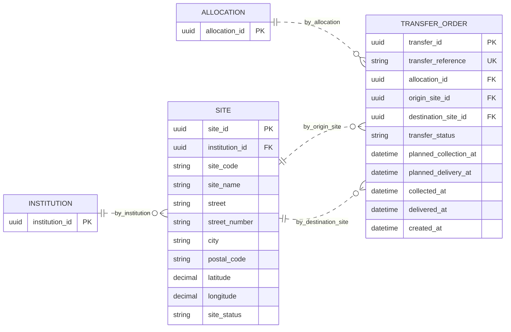

# Modelo en tercera forma normal (3FN) y comprobación BCNF

> Estado: normalización lógica desarrollada para el ejercicio académico, bajo las dependencias y decisiones declaradas. No es una base instalada, un modelo físico aprobado ni una validación clínica.

Ruta: [0FN de partida](./Modelo_0FN.md), [1FN](./Modelo_1FN.md), [2FN](./Modelo_2FN.md), [3FN](./Modelo_3FN.md), [4FN](./Modelo_4FN.md) y [trazabilidad completa](./Trazabilidad_0FN_4FN.md).

## Criterio formal

Para cada DF no trivial `X → A`, 3FN exige que X sea superclave o que A sea un atributo primo. BCNF exige que **todo** determinante de una DF no trivial sea superclave. Se comprueba BCNF antes de concluir 4FN; añadir UUID o retirar listas no reemplaza esta comprobación.

## Esquema completo por transformación

El esquema 3FN es el esquema de [2FN](./Modelo_2FN.md), incluidas sus relaciones heredadas, con las cuatro sustituciones siguientes. Todas las relaciones restantes mantienen exactamente atributos, claves y FK. El catálogo completo resultante, también usado al comprobar 4FN, está en [Modelo_4FN.md](./Modelo_4FN.md).

### 1. ACCOUNT_ROLE

- Relación de entrada: `ACCOUNT_ROLE(account_role_id, account_id, role_id, valid_from, valid_until, assigned_by, role_name, role_code)`.
- Claves candidatas: `PK: (account_role_id)`.
- DF que provoca la separación: `role_id → role_name, role_code`.
- Atributos retirados de la fila hija: `role_name`, `role_code`. Se conservan en `ROLE`, bajo `role_id`; los alias `role_name → ROLE.role_name`, `role_code → ROLE.role_code` preservan su significado.
- Relación resultante: `ACCOUNT_ROLE(account_role_id, account_id, role_id, valid_from, valid_until, assigned_by)`. Las claves y referencias válidas se mantienen.



### 2. BLOOD_UNIT

- Relación de entrada: `BLOOD_UNIT(resource_id, unit_reference, donation_id, component_id, location_id, collected_at, expires_at, expiry_parameter_version_id, current_status, component_name, component_code)`.
- Claves candidatas: `PK: (resource_id); CK1: (unit_reference)`.
- DF que provoca la separación: `component_id → component_name, component_code`.
- Atributos retirados de la fila hija: `component_name`, `component_code`. Se conservan en `BLOOD_COMPONENT`, bajo `component_id`; los alias `component_name → BLOOD_COMPONENT.component_name`, `component_code → BLOOD_COMPONENT.component_code` preservan su significado.
- Relación resultante: `BLOOD_UNIT(resource_id, unit_reference, donation_id, component_id, location_id, collected_at, expires_at, expiry_parameter_version_id, current_status)`. Las claves y referencias válidas se mantienen.

```mermaid
erDiagram
    direction LR
    bloodUnit["BLOOD_UNIT"] {
        uuid resource_id PK, FK
        string unit_reference UK
        uuid donation_id FK
        uuid component_id FK
        uuid location_id FK
        datetime collected_at
        datetime expires_at
        uuid expiry_parameter_version_id FK
        string current_status
    }
    bloodComponent["BLOOD_COMPONENT"] {
        uuid component_id PK
        string component_code UK
        string component_name
    }
    resource["RESOURCE"] {
        uuid resource_id PK
    }
    bloodDonation["BLOOD_DONATION"] {
        uuid donation_id PK
    }
    storageLocation["STORAGE_LOCATION"] {
        uuid location_id PK
    }
    parameterVersion["PARAMETER_VERSION"] {
        uuid parameter_version_id PK
    }
    resource ||--o| bloodUnit : by_resource
    bloodDonation o|..o{ bloodUnit : by_donation
    bloodComponent ||..o{ bloodUnit : by_component
    storageLocation ||..o{ bloodUnit : by_location
    parameterVersion o|..o{ bloodUnit : by_expiry_parameter_version
```



### 3. RESOURCE_REQUEST

- Relación de entrada: `RESOURCE_REQUEST(request_id, request_reference, recipient_id, requesting_institution_id, resource_kind, current_status, recorded_urgency, requested_at, recipient_reference, recipient_full_name)`.
- Claves candidatas: `PK: (request_id); CK1: (request_reference)`.
- DF que provoca la separación: `recipient_id → recipient_reference, recipient_full_name`.
- Atributos retirados de la fila hija: `recipient_reference`, `recipient_full_name`. Se conservan en `RECIPIENT`, bajo `recipient_id`; los alias `recipient_reference → RECIPIENT.recipient_reference`, `recipient_full_name → RECIPIENT.full_name` preservan su significado.
- Relación resultante: `RESOURCE_REQUEST(request_id, request_reference, recipient_id, requesting_institution_id, resource_kind, current_status, recorded_urgency, requested_at)`. Las claves y referencias válidas se mantienen.



### 4. TRANSFER_ORDER

- Relación de entrada: `TRANSFER_ORDER(transfer_id, transfer_reference, allocation_id, origin_site_id, destination_site_id, transfer_status, planned_collection_at, planned_delivery_at, collected_at, delivered_at, created_at, origin_site_name)`.
- Claves candidatas: `PK: (transfer_id); CK1: (transfer_reference)`.
- DF que provoca la separación: `origin_site_id → origin_site_name`.
- Atributos retirados de la fila hija: `origin_site_name`. Se conservan en `SITE`, bajo `site_id`; los alias `origin_site_name → SITE.site_name` preservan su significado.
- Relación resultante: `TRANSFER_ORDER(transfer_id, transfer_reference, allocation_id, origin_site_id, destination_site_id, transfer_status, planned_collection_at, planned_delivery_at, collected_at, delivered_at, created_at)`. Las claves y referencias válidas se mantienen.




## Conservación de información

Para cada DF `X → Y` utilizada, se descompone la relación de entrada R en `R1 = X ∪ Y` y `R2 = R − (Y − X)`. La intersección contiene X y X determina R1; por ello el join de esas proyecciones no introduce tuplas espurias en una instancia que satisfaga la DF. La DF eliminada queda comprobable en su relación propietaria.

En este ejercicio la relación propietaria ya puede existir desde la extracción de 1FN. En ese caso se conserva una única copia de sus atributos y se valida la FK, no se crea una segunda tabla del mismo catálogo. Las filas propietarias sin hijos permanecen: no se reconstruyen mediante un inner join que las elimine.

Si dos copias actuales del mismo determinante contienen valores distintos, la entrada viola la DF. No se elige una de forma arbitraria: debe corregirse con evidencia, o reconocerse que se trata de versiones históricas distintas y conservar su identificador de versión. Las pruebas incluyen este contraejemplo.

## DF y BCNF del esquema resultante

En el conjunto de dependencias declarado, cada clave candidata K determina los demás atributos de su relación. Las dependencias no clave anteriores quedan alojadas en sus propietarios: institución, catálogo, rol, componente, receptor o sede. No se conserva ninguna excepción a BCNF en el esquema final.

| Familia de relaciones | Dependencia y significado |
| --- | --- |
| Registros principales | Identificador o referencia candidata → atributos propios del registro. No se copian nombres actuales de entidades referenciadas. |
| Versiones | Identificador de versión o (propietario, versión) → contenido de esa versión. Una versión de regla no es solo su rótulo: incluye fuente, vigencia, ámbito y aprobación. |
| Eventos | Identificador de evento o (proceso, secuencia) → instante, actor y datos del hecho. Un proceso puede tener varios eventos distintos. |
| Elementos de evaluación | (evaluación, recurso) o (evaluación, número de candidato) → un candidato; (candidato, factor) → medición y peso aplicado en ese resultado. No se supone que el nombre del factor determine un peso universal. |
| Vínculos de pertenencia | La clave compuesta representa el hecho completo. No contiene la descripción de ninguno de sus extremos. |
| Versiones vigentes | En `DOCUMENT_CURRENT_VERSION` y `ORGAN_CURRENT_VIABILITY`, ambos extremos son claves candidatas. La pertenencia al mismo propietario es una restricción adicional comprobable. |

Los datos de `ASSESSMENT_INPUT`, observaciones, motivos, respuestas y cambios por campo son valores atómicos de un hecho identificado, no una bolsa para ocultar grupos de 0FN. Sus códigos y dominios concretos deberán validarse antes del modelo físico.

## Lo que la normalización no elimina

El estado vigente y el historial describen hechos distintos. Se conserva `APPOINTMENT.current_status` y sus eventos; su coherencia requerirá una transacción. Tampoco se sustituye el valor observado por un algoritmo con un join a datos actuales. Los cambios históricos permanecen anexados o versionados, no sobrescritos.

Que todas las DF conocidas satisfagan BCNF aún exige revisar las DMV. La siguiente etapa realiza esa comprobación sin asumir que toda relación de varios a varios es una independencia.

## Verificación reproducible

Desde la raíz del proyecto:

```sh
node documentation/database-diagrams/normalization/validate.mjs
```

El verificador comprueba los cuatro esquemas, claves declaradas y su minimalidad respecto de las DF proporcionadas, FK y tipos, redundancias parciales y transitivas, trazabilidad de los 208 atributos iniciales, cobertura de todas las tablas finales, reconstrucciones de ejemplo y sintaxis Mermaid. También detecta divergencias entre la especificación y los Markdown.

Las pruebas usan datos DEMO sin significado clínico. No descubren dependencias de negocio, no prueban todas las instancias posibles y no sustituyen la justificación algebraica ni la revisión funcional. Una DF o DMV nueva obliga a volver a evaluar la forma normal. El analizador Mermaid se carga de la instalación local de VS Code; en otro entorno se puede indicar un módulo ya instalado mediante `NORMALIZATION_MERMAID_MODULE`, sin instalar dependencias automáticamente.
