# Modelo en cuarta forma normal (4FN)

> Estado: normalización lógica desarrollada para el ejercicio académico, bajo las dependencias y decisiones declaradas. No es una base instalada, un modelo físico aprobado ni una validación clínica.

Ruta: [0FN de partida](./Modelo_0FN.md), [1FN](./Modelo_1FN.md), [2FN](./Modelo_2FN.md), [3FN](./Modelo_3FN.md), [4FN](./Modelo_4FN.md) y [trazabilidad completa](./Trazabilidad_0FN_4FN.md).

## Resultado

Se normalizó el modelo de 18 registros 0FN en **169 relaciones lógicas**, con **918 atributos declarados**, claves, referencias y vistas por dominio. La [trazabilidad](./Trazabilidad_0FN_4FN.md) cubre los **208 atributos originales**, incluidos sus grupos repetitivos.

El resultado satisface 4FN **respecto de las DF y las independencias declaradas en este ejercicio**. Las reglas clínicas, formularios mínimos, hipótesis de cardinalidad y traducción física requieren validación posterior. El diagrama anterior basado en HU se utilizó como referencia estructural autorizada; no se trasladó como una normalización demostrada.

## 1. Comprobación de 4FN

Para toda DMV no trivial `X ↠ Y`, X debe ser superclave. La DMV es trivial cuando `Y ⊆ X` o `X ∪ Y = R`. Las DF son un caso particular; por ello también se exige BCNF. Una descomposición por DMV usa `XY` y `X(R − Y)`, y su join recupera la relación cuando la independencia declarada es válida. [Fundamento: Fagin, 1977, apartados 2 y 3](https://www.comp.nus.edu.sg/~lingtw/papers/fagin.pdf).

### DMV identificada en los grupos originales

Considérese la vista plana de directorio `SITE_DIRECTORY(site_id, contact_id, schedule_sequence)`. Para esta vista se define que los contactos generales de una sede y sus horarios de apertura son conjuntos independientes: el directorio **no asigna cada contacto a un turno**. La clave candidata es el triple completo; no se declara una DF entre sus componentes.

- `site_id ↠ contact_id`.
- `site_id ↠ schedule_sequence`.
- `site_id` no es superclave, por lo que la vista combinada no está en 4FN.
- Se conservan `SITE_CONTACT(site_id, contact_id)` y la proyección `(site_id, sequence)` de `SITE_SCHEDULE`. Los datos del horario permanecen en `SITE_SCHEDULE`, determinados por su identidad o por (site_id, sequence).

Con C1/C2 y horarios 1/2, la vista combinada tiene cuatro filas. Las dos proyecciones conservan dos pertenencias cada una; su join reproduce exactamente las cuatro combinaciones. Si una sede aún no tiene horarios, su fila y sus contactos siguen existiendo por separado; no se reconstruye todo con un inner join.

**La separación ya se realizó al extraer las listas en 1FN.** No se vuelve a combinar la información solo para descomponerla en 4FN. Por eso el conjunto de relaciones de 3FN/BCNF y el de 4FN son iguales: cambia la comprobación realizada, no necesariamente el número de tablas. Si posteriormente se registran teléfonos asignados a turnos concretos, ese nuevo hecho requerirá su asociación y dejará de ser independiente.

### Asociaciones que no admiten separación independiente

| Grupo | Unidad que debe permanecer asociada |
| --- | --- |
| Roles, permisos y ámbitos | Una concesión (asignación de rol, permiso, ámbito, vigencia). READ en A y WRITE en B no autorizan READ en B ni WRITE en A. |
| Candidato y factores | El recurso dentro de una ejecución y cada factor de ese candidato; no todos los factores de una solicitud se aplican indiscriminadamente a todos sus candidatos. |
| Prueba, muestra y observación | La prueba, su revisión y el resultado concreto; varios resultados no prueban independencia entre muestra, locus o método. |
| Destinatarios y canales | Cada entrega pertenece a un destinatario y a un canal; los acuses pertenecen a sus intentos, no a cualquier envío de la alerta. |
| Evento y evidencia | El documento/version corresponde a un evento de custodia y su autorización de captura. No toda fotografía de un traslado prueba todos sus eventos. |
| Versión y aprobación | Fuente, vigencia, ámbito y responsable pertenecen a la versión aplicada; no son listas intercambiables. |

Cada relación final describe un registro, un elemento de una lista, una versión, un evento o una asociación contextualizada. Sus descriptores dependen de las claves declaradas; los conjuntos independientes del propietario están en relaciones distintas. No se postula ninguna DMV residual no trivial con determinante no superclave. Esto no es una prueba sobre dependencias desconocidas del negocio.

## Convenciones y límites

- Nombres de tablas y atributos en inglés. PK es la clave primaria escogida; CK identifica otra clave candidata y UK se dibuja solo cuando la unicidad corresponde a un atributo individual. Una CK compuesta **no** significa que cada columna sea única por separado.
- Los identificadores técnicos permiten distinguir hechos, pero no demuestran una forma normal. Se examinan también las claves candidatas compuestas, por ejemplo `(appointment_id, sequence)` y `(catalog_id, version_no)`.
- `uuid`, `string`, `decimal` y los demás tipos son dominios lógicos, no decisiones de longitud, motor, índices ni DDL. `version_no` admite rótulos de versión; `sequence`, `revision_no` y posiciones de elementos son ordinales enteros.
- Cada `scalar_value`, `scalar_result` o respuesta contiene un único valor del dominio indicado por su código. No se permiten JSON, arreglos, objetos, listas separadas por comas ni varios resultados clínicos ocultos en una cadena. Una nota narrativa es un dato textual; no sustituye una lista de hechos consultables.
- Los nombres, fechas de nacimiento y componentes de dirección son una atomización mínima propuesta de los objetos abiertos de la 0FN; no se afirma que la documentación haya aprobado un formulario clínico definitivo. No se impone un identificador nacional, una regla médica ni una equivalencia automática entre donante, receptor y cuenta.
- Los objetos `*_details` de referencia se resuelven por relaciones. Las entradas de una evaluación, el destino usado al enviar una alerta y el contexto de auditoría son hechos históricos: conservan el valor observado, no se reemplazan por el valor actual de otra tabla.
- Una ausencia opcional se representa mediante ausencia de la fila asociativa, cuando existe una relación específica; las FK opcionales restantes se señalan en el catálogo. No se usan filas ficticias, identificadores vacíos ni NULL dentro de claves candidatas. La traducción de opcionalidad a restricciones físicas sigue pendiente.
- Las listas con identidad propia conservan esa identidad. Las listas ordenadas o con repeticiones significativas conservan un ordinal, evento o versión; las relaciones de pertenencia sin orden tienen semántica de conjunto. No se emparejan listas independientes por su posición.

## 2. Diagramas completos por dominio

Las vistas se dividen siguiendo la guía de diagramas ER para mantener legibles las claves, atributos y relaciones. En cada vista las tablas desarrolladas contienen **todos** sus atributos. Las cajas externas solo repiten claves para mostrar conexiones entre dominios. Una tabla tiene una única definición canónica aunque aparezca como referencia en varias vistas.

Las líneas sólidas representan FK contenidas en la PK de la relación hija; las discontinuas, otras asociaciones. `o|` indica opcionalidad y la terminación de varios indica cero o más filas hijas. Las CK compuestas completas y los extremos exactos de cada FK se indican debajo de las vistas.

| Dominio | Relaciones |
| --- | --- |
| [01 — Instituciones y sedes](#domain-01) | 12 |
| [02 — Identidad, permisos y ámbitos](#domain-02) | 14 |
| [03 — Catálogos y reglas versionadas](#domain-03) | 10 |
| [04 — Donantes y episodios de donación](#domain-04) | 14 |
| [05 — Campañas y citas](#domain-05) | 10 |
| [06 — Receptores y necesidades](#domain-06) | 9 |
| [07 — Estudios, muestras y resultados](#domain-07) | 12 |
| [08 — Recursos sanguíneos y órganos](#domain-08) | 16 |
| [09 — Solicitudes](#domain-09) | 7 |
| [10 — Evaluaciones reproducibles](#domain-10) | 11 |
| [11 — Reserva y asignación humana](#domain-11) | 7 |
| [12 — Traslado y cadena de custodia](#domain-12) | 12 |
| [13 — Pronóstico y balanceo](#domain-13) | 8 |
| [14 — Alertas y entregas](#domain-14) | 7 |
| [15 — Documentos y reportes](#domain-15) | 9 |
| [16 — Auditoría y cambios mínimos](#domain-16) | 4 |
| [17 — Dispositivos y sincronización](#domain-17) | 7 |

<a id="domain-01"></a>

### 01 — Instituciones y sedes

#### Vista 1

Tablas desarrolladas: `INSTITUTION`, `SITE`, `CONTACT`, `CONTACT_METHOD`, `INSTITUTION_CONTACT`, `SITE_CONTACT`. Las otras cajas muestran solo claves de referencia; su definición completa está en el dominio correspondiente.

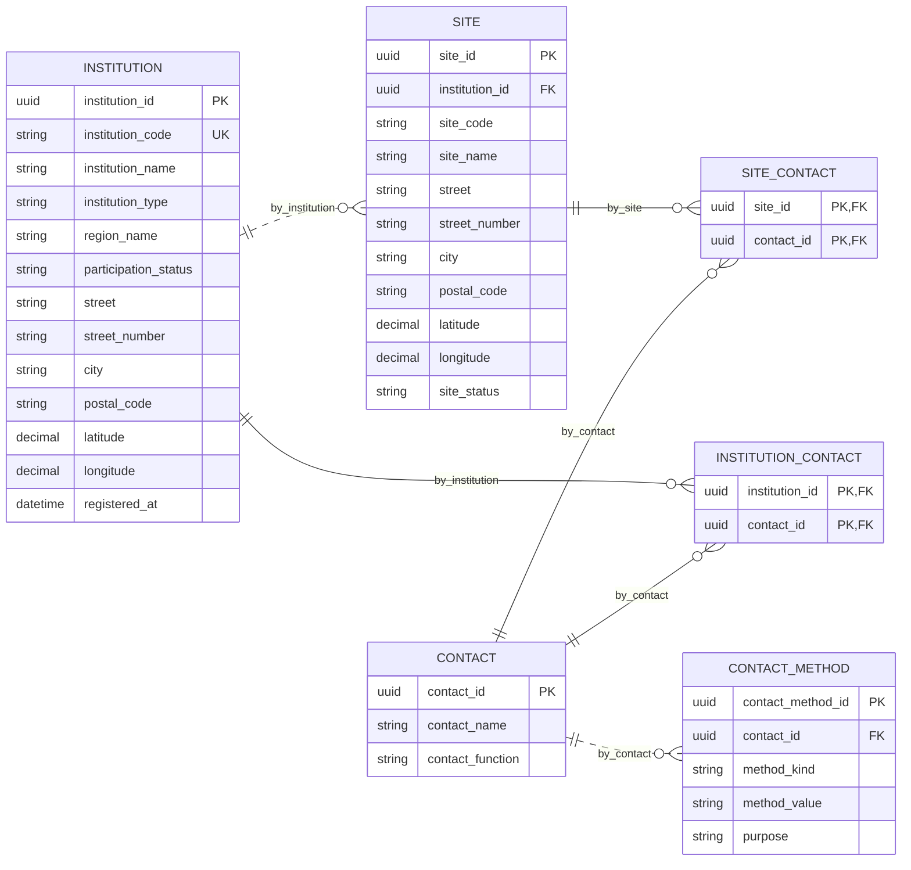
```mermaid
erDiagram
    direction LR
    institution["INSTITUTION"] {
        uuid institution_id PK
        string institution_code UK
        string institution_name
        string institution_type
        string region_name
        string participation_status
        string street
        string street_number
        string city
        string postal_code
        decimal latitude
        decimal longitude
        datetime registered_at
    }
    site["SITE"] {
        uuid site_id PK
        uuid institution_id FK
        string site_code
        string site_name
        string street
        string street_number
        string city
        string postal_code
        decimal latitude
        decimal longitude
        string site_status
    }
    contact["CONTACT"] {
        uuid contact_id PK
        string contact_name
        string contact_function
    }
    contactMethod["CONTACT_METHOD"] {
        uuid contact_method_id PK
        uuid contact_id FK
        string method_kind
        string method_value
        string purpose
    }
    institutionContact["INSTITUTION_CONTACT"] {
        uuid institution_id PK, FK
        uuid contact_id PK, FK
    }
    siteContact["SITE_CONTACT"] {
        uuid site_id PK, FK
        uuid contact_id PK, FK
    }
    institution ||..o{ site : by_institution
    contact ||..o{ contactMethod : by_contact
    institution ||--o{ institutionContact : by_institution
    contact ||--o{ institutionContact : by_contact
    site ||--o{ siteContact : by_site
    contact ||--o{ siteContact : by_contact
```

| Tabla | Claves candidatas | Referencias lógicas |
| --- | --- | --- |
| `INSTITUTION` | `PK: (institution_id); CK1: (institution_code)` | `—` |
| `SITE` | `PK: (site_id); CK1: (institution_id, site_code)` | `(institution_id) → INSTITUTION(institution_id)` |
| `CONTACT` | `PK: (contact_id)` | `—` |
| `CONTACT_METHOD` | `PK: (contact_method_id)` | `(contact_id) → CONTACT(contact_id)` |
| `INSTITUTION_CONTACT` | `PK: (institution_id, contact_id)` | `(institution_id) → INSTITUTION(institution_id); (contact_id) → CONTACT(contact_id)` |
| `SITE_CONTACT` | `PK: (site_id, contact_id)` | `(site_id) → SITE(site_id); (contact_id) → CONTACT(contact_id)` |

#### Vista 2

Tablas desarrolladas: `SITE_SCHEDULE`, `CAPABILITY`, `INSTITUTION_CAPABILITY`, `SITE_CAPABILITY`, `INSTITUTION_SETTING`, `INSTITUTION_EVENT`. Las otras cajas muestran solo claves de referencia; su definición completa está en el dominio correspondiente.

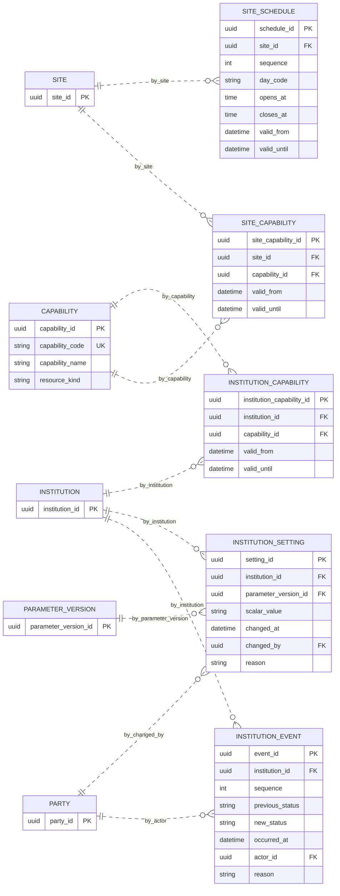
```mermaid
erDiagram
    direction LR
    siteSchedule["SITE_SCHEDULE"] {
        uuid schedule_id PK
        uuid site_id FK
        int sequence
        string day_code
        time opens_at
        time closes_at
        datetime valid_from
        datetime valid_until
    }
    capability["CAPABILITY"] {
        uuid capability_id PK
        string capability_code UK
        string capability_name
        string resource_kind
    }
    institutionCapability["INSTITUTION_CAPABILITY"] {
        uuid institution_capability_id PK
        uuid institution_id FK
        uuid capability_id FK
        datetime valid_from
        datetime valid_until
    }
    siteCapability["SITE_CAPABILITY"] {
        uuid site_capability_id PK
        uuid site_id FK
        uuid capability_id FK
        datetime valid_from
        datetime valid_until
    }
    institutionSetting["INSTITUTION_SETTING"] {
        uuid setting_id PK
        uuid institution_id FK
        uuid parameter_version_id FK
        string scalar_value
        datetime changed_at
        uuid changed_by FK
        string reason
    }
    institutionEvent["INSTITUTION_EVENT"] {
        uuid event_id PK
        uuid institution_id FK
        int sequence
        string previous_status
        string new_status
        datetime occurred_at
        uuid actor_id FK
        string reason
    }
    site["SITE"] {
        uuid site_id PK
    }
    institution["INSTITUTION"] {
        uuid institution_id PK
    }
    parameterVersion["PARAMETER_VERSION"] {
        uuid parameter_version_id PK
    }
    party["PARTY"] {
        uuid party_id PK
    }
    site ||..o{ siteSchedule : by_site
    institution ||..o{ institutionCapability : by_institution
    capability ||..o{ institutionCapability : by_capability
    site ||..o{ siteCapability : by_site
    capability ||..o{ siteCapability : by_capability
    institution ||..o{ institutionSetting : by_institution
    parameterVersion ||..o{ institutionSetting : by_parameter_version
    party ||..o{ institutionSetting : by_changed_by
    institution ||..o{ institutionEvent : by_institution
    party ||..o{ institutionEvent : by_actor
```

| Tabla | Claves candidatas | Referencias lógicas |
| --- | --- | --- |
| `SITE_SCHEDULE` | `PK: (schedule_id); CK1: (site_id, sequence)` | `(site_id) → SITE(site_id)` |
| `CAPABILITY` | `PK: (capability_id); CK1: (capability_code)` | `—` |
| `INSTITUTION_CAPABILITY` | `PK: (institution_capability_id)` | `(institution_id) → INSTITUTION(institution_id); (capability_id) → CAPABILITY(capability_id)` |
| `SITE_CAPABILITY` | `PK: (site_capability_id)` | `(site_id) → SITE(site_id); (capability_id) → CAPABILITY(capability_id)` |
| `INSTITUTION_SETTING` | `PK: (setting_id)` | `(institution_id) → INSTITUTION(institution_id); (parameter_version_id) → PARAMETER_VERSION(parameter_version_id); (changed_by) → PARTY(party_id)` |
| `INSTITUTION_EVENT` | `PK: (event_id); CK1: (institution_id, sequence)` | `(institution_id) → INSTITUTION(institution_id); (actor_id) → PARTY(party_id)` |


<a id="domain-02"></a>

### 02 — Identidad, permisos y ámbitos

#### Vista 1

Tablas desarrolladas: `PARTY`, `USER_ACCOUNT`, `ACCOUNT_CONTACT`, `ROLE`, `PERMISSION`, `ACCOUNT_ROLE`. Las otras cajas muestran solo claves de referencia; su definición completa está en el dominio correspondiente.

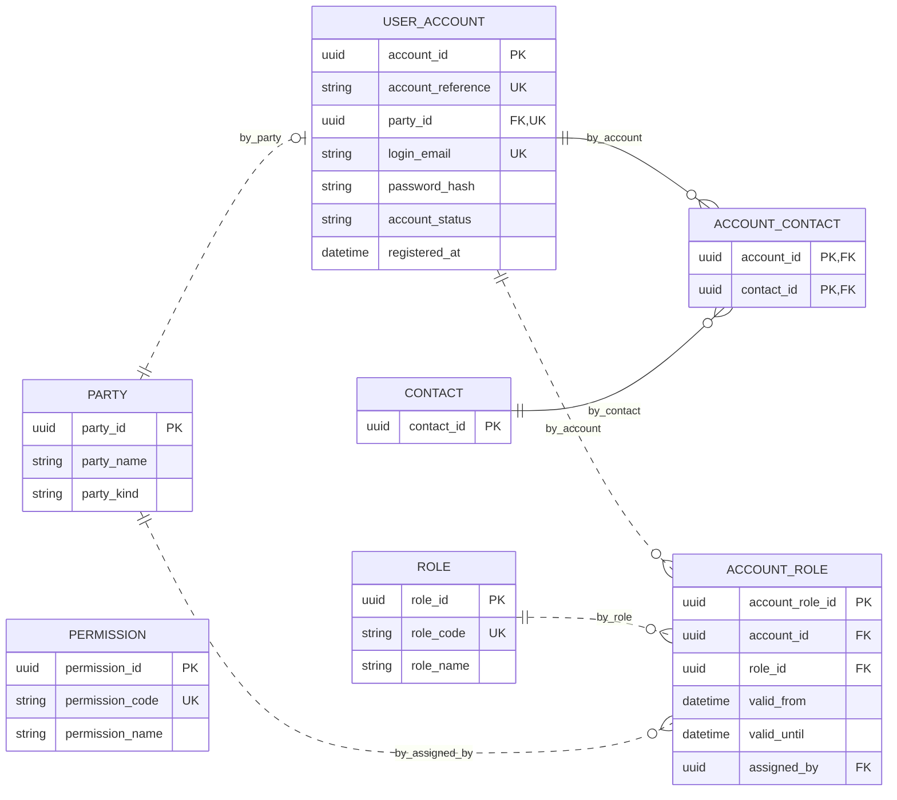
```mermaid
erDiagram
    direction LR
    party["PARTY"] {
        uuid party_id PK
        string party_name
        string party_kind
    }
    userAccount["USER_ACCOUNT"] {
        uuid account_id PK
        string account_reference UK
        uuid party_id FK, UK
        string login_email UK
        string password_hash
        string account_status
        datetime registered_at
    }
    accountContact["ACCOUNT_CONTACT"] {
        uuid account_id PK, FK
        uuid contact_id PK, FK
    }
    role["ROLE"] {
        uuid role_id PK
        string role_code UK
        string role_name
    }
    permission["PERMISSION"] {
        uuid permission_id PK
        string permission_code UK
        string permission_name
    }
    accountRole["ACCOUNT_ROLE"] {
        uuid account_role_id PK
        uuid account_id FK
        uuid role_id FK
        datetime valid_from
        datetime valid_until
        uuid assigned_by FK
    }
    contact["CONTACT"] {
        uuid contact_id PK
    }
    party ||..o| userAccount : by_party
    userAccount ||--o{ accountContact : by_account
    contact ||--o{ accountContact : by_contact
    userAccount ||..o{ accountRole : by_account
    role ||..o{ accountRole : by_role
    party ||..o{ accountRole : by_assigned_by
```

| Tabla | Claves candidatas | Referencias lógicas |
| --- | --- | --- |
| `PARTY` | `PK: (party_id)` | `—` |
| `USER_ACCOUNT` | `PK: (account_id); CK1: (account_reference); CK2: (login_email); CK3: (party_id)` | `(party_id) → PARTY(party_id)` |
| `ACCOUNT_CONTACT` | `PK: (account_id, contact_id)` | `(account_id) → USER_ACCOUNT(account_id); (contact_id) → CONTACT(contact_id)` |
| `ROLE` | `PK: (role_id); CK1: (role_code)` | `—` |
| `PERMISSION` | `PK: (permission_id); CK1: (permission_code)` | `—` |
| `ACCOUNT_ROLE` | `PK: (account_role_id)` | `(account_id) → USER_ACCOUNT(account_id); (role_id) → ROLE(role_id); (assigned_by) → PARTY(party_id)` |

#### Vista 2

Tablas desarrolladas: `ACCESS_SCOPE`, `INSTITUTION_SCOPE`, `SITE_SCOPE`, `REGIONAL_SCOPE`, `ACCESS_GRANT`, `ACCOUNT_EVENT`. Las otras cajas muestran solo claves de referencia; su definición completa está en el dominio correspondiente.

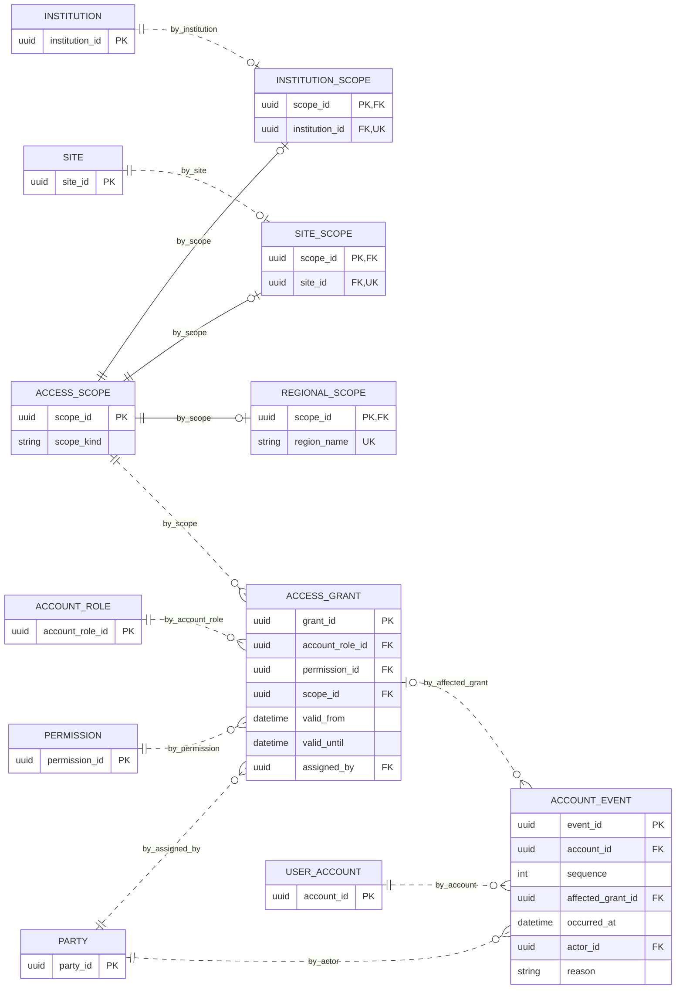
```mermaid
erDiagram
    direction LR
    accessScope["ACCESS_SCOPE"] {
        uuid scope_id PK
        string scope_kind
    }
    institutionScope["INSTITUTION_SCOPE"] {
        uuid scope_id PK, FK
        uuid institution_id FK, UK
    }
    siteScope["SITE_SCOPE"] {
        uuid scope_id PK, FK
        uuid site_id FK, UK
    }
    regionalScope["REGIONAL_SCOPE"] {
        uuid scope_id PK, FK
        string region_name UK
    }
    accessGrant["ACCESS_GRANT"] {
        uuid grant_id PK
        uuid account_role_id FK
        uuid permission_id FK
        uuid scope_id FK
        datetime valid_from
        datetime valid_until
        uuid assigned_by FK
    }
    accountEvent["ACCOUNT_EVENT"] {
        uuid event_id PK
        uuid account_id FK
        int sequence
        uuid affected_grant_id FK
        datetime occurred_at
        uuid actor_id FK
        string reason
    }
    institution["INSTITUTION"] {
        uuid institution_id PK
    }
    site["SITE"] {
        uuid site_id PK
    }
    accountRole["ACCOUNT_ROLE"] {
        uuid account_role_id PK
    }
    permission["PERMISSION"] {
        uuid permission_id PK
    }
    party["PARTY"] {
        uuid party_id PK
    }
    userAccount["USER_ACCOUNT"] {
        uuid account_id PK
    }
    accessScope ||--o| institutionScope : by_scope
    institution ||..o| institutionScope : by_institution
    accessScope ||--o| siteScope : by_scope
    site ||..o| siteScope : by_site
    accessScope ||--o| regionalScope : by_scope
    accountRole ||..o{ accessGrant : by_account_role
    permission ||..o{ accessGrant : by_permission
    accessScope ||..o{ accessGrant : by_scope
    party ||..o{ accessGrant : by_assigned_by
    userAccount ||..o{ accountEvent : by_account
    accessGrant o|..o{ accountEvent : by_affected_grant
    party ||..o{ accountEvent : by_actor
```

| Tabla | Claves candidatas | Referencias lógicas |
| --- | --- | --- |
| `ACCESS_SCOPE` | `PK: (scope_id)` | `—` |
| `INSTITUTION_SCOPE` | `PK: (scope_id); CK1: (institution_id)` | `(scope_id) → ACCESS_SCOPE(scope_id); (institution_id) → INSTITUTION(institution_id)` |
| `SITE_SCOPE` | `PK: (scope_id); CK1: (site_id)` | `(scope_id) → ACCESS_SCOPE(scope_id); (site_id) → SITE(site_id)` |
| `REGIONAL_SCOPE` | `PK: (scope_id); CK1: (region_name)` | `(scope_id) → ACCESS_SCOPE(scope_id)` |
| `ACCESS_GRANT` | `PK: (grant_id)` | `(account_role_id) → ACCOUNT_ROLE(account_role_id); (permission_id) → PERMISSION(permission_id); (scope_id) → ACCESS_SCOPE(scope_id); (assigned_by) → PARTY(party_id)` |
| `ACCOUNT_EVENT` | `PK: (event_id); CK1: (account_id, sequence)` | `(account_id) → USER_ACCOUNT(account_id); (affected_grant_id) → ACCESS_GRANT(grant_id) [opcional]; (actor_id) → PARTY(party_id)` |

#### Vista 3

Tablas desarrolladas: `NOTIFICATION_PREFERENCE`, `PROFESSIONAL_AUTHORIZATION`. Las otras cajas muestran solo claves de referencia; su definición completa está en el dominio correspondiente.

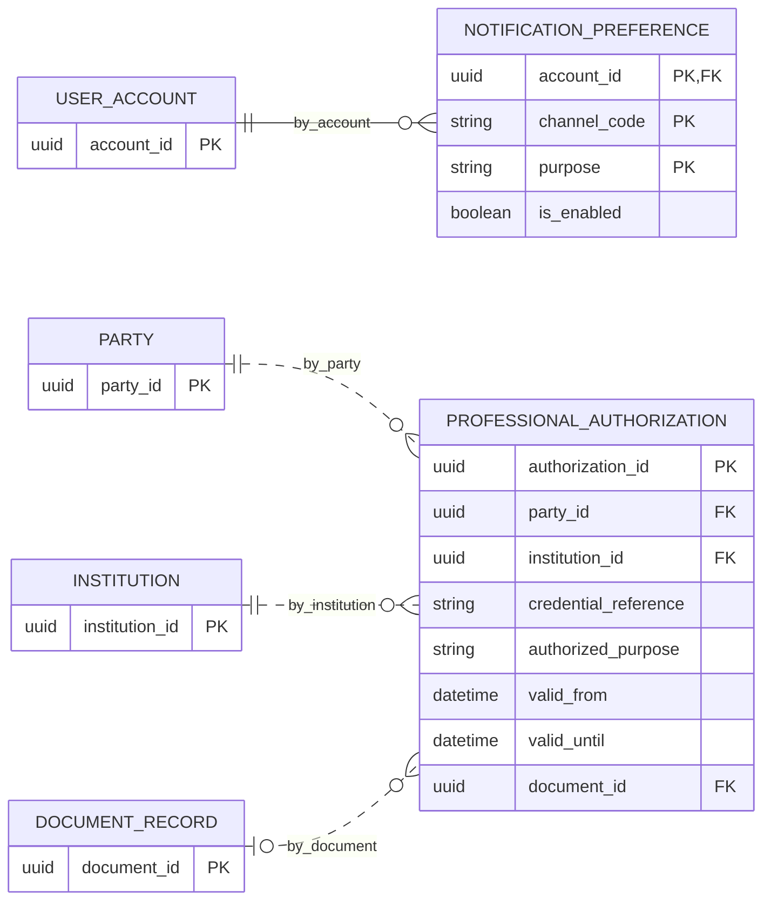
```mermaid
erDiagram
    direction LR
    notificationPreference["NOTIFICATION_PREFERENCE"] {
        uuid account_id PK, FK
        string channel_code PK
        string purpose PK
        boolean is_enabled
    }
    professionalAuthorization["PROFESSIONAL_AUTHORIZATION"] {
        uuid authorization_id PK
        uuid party_id FK
        uuid institution_id FK
        string credential_reference
        string authorized_purpose
        datetime valid_from
        datetime valid_until
        uuid document_id FK
    }
    userAccount["USER_ACCOUNT"] {
        uuid account_id PK
    }
    party["PARTY"] {
        uuid party_id PK
    }
    institution["INSTITUTION"] {
        uuid institution_id PK
    }
    documentRecord["DOCUMENT_RECORD"] {
        uuid document_id PK
    }
    userAccount ||--o{ notificationPreference : by_account
    party ||..o{ professionalAuthorization : by_party
    institution ||..o{ professionalAuthorization : by_institution
    documentRecord o|..o{ professionalAuthorization : by_document
```

| Tabla | Claves candidatas | Referencias lógicas |
| --- | --- | --- |
| `NOTIFICATION_PREFERENCE` | `PK: (account_id, channel_code, purpose)` | `(account_id) → USER_ACCOUNT(account_id)` |
| `PROFESSIONAL_AUTHORIZATION` | `PK: (authorization_id)` | `(party_id) → PARTY(party_id); (institution_id) → INSTITUTION(institution_id); (document_id) → DOCUMENT_RECORD(document_id) [opcional]` |


<a id="domain-03"></a>

### 03 — Catálogos y reglas versionadas

#### Vista 1

Tablas desarrolladas: `REFERENCE_CATALOG`, `CATALOG_VERSION`, `CATALOG_ENTRY`, `CATALOG_ENTRY_VALUE`, `CATALOG_CHANGE`, `CATALOG_CHANGED_ENTRY`. Las otras cajas muestran solo claves de referencia; su definición completa está en el dominio correspondiente.

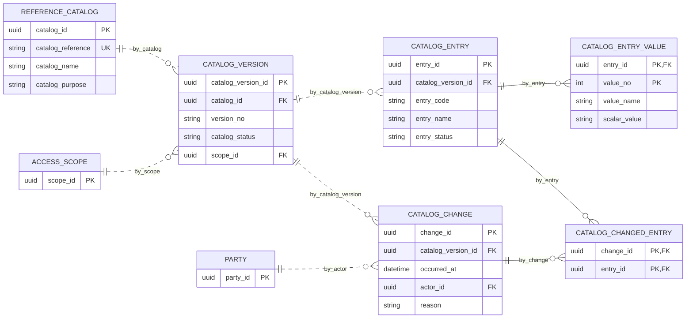
```mermaid
erDiagram
    direction LR
    referenceCatalog["REFERENCE_CATALOG"] {
        uuid catalog_id PK
        string catalog_reference UK
        string catalog_name
        string catalog_purpose
    }
    catalogVersion["CATALOG_VERSION"] {
        uuid catalog_version_id PK
        uuid catalog_id FK
        string version_no
        string catalog_status
        uuid scope_id FK
    }
    catalogEntry["CATALOG_ENTRY"] {
        uuid entry_id PK
        uuid catalog_version_id FK
        string entry_code
        string entry_name
        string entry_status
    }
    catalogEntryValue["CATALOG_ENTRY_VALUE"] {
        uuid entry_id PK, FK
        int value_no PK
        string value_name
        string scalar_value
    }
    catalogChange["CATALOG_CHANGE"] {
        uuid change_id PK
        uuid catalog_version_id FK
        datetime occurred_at
        uuid actor_id FK
        string reason
    }
    catalogChangedEntry["CATALOG_CHANGED_ENTRY"] {
        uuid change_id PK, FK
        uuid entry_id PK, FK
    }
    accessScope["ACCESS_SCOPE"] {
        uuid scope_id PK
    }
    party["PARTY"] {
        uuid party_id PK
    }
    referenceCatalog ||..o{ catalogVersion : by_catalog
    accessScope ||..o{ catalogVersion : by_scope
    catalogVersion ||..o{ catalogEntry : by_catalog_version
    catalogEntry ||--o{ catalogEntryValue : by_entry
    catalogVersion ||..o{ catalogChange : by_catalog_version
    party ||..o{ catalogChange : by_actor
    catalogChange ||--o{ catalogChangedEntry : by_change
    catalogEntry ||--o{ catalogChangedEntry : by_entry
```

| Tabla | Claves candidatas | Referencias lógicas |
| --- | --- | --- |
| `REFERENCE_CATALOG` | `PK: (catalog_id); CK1: (catalog_reference)` | `—` |
| `CATALOG_VERSION` | `PK: (catalog_version_id); CK1: (catalog_id, version_no)` | `(catalog_id) → REFERENCE_CATALOG(catalog_id); (scope_id) → ACCESS_SCOPE(scope_id)` |
| `CATALOG_ENTRY` | `PK: (entry_id); CK1: (catalog_version_id, entry_code)` | `(catalog_version_id) → CATALOG_VERSION(catalog_version_id)` |
| `CATALOG_ENTRY_VALUE` | `PK: (entry_id, value_no)` | `(entry_id) → CATALOG_ENTRY(entry_id)` |
| `CATALOG_CHANGE` | `PK: (change_id)` | `(catalog_version_id) → CATALOG_VERSION(catalog_version_id); (actor_id) → PARTY(party_id)` |
| `CATALOG_CHANGED_ENTRY` | `PK: (change_id, entry_id)` | `(change_id) → CATALOG_CHANGE(change_id); (entry_id) → CATALOG_ENTRY(entry_id)` |

#### Vista 2

Tablas desarrolladas: `CATALOG_CHANGE_FIELD`, `PARAMETER_VERSION`, `CATALOG_PARAMETER`, `RULE_VERSION`. Las otras cajas muestran solo claves de referencia; su definición completa está en el dominio correspondiente.

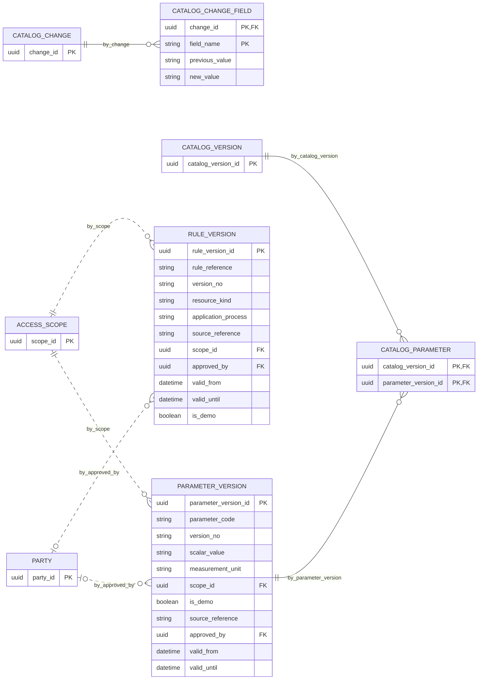
```mermaid
erDiagram
    direction LR
    catalogChangeField["CATALOG_CHANGE_FIELD"] {
        uuid change_id PK, FK
        string field_name PK
        string previous_value
        string new_value
    }
    parameterVersion["PARAMETER_VERSION"] {
        uuid parameter_version_id PK
        string parameter_code
        string version_no
        string scalar_value
        string measurement_unit
        uuid scope_id FK
        boolean is_demo
        string source_reference
        uuid approved_by FK
        datetime valid_from
        datetime valid_until
    }
    catalogParameter["CATALOG_PARAMETER"] {
        uuid catalog_version_id PK, FK
        uuid parameter_version_id PK, FK
    }
    ruleVersion["RULE_VERSION"] {
        uuid rule_version_id PK
        string rule_reference
        string version_no
        string resource_kind
        string application_process
        string source_reference
        uuid scope_id FK
        uuid approved_by FK
        datetime valid_from
        datetime valid_until
        boolean is_demo
    }
    catalogChange["CATALOG_CHANGE"] {
        uuid change_id PK
    }
    accessScope["ACCESS_SCOPE"] {
        uuid scope_id PK
    }
    party["PARTY"] {
        uuid party_id PK
    }
    catalogVersion["CATALOG_VERSION"] {
        uuid catalog_version_id PK
    }
    catalogChange ||--o{ catalogChangeField : by_change
    accessScope ||..o{ parameterVersion : by_scope
    party o|..o{ parameterVersion : by_approved_by
    catalogVersion ||--o{ catalogParameter : by_catalog_version
    parameterVersion ||--o{ catalogParameter : by_parameter_version
    accessScope ||..o{ ruleVersion : by_scope
    party o|..o{ ruleVersion : by_approved_by
```

| Tabla | Claves candidatas | Referencias lógicas |
| --- | --- | --- |
| `CATALOG_CHANGE_FIELD` | `PK: (change_id, field_name)` | `(change_id) → CATALOG_CHANGE(change_id)` |
| `PARAMETER_VERSION` | `PK: (parameter_version_id); CK1: (parameter_code, version_no)` | `(scope_id) → ACCESS_SCOPE(scope_id); (approved_by) → PARTY(party_id) [opcional]` |
| `CATALOG_PARAMETER` | `PK: (catalog_version_id, parameter_version_id)` | `(catalog_version_id) → CATALOG_VERSION(catalog_version_id); (parameter_version_id) → PARAMETER_VERSION(parameter_version_id)` |
| `RULE_VERSION` | `PK: (rule_version_id); CK1: (rule_reference, version_no)` | `(scope_id) → ACCESS_SCOPE(scope_id); (approved_by) → PARTY(party_id) [opcional]` |


<a id="domain-04"></a>

### 04 — Donantes y episodios de donación

#### Vista 1

Tablas desarrolladas: `DONOR`, `DONOR_CONTACT`, `DONOR_INSTITUTION`, `DONOR_CONSENT`, `PRELIMINARY_EVALUATION`, `PRELIMINARY_ANSWER`. Las otras cajas muestran solo claves de referencia; su definición completa está en el dominio correspondiente.

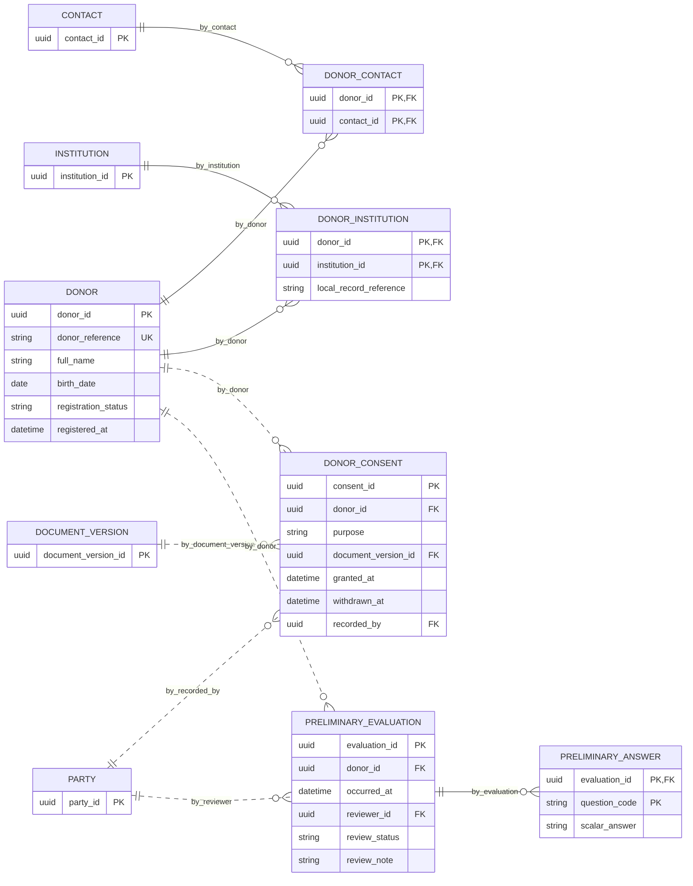
```mermaid
erDiagram
    direction LR
    donor["DONOR"] {
        uuid donor_id PK
        string donor_reference UK
        string full_name
        date birth_date
        string registration_status
        datetime registered_at
    }
    donorContact["DONOR_CONTACT"] {
        uuid donor_id PK, FK
        uuid contact_id PK, FK
    }
    donorInstitution["DONOR_INSTITUTION"] {
        uuid donor_id PK, FK
        uuid institution_id PK, FK
        string local_record_reference
    }
    donorConsent["DONOR_CONSENT"] {
        uuid consent_id PK
        uuid donor_id FK
        string purpose
        uuid document_version_id FK
        datetime granted_at
        datetime withdrawn_at
        uuid recorded_by FK
    }
    preliminaryEvaluation["PRELIMINARY_EVALUATION"] {
        uuid evaluation_id PK
        uuid donor_id FK
        datetime occurred_at
        uuid reviewer_id FK
        string review_status
        string review_note
    }
    preliminaryAnswer["PRELIMINARY_ANSWER"] {
        uuid evaluation_id PK, FK
        string question_code PK
        string scalar_answer
    }
    contact["CONTACT"] {
        uuid contact_id PK
    }
    institution["INSTITUTION"] {
        uuid institution_id PK
    }
    documentVersion["DOCUMENT_VERSION"] {
        uuid document_version_id PK
    }
    party["PARTY"] {
        uuid party_id PK
    }
    donor ||--o{ donorContact : by_donor
    contact ||--o{ donorContact : by_contact
    donor ||--o{ donorInstitution : by_donor
    institution ||--o{ donorInstitution : by_institution
    donor ||..o{ donorConsent : by_donor
    documentVersion ||..o{ donorConsent : by_document_version
    party ||..o{ donorConsent : by_recorded_by
    donor ||..o{ preliminaryEvaluation : by_donor
    party ||..o{ preliminaryEvaluation : by_reviewer
    preliminaryEvaluation ||--o{ preliminaryAnswer : by_evaluation
```

| Tabla | Claves candidatas | Referencias lógicas |
| --- | --- | --- |
| `DONOR` | `PK: (donor_id); CK1: (donor_reference)` | `—` |
| `DONOR_CONTACT` | `PK: (donor_id, contact_id)` | `(donor_id) → DONOR(donor_id); (contact_id) → CONTACT(contact_id)` |
| `DONOR_INSTITUTION` | `PK: (donor_id, institution_id); CK1: (institution_id, local_record_reference)` | `(donor_id) → DONOR(donor_id); (institution_id) → INSTITUTION(institution_id)` |
| `DONOR_CONSENT` | `PK: (consent_id)` | `(donor_id) → DONOR(donor_id); (document_version_id) → DOCUMENT_VERSION(document_version_id); (recorded_by) → PARTY(party_id)` |
| `PRELIMINARY_EVALUATION` | `PK: (evaluation_id)` | `(donor_id) → DONOR(donor_id); (reviewer_id) → PARTY(party_id)` |
| `PRELIMINARY_ANSWER` | `PK: (evaluation_id, question_code)` | `(evaluation_id) → PRELIMINARY_EVALUATION(evaluation_id)` |

#### Vista 2

Tablas desarrolladas: `ELIGIBILITY_DECISION`, `BLOOD_DONATION`, `BLOOD_DONATION_SAMPLE`, `DONATION_INCIDENT`, `ORGAN_DONATION_PROCESS`, `ORGAN_PROCESS_AUTHORIZATION`. Las otras cajas muestran solo claves de referencia; su definición completa está en el dominio correspondiente.

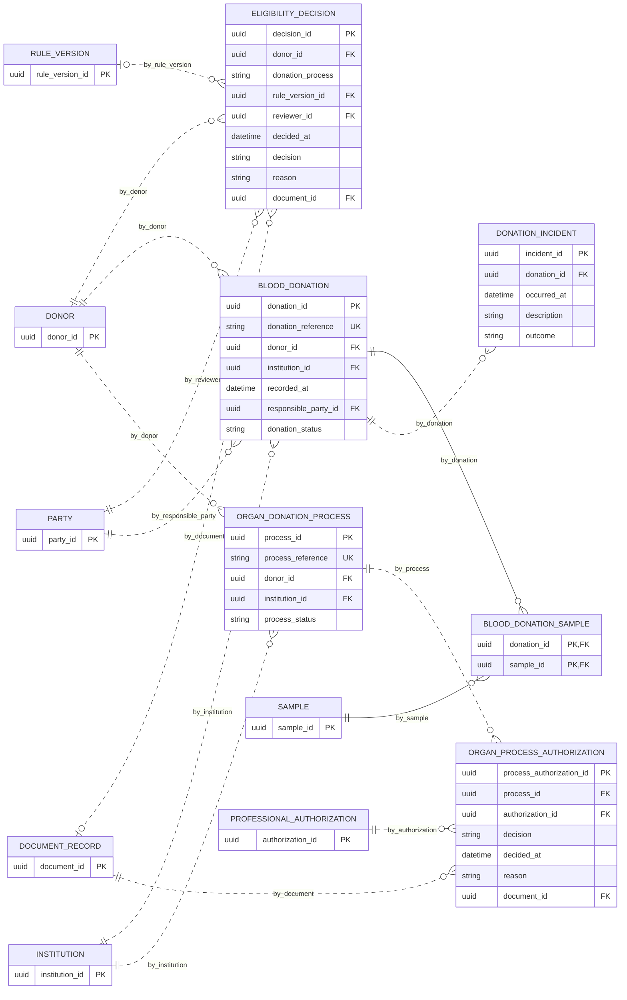
```mermaid
erDiagram
    direction LR
    eligibilityDecision["ELIGIBILITY_DECISION"] {
        uuid decision_id PK
        uuid donor_id FK
        string donation_process
        uuid rule_version_id FK
        uuid reviewer_id FK
        datetime decided_at
        string decision
        string reason
        uuid document_id FK
    }
    bloodDonation["BLOOD_DONATION"] {
        uuid donation_id PK
        string donation_reference UK
        uuid donor_id FK
        uuid institution_id FK
        datetime recorded_at
        uuid responsible_party_id FK
        string donation_status
    }
    bloodDonationSample["BLOOD_DONATION_SAMPLE"] {
        uuid donation_id PK, FK
        uuid sample_id PK, FK
    }
    donationIncident["DONATION_INCIDENT"] {
        uuid incident_id PK
        uuid donation_id FK
        datetime occurred_at
        string description
        string outcome
    }
    organDonationProcess["ORGAN_DONATION_PROCESS"] {
        uuid process_id PK
        string process_reference UK
        uuid donor_id FK
        uuid institution_id FK
        string process_status
    }
    organProcessAuthorization["ORGAN_PROCESS_AUTHORIZATION"] {
        uuid process_authorization_id PK
        uuid process_id FK
        uuid authorization_id FK
        string decision
        datetime decided_at
        string reason
        uuid document_id FK
    }
    donor["DONOR"] {
        uuid donor_id PK
    }
    ruleVersion["RULE_VERSION"] {
        uuid rule_version_id PK
    }
    party["PARTY"] {
        uuid party_id PK
    }
    documentRecord["DOCUMENT_RECORD"] {
        uuid document_id PK
    }
    institution["INSTITUTION"] {
        uuid institution_id PK
    }
    sample["SAMPLE"] {
        uuid sample_id PK
    }
    professionalAuthorization["PROFESSIONAL_AUTHORIZATION"] {
        uuid authorization_id PK
    }
    donor ||..o{ eligibilityDecision : by_donor
    ruleVersion o|..o{ eligibilityDecision : by_rule_version
    party ||..o{ eligibilityDecision : by_reviewer
    documentRecord o|..o{ eligibilityDecision : by_document
    donor ||..o{ bloodDonation : by_donor
    institution ||..o{ bloodDonation : by_institution
    party ||..o{ bloodDonation : by_responsible_party
    bloodDonation ||--o{ bloodDonationSample : by_donation
    sample ||--o{ bloodDonationSample : by_sample
    bloodDonation ||..o{ donationIncident : by_donation
    donor ||..o{ organDonationProcess : by_donor
    institution ||..o{ organDonationProcess : by_institution
    organDonationProcess ||..o{ organProcessAuthorization : by_process
    professionalAuthorization ||..o{ organProcessAuthorization : by_authorization
    documentRecord ||..o{ organProcessAuthorization : by_document
```

| Tabla | Claves candidatas | Referencias lógicas |
| --- | --- | --- |
| `ELIGIBILITY_DECISION` | `PK: (decision_id)` | `(donor_id) → DONOR(donor_id); (rule_version_id) → RULE_VERSION(rule_version_id) [opcional]; (reviewer_id) → PARTY(party_id); (document_id) → DOCUMENT_RECORD(document_id) [opcional]` |
| `BLOOD_DONATION` | `PK: (donation_id); CK1: (donation_reference)` | `(donor_id) → DONOR(donor_id); (institution_id) → INSTITUTION(institution_id); (responsible_party_id) → PARTY(party_id)` |
| `BLOOD_DONATION_SAMPLE` | `PK: (donation_id, sample_id)` | `(donation_id) → BLOOD_DONATION(donation_id); (sample_id) → SAMPLE(sample_id)` |
| `DONATION_INCIDENT` | `PK: (incident_id)` | `(donation_id) → BLOOD_DONATION(donation_id)` |
| `ORGAN_DONATION_PROCESS` | `PK: (process_id); CK1: (process_reference)` | `(donor_id) → DONOR(donor_id); (institution_id) → INSTITUTION(institution_id)` |
| `ORGAN_PROCESS_AUTHORIZATION` | `PK: (process_authorization_id)` | `(process_id) → ORGAN_DONATION_PROCESS(process_id); (authorization_id) → PROFESSIONAL_AUTHORIZATION(authorization_id); (document_id) → DOCUMENT_RECORD(document_id)` |

#### Vista 3

Tablas desarrolladas: `ORGAN_PROCESS_EVENT`, `DONOR_EVENT`. Las otras cajas muestran solo claves de referencia; su definición completa está en el dominio correspondiente.

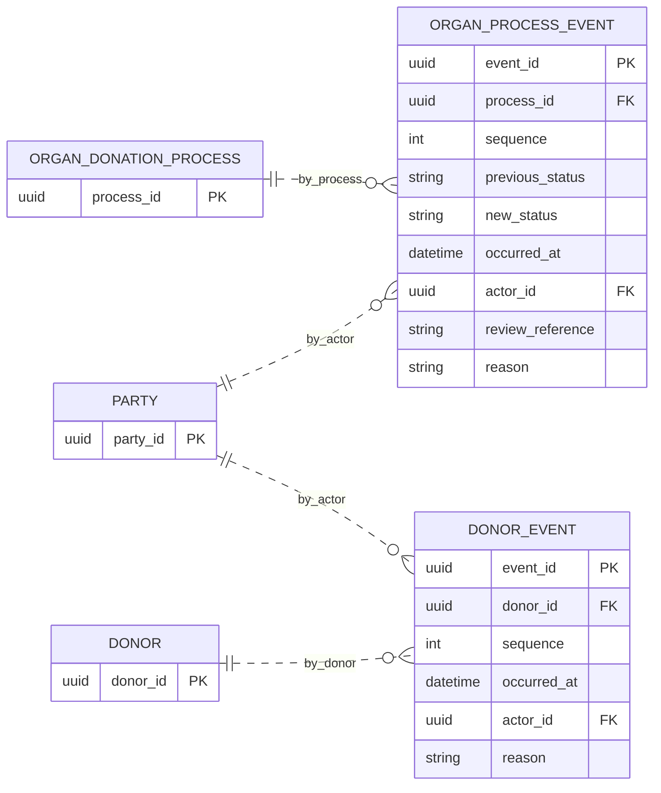
```mermaid
erDiagram
    direction LR
    organProcessEvent["ORGAN_PROCESS_EVENT"] {
        uuid event_id PK
        uuid process_id FK
        int sequence
        string previous_status
        string new_status
        datetime occurred_at
        uuid actor_id FK
        string review_reference
        string reason
    }
    donorEvent["DONOR_EVENT"] {
        uuid event_id PK
        uuid donor_id FK
        int sequence
        datetime occurred_at
        uuid actor_id FK
        string reason
    }
    organDonationProcess["ORGAN_DONATION_PROCESS"] {
        uuid process_id PK
    }
    party["PARTY"] {
        uuid party_id PK
    }
    donor["DONOR"] {
        uuid donor_id PK
    }
    organDonationProcess ||..o{ organProcessEvent : by_process
    party ||..o{ organProcessEvent : by_actor
    donor ||..o{ donorEvent : by_donor
    party ||..o{ donorEvent : by_actor
```

| Tabla | Claves candidatas | Referencias lógicas |
| --- | --- | --- |
| `ORGAN_PROCESS_EVENT` | `PK: (event_id); CK1: (process_id, sequence)` | `(process_id) → ORGAN_DONATION_PROCESS(process_id); (actor_id) → PARTY(party_id)` |
| `DONOR_EVENT` | `PK: (event_id); CK1: (donor_id, sequence)` | `(donor_id) → DONOR(donor_id); (actor_id) → PARTY(party_id)` |


<a id="domain-05"></a>

### 05 — Campañas y citas

#### Vista 1

Tablas desarrolladas: `CAMPAIGN`, `CAMPAIGN_SLOT`, `CAMPAIGN_CONDITION`, `SLOT_CONDITION`, `CAMPAIGN_EVENT`, `APPOINTMENT`. Las otras cajas muestran solo claves de referencia; su definición completa está en el dominio correspondiente.

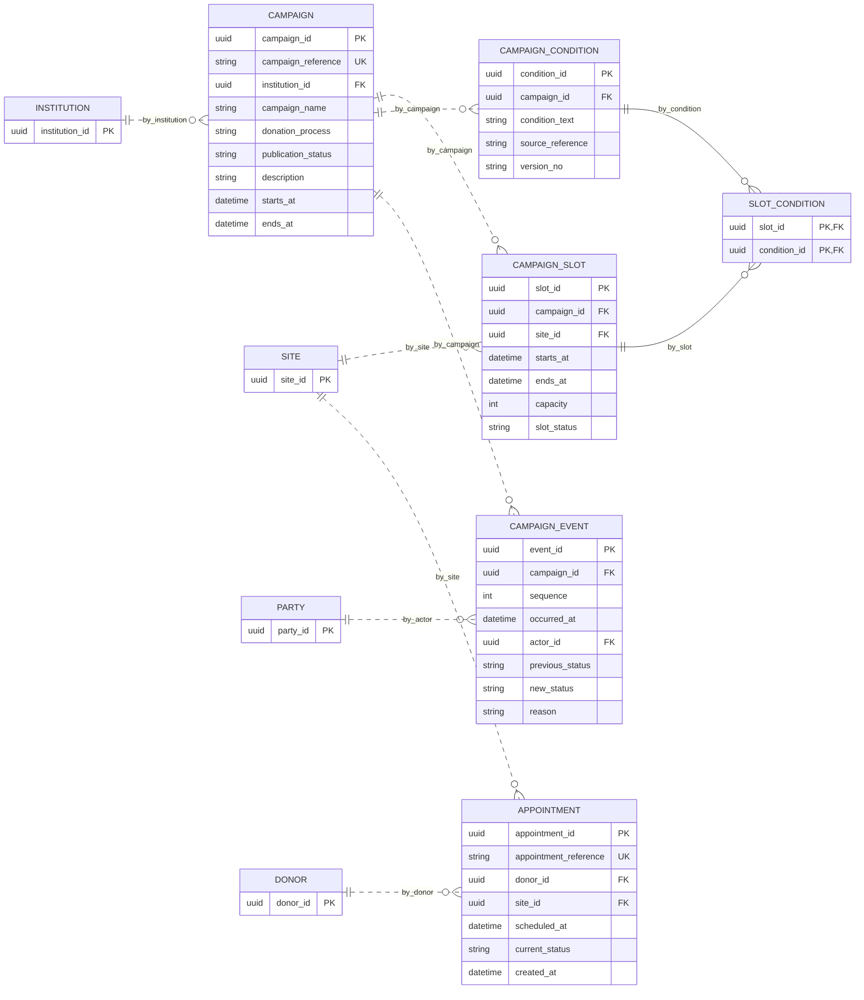
```mermaid
erDiagram
    direction LR
    campaign["CAMPAIGN"] {
        uuid campaign_id PK
        string campaign_reference UK
        uuid institution_id FK
        string campaign_name
        string donation_process
        string publication_status
        string description
        datetime starts_at
        datetime ends_at
    }
    campaignSlot["CAMPAIGN_SLOT"] {
        uuid slot_id PK
        uuid campaign_id FK
        uuid site_id FK
        datetime starts_at
        datetime ends_at
        int capacity
        string slot_status
    }
    campaignCondition["CAMPAIGN_CONDITION"] {
        uuid condition_id PK
        uuid campaign_id FK
        string condition_text
        string source_reference
        string version_no
    }
    slotCondition["SLOT_CONDITION"] {
        uuid slot_id PK, FK
        uuid condition_id PK, FK
    }
    campaignEvent["CAMPAIGN_EVENT"] {
        uuid event_id PK
        uuid campaign_id FK
        int sequence
        datetime occurred_at
        uuid actor_id FK
        string previous_status
        string new_status
        string reason
    }
    appointment["APPOINTMENT"] {
        uuid appointment_id PK
        string appointment_reference UK
        uuid donor_id FK
        uuid site_id FK
        datetime scheduled_at
        string current_status
        datetime created_at
    }
    institution["INSTITUTION"] {
        uuid institution_id PK
    }
    site["SITE"] {
        uuid site_id PK
    }
    party["PARTY"] {
        uuid party_id PK
    }
    donor["DONOR"] {
        uuid donor_id PK
    }
    institution ||..o{ campaign : by_institution
    campaign ||..o{ campaignSlot : by_campaign
    site ||..o{ campaignSlot : by_site
    campaign ||..o{ campaignCondition : by_campaign
    campaignSlot ||--o{ slotCondition : by_slot
    campaignCondition ||--o{ slotCondition : by_condition
    campaign ||..o{ campaignEvent : by_campaign
    party ||..o{ campaignEvent : by_actor
    donor ||..o{ appointment : by_donor
    site ||..o{ appointment : by_site
```

| Tabla | Claves candidatas | Referencias lógicas |
| --- | --- | --- |
| `CAMPAIGN` | `PK: (campaign_id); CK1: (campaign_reference)` | `(institution_id) → INSTITUTION(institution_id)` |
| `CAMPAIGN_SLOT` | `PK: (slot_id)` | `(campaign_id) → CAMPAIGN(campaign_id); (site_id) → SITE(site_id)` |
| `CAMPAIGN_CONDITION` | `PK: (condition_id)` | `(campaign_id) → CAMPAIGN(campaign_id)` |
| `SLOT_CONDITION` | `PK: (slot_id, condition_id)` | `(slot_id) → CAMPAIGN_SLOT(slot_id); (condition_id) → CAMPAIGN_CONDITION(condition_id)` |
| `CAMPAIGN_EVENT` | `PK: (event_id); CK1: (campaign_id, sequence)` | `(campaign_id) → CAMPAIGN(campaign_id); (actor_id) → PARTY(party_id)` |
| `APPOINTMENT` | `PK: (appointment_id); CK1: (appointment_reference)` | `(donor_id) → DONOR(donor_id); (site_id) → SITE(site_id)` |

#### Vista 2

Tablas desarrolladas: `APPOINTMENT_CAMPAIGN`, `APPOINTMENT_STATUS_EVENT`, `APPOINTMENT_RESCHEDULE`, `APPOINTMENT_NOTICE`. Las otras cajas muestran solo claves de referencia; su definición completa está en el dominio correspondiente.

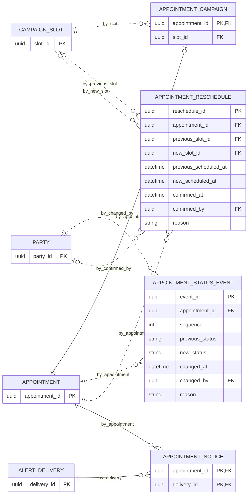
```mermaid
erDiagram
    direction LR
    appointmentCampaign["APPOINTMENT_CAMPAIGN"] {
        uuid appointment_id PK, FK
        uuid slot_id FK
    }
    appointmentStatusEvent["APPOINTMENT_STATUS_EVENT"] {
        uuid event_id PK
        uuid appointment_id FK
        int sequence
        string previous_status
        string new_status
        datetime changed_at
        uuid changed_by FK
        string reason
    }
    appointmentReschedule["APPOINTMENT_RESCHEDULE"] {
        uuid reschedule_id PK
        uuid appointment_id FK
        uuid previous_slot_id FK
        uuid new_slot_id FK
        datetime previous_scheduled_at
        datetime new_scheduled_at
        datetime confirmed_at
        uuid confirmed_by FK
        string reason
    }
    appointmentNotice["APPOINTMENT_NOTICE"] {
        uuid appointment_id PK, FK
        uuid delivery_id PK, FK
    }
    appointment["APPOINTMENT"] {
        uuid appointment_id PK
    }
    campaignSlot["CAMPAIGN_SLOT"] {
        uuid slot_id PK
    }
    party["PARTY"] {
        uuid party_id PK
    }
    alertDelivery["ALERT_DELIVERY"] {
        uuid delivery_id PK
    }
    appointment ||--o| appointmentCampaign : by_appointment
    campaignSlot ||..o{ appointmentCampaign : by_slot
    appointment ||..o{ appointmentStatusEvent : by_appointment
    party ||..o{ appointmentStatusEvent : by_changed_by
    appointment ||..o{ appointmentReschedule : by_appointment
    campaignSlot o|..o{ appointmentReschedule : by_previous_slot
    campaignSlot o|..o{ appointmentReschedule : by_new_slot
    party o|..o{ appointmentReschedule : by_confirmed_by
    appointment ||--o{ appointmentNotice : by_appointment
    alertDelivery ||--o{ appointmentNotice : by_delivery
```

| Tabla | Claves candidatas | Referencias lógicas |
| --- | --- | --- |
| `APPOINTMENT_CAMPAIGN` | `PK: (appointment_id)` | `(appointment_id) → APPOINTMENT(appointment_id); (slot_id) → CAMPAIGN_SLOT(slot_id)` |
| `APPOINTMENT_STATUS_EVENT` | `PK: (event_id); CK1: (appointment_id, sequence)` | `(appointment_id) → APPOINTMENT(appointment_id); (changed_by) → PARTY(party_id)` |
| `APPOINTMENT_RESCHEDULE` | `PK: (reschedule_id)` | `(appointment_id) → APPOINTMENT(appointment_id); (previous_slot_id) → CAMPAIGN_SLOT(slot_id) [opcional]; (new_slot_id) → CAMPAIGN_SLOT(slot_id) [opcional]; (confirmed_by) → PARTY(party_id) [opcional]` |
| `APPOINTMENT_NOTICE` | `PK: (appointment_id, delivery_id)` | `(appointment_id) → APPOINTMENT(appointment_id); (delivery_id) → ALERT_DELIVERY(delivery_id)` |


<a id="domain-06"></a>

### 06 — Receptores y necesidades

#### Vista 1

Tablas desarrolladas: `RECIPIENT`, `RECIPIENT_CONTACT`, `CARE_EPISODE`, `CARE_PROFESSIONAL`, `RECIPIENT_CONSENT`, `RECIPIENT_BLOOD_NEED`. Las otras cajas muestran solo claves de referencia; su definición completa está en el dominio correspondiente.

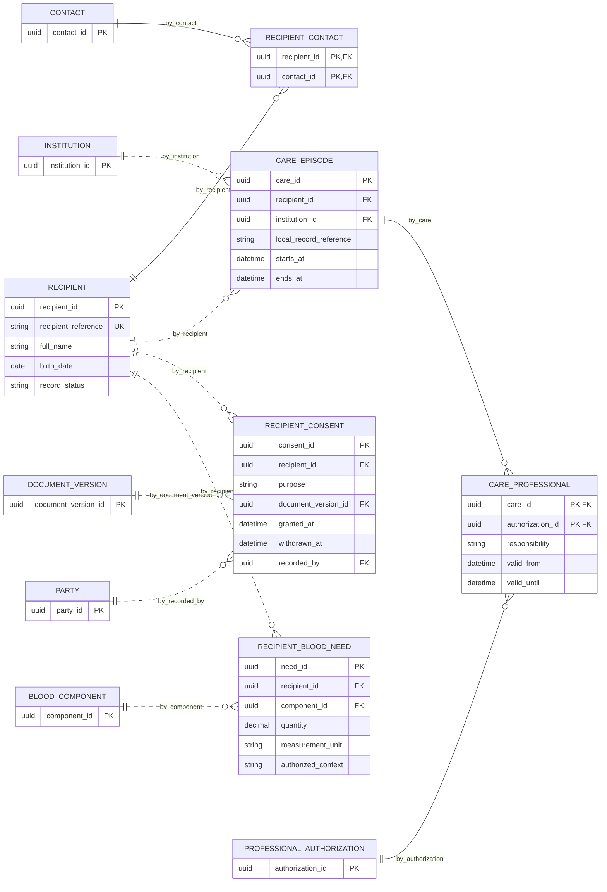
```mermaid
erDiagram
    direction LR
    recipient["RECIPIENT"] {
        uuid recipient_id PK
        string recipient_reference UK
        string full_name
        date birth_date
        string record_status
    }
    recipientContact["RECIPIENT_CONTACT"] {
        uuid recipient_id PK, FK
        uuid contact_id PK, FK
    }
    careEpisode["CARE_EPISODE"] {
        uuid care_id PK
        uuid recipient_id FK
        uuid institution_id FK
        string local_record_reference
        datetime starts_at
        datetime ends_at
    }
    careProfessional["CARE_PROFESSIONAL"] {
        uuid care_id PK, FK
        uuid authorization_id PK, FK
        string responsibility
        datetime valid_from
        datetime valid_until
    }
    recipientConsent["RECIPIENT_CONSENT"] {
        uuid consent_id PK
        uuid recipient_id FK
        string purpose
        uuid document_version_id FK
        datetime granted_at
        datetime withdrawn_at
        uuid recorded_by FK
    }
    recipientBloodNeed["RECIPIENT_BLOOD_NEED"] {
        uuid need_id PK
        uuid recipient_id FK
        uuid component_id FK
        decimal quantity
        string measurement_unit
        string authorized_context
    }
    contact["CONTACT"] {
        uuid contact_id PK
    }
    institution["INSTITUTION"] {
        uuid institution_id PK
    }
    professionalAuthorization["PROFESSIONAL_AUTHORIZATION"] {
        uuid authorization_id PK
    }
    documentVersion["DOCUMENT_VERSION"] {
        uuid document_version_id PK
    }
    party["PARTY"] {
        uuid party_id PK
    }
    bloodComponent["BLOOD_COMPONENT"] {
        uuid component_id PK
    }
    recipient ||--o{ recipientContact : by_recipient
    contact ||--o{ recipientContact : by_contact
    recipient ||..o{ careEpisode : by_recipient
    institution ||..o{ careEpisode : by_institution
    careEpisode ||--o{ careProfessional : by_care
    professionalAuthorization ||--o{ careProfessional : by_authorization
    recipient ||..o{ recipientConsent : by_recipient
    documentVersion ||..o{ recipientConsent : by_document_version
    party ||..o{ recipientConsent : by_recorded_by
    recipient ||..o{ recipientBloodNeed : by_recipient
    bloodComponent ||..o{ recipientBloodNeed : by_component
```

| Tabla | Claves candidatas | Referencias lógicas |
| --- | --- | --- |
| `RECIPIENT` | `PK: (recipient_id); CK1: (recipient_reference)` | `—` |
| `RECIPIENT_CONTACT` | `PK: (recipient_id, contact_id)` | `(recipient_id) → RECIPIENT(recipient_id); (contact_id) → CONTACT(contact_id)` |
| `CARE_EPISODE` | `PK: (care_id)` | `(recipient_id) → RECIPIENT(recipient_id); (institution_id) → INSTITUTION(institution_id)` |
| `CARE_PROFESSIONAL` | `PK: (care_id, authorization_id)` | `(care_id) → CARE_EPISODE(care_id); (authorization_id) → PROFESSIONAL_AUTHORIZATION(authorization_id)` |
| `RECIPIENT_CONSENT` | `PK: (consent_id)` | `(recipient_id) → RECIPIENT(recipient_id); (document_version_id) → DOCUMENT_VERSION(document_version_id); (recorded_by) → PARTY(party_id)` |
| `RECIPIENT_BLOOD_NEED` | `PK: (need_id)` | `(recipient_id) → RECIPIENT(recipient_id); (component_id) → BLOOD_COMPONENT(component_id)` |

#### Vista 2

Tablas desarrolladas: `ORGAN_WAITING_PROCESS`, `WAITING_EVENT`, `CARE_EVENT`. Las otras cajas muestran solo claves de referencia; su definición completa está en el dominio correspondiente.

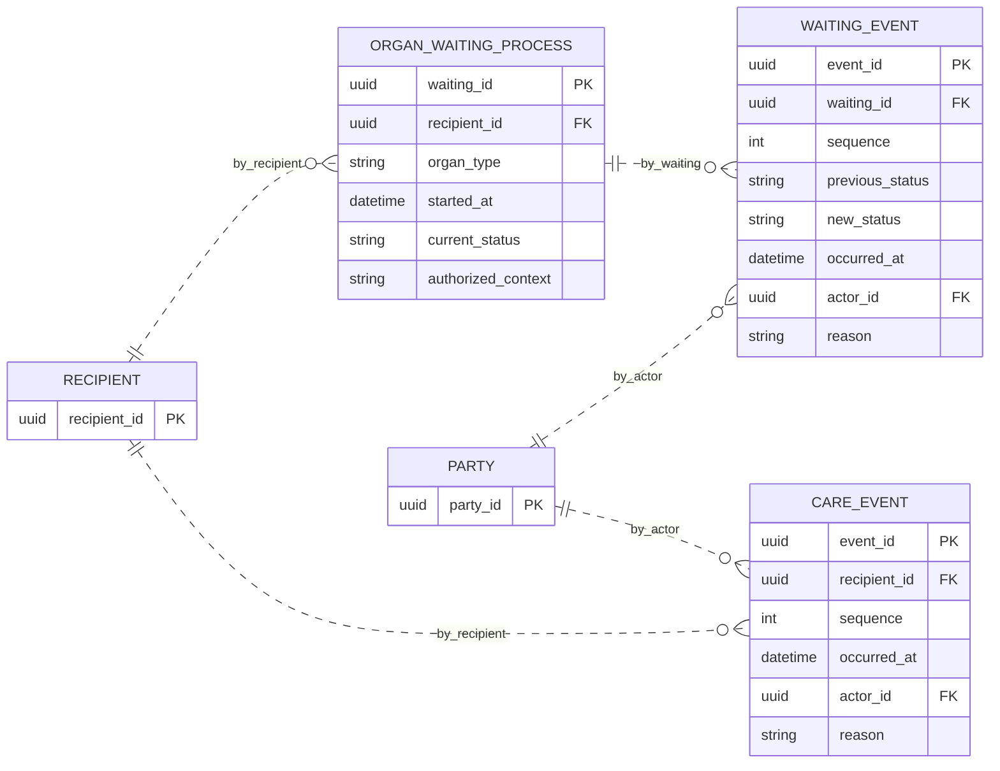
```mermaid
erDiagram
    direction LR
    organWaitingProcess["ORGAN_WAITING_PROCESS"] {
        uuid waiting_id PK
        uuid recipient_id FK
        string organ_type
        datetime started_at
        string current_status
        string authorized_context
    }
    waitingEvent["WAITING_EVENT"] {
        uuid event_id PK
        uuid waiting_id FK
        int sequence
        string previous_status
        string new_status
        datetime occurred_at
        uuid actor_id FK
        string reason
    }
    careEvent["CARE_EVENT"] {
        uuid event_id PK
        uuid recipient_id FK
        int sequence
        datetime occurred_at
        uuid actor_id FK
        string reason
    }
    recipient["RECIPIENT"] {
        uuid recipient_id PK
    }
    party["PARTY"] {
        uuid party_id PK
    }
    recipient ||..o{ organWaitingProcess : by_recipient
    organWaitingProcess ||..o{ waitingEvent : by_waiting
    party ||..o{ waitingEvent : by_actor
    recipient ||..o{ careEvent : by_recipient
    party ||..o{ careEvent : by_actor
```

| Tabla | Claves candidatas | Referencias lógicas |
| --- | --- | --- |
| `ORGAN_WAITING_PROCESS` | `PK: (waiting_id)` | `(recipient_id) → RECIPIENT(recipient_id)` |
| `WAITING_EVENT` | `PK: (event_id); CK1: (waiting_id, sequence)` | `(waiting_id) → ORGAN_WAITING_PROCESS(waiting_id); (actor_id) → PARTY(party_id)` |
| `CARE_EVENT` | `PK: (event_id); CK1: (recipient_id, sequence)` | `(recipient_id) → RECIPIENT(recipient_id); (actor_id) → PARTY(party_id)` |


<a id="domain-07"></a>

### 07 — Estudios, muestras y resultados

#### Vista 1

Tablas desarrolladas: `STUDY_SUBJECT`, `DONOR_SUBJECT`, `RECIPIENT_SUBJECT`, `RESOURCE_SUBJECT`, `SAMPLE`, `CLINICAL_TEST`. Las otras cajas muestran solo claves de referencia; su definición completa está en el dominio correspondiente.

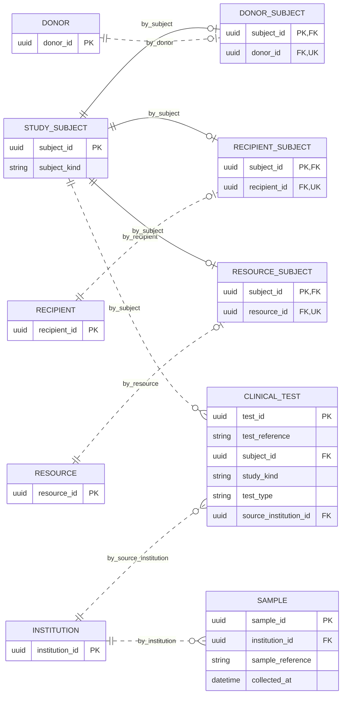
```mermaid
erDiagram
    direction LR
    studySubject["STUDY_SUBJECT"] {
        uuid subject_id PK
        string subject_kind
    }
    donorSubject["DONOR_SUBJECT"] {
        uuid subject_id PK, FK
        uuid donor_id FK, UK
    }
    recipientSubject["RECIPIENT_SUBJECT"] {
        uuid subject_id PK, FK
        uuid recipient_id FK, UK
    }
    resourceSubject["RESOURCE_SUBJECT"] {
        uuid subject_id PK, FK
        uuid resource_id FK, UK
    }
    sample["SAMPLE"] {
        uuid sample_id PK
        uuid institution_id FK
        string sample_reference
        datetime collected_at
    }
    clinicalTest["CLINICAL_TEST"] {
        uuid test_id PK
        string test_reference
        uuid subject_id FK
        string study_kind
        string test_type
        uuid source_institution_id FK
    }
    donor["DONOR"] {
        uuid donor_id PK
    }
    recipient["RECIPIENT"] {
        uuid recipient_id PK
    }
    resource["RESOURCE"] {
        uuid resource_id PK
    }
    institution["INSTITUTION"] {
        uuid institution_id PK
    }
    studySubject ||--o| donorSubject : by_subject
    donor ||..o| donorSubject : by_donor
    studySubject ||--o| recipientSubject : by_subject
    recipient ||..o| recipientSubject : by_recipient
    studySubject ||--o| resourceSubject : by_subject
    resource ||..o| resourceSubject : by_resource
    institution ||..o{ sample : by_institution
    studySubject ||..o{ clinicalTest : by_subject
    institution ||..o{ clinicalTest : by_source_institution
```

| Tabla | Claves candidatas | Referencias lógicas |
| --- | --- | --- |
| `STUDY_SUBJECT` | `PK: (subject_id)` | `—` |
| `DONOR_SUBJECT` | `PK: (subject_id); CK1: (donor_id)` | `(subject_id) → STUDY_SUBJECT(subject_id); (donor_id) → DONOR(donor_id)` |
| `RECIPIENT_SUBJECT` | `PK: (subject_id); CK1: (recipient_id)` | `(subject_id) → STUDY_SUBJECT(subject_id); (recipient_id) → RECIPIENT(recipient_id)` |
| `RESOURCE_SUBJECT` | `PK: (subject_id); CK1: (resource_id)` | `(subject_id) → STUDY_SUBJECT(subject_id); (resource_id) → RESOURCE(resource_id)` |
| `SAMPLE` | `PK: (sample_id); CK1: (institution_id, sample_reference)` | `(institution_id) → INSTITUTION(institution_id)` |
| `CLINICAL_TEST` | `PK: (test_id); CK1: (source_institution_id, test_reference)` | `(subject_id) → STUDY_SUBJECT(subject_id); (source_institution_id) → INSTITUTION(institution_id)` |

#### Vista 2

Tablas desarrolladas: `TEST_SAMPLE`, `TEST_REVISION`, `BLOOD_OBSERVATION`, `ORGAN_OBSERVATION`, `HLA_CALL`, `TEST_DOCUMENT`. Las otras cajas muestran solo claves de referencia; su definición completa está en el dominio correspondiente.

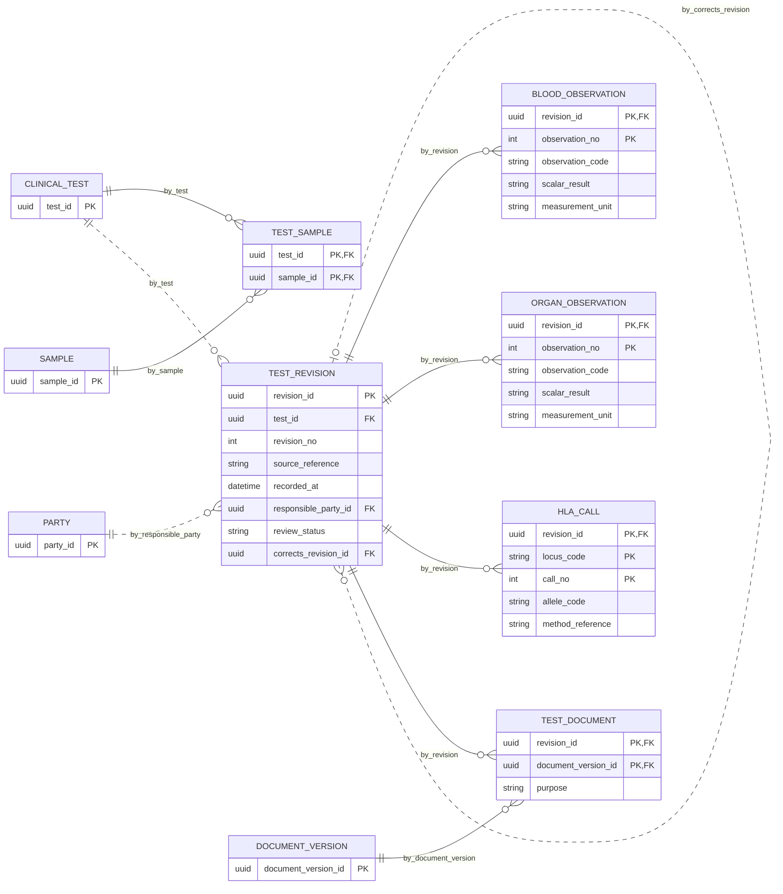
```mermaid
erDiagram
    direction LR
    testSample["TEST_SAMPLE"] {
        uuid test_id PK, FK
        uuid sample_id PK, FK
    }
    testRevision["TEST_REVISION"] {
        uuid revision_id PK
        uuid test_id FK
        int revision_no
        string source_reference
        datetime recorded_at
        uuid responsible_party_id FK
        string review_status
        uuid corrects_revision_id FK
    }
    bloodObservation["BLOOD_OBSERVATION"] {
        uuid revision_id PK, FK
        int observation_no PK
        string observation_code
        string scalar_result
        string measurement_unit
    }
    organObservation["ORGAN_OBSERVATION"] {
        uuid revision_id PK, FK
        int observation_no PK
        string observation_code
        string scalar_result
        string measurement_unit
    }
    hlaCall["HLA_CALL"] {
        uuid revision_id PK, FK
        string locus_code PK
        int call_no PK
        string allele_code
        string method_reference
    }
    testDocument["TEST_DOCUMENT"] {
        uuid revision_id PK, FK
        uuid document_version_id PK, FK
        string purpose
    }
    clinicalTest["CLINICAL_TEST"] {
        uuid test_id PK
    }
    sample["SAMPLE"] {
        uuid sample_id PK
    }
    party["PARTY"] {
        uuid party_id PK
    }
    documentVersion["DOCUMENT_VERSION"] {
        uuid document_version_id PK
    }
    clinicalTest ||--o{ testSample : by_test
    sample ||--o{ testSample : by_sample
    clinicalTest ||..o{ testRevision : by_test
    party ||..o{ testRevision : by_responsible_party
    testRevision o|..o{ testRevision : by_corrects_revision
    testRevision ||--o{ bloodObservation : by_revision
    testRevision ||--o{ organObservation : by_revision
    testRevision ||--o{ hlaCall : by_revision
    testRevision ||--o{ testDocument : by_revision
    documentVersion ||--o{ testDocument : by_document_version
```

| Tabla | Claves candidatas | Referencias lógicas |
| --- | --- | --- |
| `TEST_SAMPLE` | `PK: (test_id, sample_id)` | `(test_id) → CLINICAL_TEST(test_id); (sample_id) → SAMPLE(sample_id)` |
| `TEST_REVISION` | `PK: (revision_id); CK1: (test_id, revision_no)` | `(test_id) → CLINICAL_TEST(test_id); (responsible_party_id) → PARTY(party_id); (corrects_revision_id) → TEST_REVISION(revision_id) [opcional]` |
| `BLOOD_OBSERVATION` | `PK: (revision_id, observation_no)` | `(revision_id) → TEST_REVISION(revision_id)` |
| `ORGAN_OBSERVATION` | `PK: (revision_id, observation_no)` | `(revision_id) → TEST_REVISION(revision_id)` |
| `HLA_CALL` | `PK: (revision_id, locus_code, call_no)` | `(revision_id) → TEST_REVISION(revision_id)` |
| `TEST_DOCUMENT` | `PK: (revision_id, document_version_id)` | `(revision_id) → TEST_REVISION(revision_id); (document_version_id) → DOCUMENT_VERSION(document_version_id)` |


<a id="domain-08"></a>

### 08 — Recursos sanguíneos y órganos

#### Vista 1

Tablas desarrolladas: `RESOURCE`, `BLOOD_COMPONENT`, `COMPONENT_ATTRIBUTE`, `STORAGE_LOCATION`, `BLOOD_UNIT`, `BLOOD_ORIGIN`. Las otras cajas muestran solo claves de referencia; su definición completa está en el dominio correspondiente.

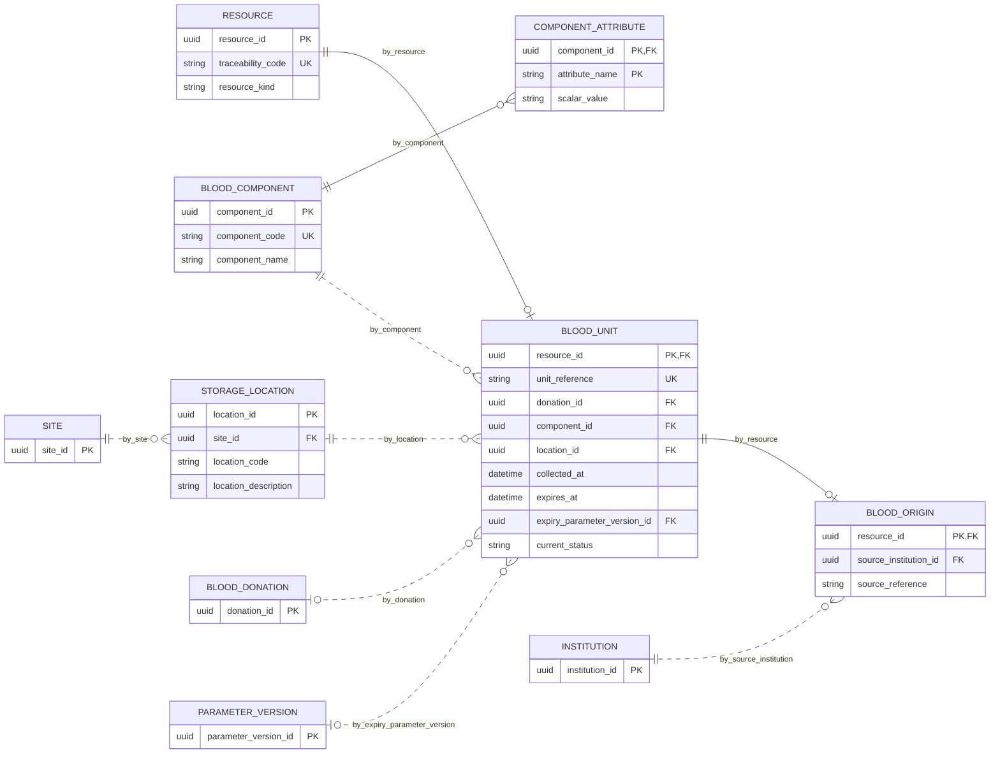
```mermaid
erDiagram
    direction LR
    resource["RESOURCE"] {
        uuid resource_id PK
        string traceability_code UK
        string resource_kind
    }
    bloodComponent["BLOOD_COMPONENT"] {
        uuid component_id PK
        string component_code UK
        string component_name
    }
    componentAttribute["COMPONENT_ATTRIBUTE"] {
        uuid component_id PK, FK
        string attribute_name PK
        string scalar_value
    }
    storageLocation["STORAGE_LOCATION"] {
        uuid location_id PK
        uuid site_id FK
        string location_code
        string location_description
    }
    bloodUnit["BLOOD_UNIT"] {
        uuid resource_id PK, FK
        string unit_reference UK
        uuid donation_id FK
        uuid component_id FK
        uuid location_id FK
        datetime collected_at
        datetime expires_at
        uuid expiry_parameter_version_id FK
        string current_status
    }
    bloodOrigin["BLOOD_ORIGIN"] {
        uuid resource_id PK, FK
        uuid source_institution_id FK
        string source_reference
    }
    site["SITE"] {
        uuid site_id PK
    }
    bloodDonation["BLOOD_DONATION"] {
        uuid donation_id PK
    }
    parameterVersion["PARAMETER_VERSION"] {
        uuid parameter_version_id PK
    }
    institution["INSTITUTION"] {
        uuid institution_id PK
    }
    bloodComponent ||--o{ componentAttribute : by_component
    site ||..o{ storageLocation : by_site
    resource ||--o| bloodUnit : by_resource
    bloodDonation o|..o{ bloodUnit : by_donation
    bloodComponent ||..o{ bloodUnit : by_component
    storageLocation ||..o{ bloodUnit : by_location
    parameterVersion o|..o{ bloodUnit : by_expiry_parameter_version
    bloodUnit ||--o| bloodOrigin : by_resource
    institution ||..o{ bloodOrigin : by_source_institution
```

| Tabla | Claves candidatas | Referencias lógicas |
| --- | --- | --- |
| `RESOURCE` | `PK: (resource_id); CK1: (traceability_code)` | `—` |
| `BLOOD_COMPONENT` | `PK: (component_id); CK1: (component_code)` | `—` |
| `COMPONENT_ATTRIBUTE` | `PK: (component_id, attribute_name)` | `(component_id) → BLOOD_COMPONENT(component_id)` |
| `STORAGE_LOCATION` | `PK: (location_id); CK1: (site_id, location_code)` | `(site_id) → SITE(site_id)` |
| `BLOOD_UNIT` | `PK: (resource_id); CK1: (unit_reference)` | `(resource_id) → RESOURCE(resource_id); (donation_id) → BLOOD_DONATION(donation_id) [opcional]; (component_id) → BLOOD_COMPONENT(component_id); (location_id) → STORAGE_LOCATION(location_id); (expiry_parameter_version_id) → PARAMETER_VERSION(parameter_version_id) [opcional]` |
| `BLOOD_ORIGIN` | `PK: (resource_id)` | `(resource_id) → BLOOD_UNIT(resource_id); (source_institution_id) → INSTITUTION(institution_id)` |

#### Vista 2

Tablas desarrolladas: `BLOOD_CLASSIFICATION`, `BLOOD_MOVEMENT`, `DOCUMENT_TEMPLATE_VERSION`, `LABEL_PRINT`, `ORGAN_AVAILABILITY`, `ORGAN_VIABILITY_RECORD`. Las otras cajas muestran solo claves de referencia; su definición completa está en el dominio correspondiente.

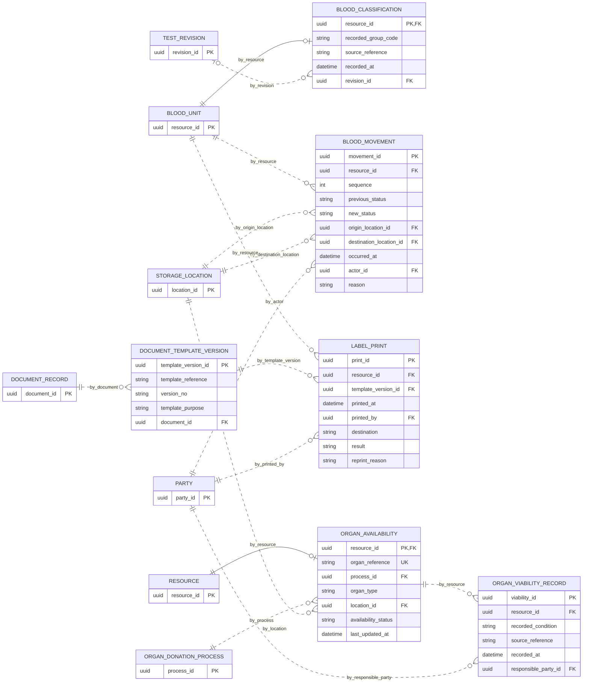
```mermaid
erDiagram
    direction LR
    bloodClassification["BLOOD_CLASSIFICATION"] {
        uuid resource_id PK, FK
        string recorded_group_code
        string source_reference
        datetime recorded_at
        uuid revision_id FK
    }
    bloodMovement["BLOOD_MOVEMENT"] {
        uuid movement_id PK
        uuid resource_id FK
        int sequence
        string previous_status
        string new_status
        uuid origin_location_id FK
        uuid destination_location_id FK
        datetime occurred_at
        uuid actor_id FK
        string reason
    }
    documentTemplateVersion["DOCUMENT_TEMPLATE_VERSION"] {
        uuid template_version_id PK
        string template_reference
        string version_no
        string template_purpose
        uuid document_id FK
    }
    labelPrint["LABEL_PRINT"] {
        uuid print_id PK
        uuid resource_id FK
        uuid template_version_id FK
        datetime printed_at
        uuid printed_by FK
        string destination
        string result
        string reprint_reason
    }
    organAvailability["ORGAN_AVAILABILITY"] {
        uuid resource_id PK, FK
        string organ_reference UK
        uuid process_id FK
        string organ_type
        uuid location_id FK
        string availability_status
        datetime last_updated_at
    }
    organViabilityRecord["ORGAN_VIABILITY_RECORD"] {
        uuid viability_id PK
        uuid resource_id FK
        string recorded_condition
        string source_reference
        datetime recorded_at
        uuid responsible_party_id FK
    }
    bloodUnit["BLOOD_UNIT"] {
        uuid resource_id PK
    }
    testRevision["TEST_REVISION"] {
        uuid revision_id PK
    }
    storageLocation["STORAGE_LOCATION"] {
        uuid location_id PK
    }
    party["PARTY"] {
        uuid party_id PK
    }
    documentRecord["DOCUMENT_RECORD"] {
        uuid document_id PK
    }
    resource["RESOURCE"] {
        uuid resource_id PK
    }
    organDonationProcess["ORGAN_DONATION_PROCESS"] {
        uuid process_id PK
    }
    bloodUnit ||--o| bloodClassification : by_resource
    testRevision o|..o{ bloodClassification : by_revision
    bloodUnit ||..o{ bloodMovement : by_resource
    storageLocation ||..o{ bloodMovement : by_origin_location
    storageLocation ||..o{ bloodMovement : by_destination_location
    party ||..o{ bloodMovement : by_actor
    documentRecord ||..o{ documentTemplateVersion : by_document
    bloodUnit ||..o{ labelPrint : by_resource
    documentTemplateVersion ||..o{ labelPrint : by_template_version
    party ||..o{ labelPrint : by_printed_by
    resource ||--o| organAvailability : by_resource
    organDonationProcess ||..o{ organAvailability : by_process
    storageLocation ||..o{ organAvailability : by_location
    organAvailability ||..o{ organViabilityRecord : by_resource
    party ||..o{ organViabilityRecord : by_responsible_party
```

| Tabla | Claves candidatas | Referencias lógicas |
| --- | --- | --- |
| `BLOOD_CLASSIFICATION` | `PK: (resource_id)` | `(resource_id) → BLOOD_UNIT(resource_id); (revision_id) → TEST_REVISION(revision_id) [opcional]` |
| `BLOOD_MOVEMENT` | `PK: (movement_id); CK1: (resource_id, sequence)` | `(resource_id) → BLOOD_UNIT(resource_id); (origin_location_id) → STORAGE_LOCATION(location_id); (destination_location_id) → STORAGE_LOCATION(location_id); (actor_id) → PARTY(party_id)` |
| `DOCUMENT_TEMPLATE_VERSION` | `PK: (template_version_id); CK1: (template_reference, version_no)` | `(document_id) → DOCUMENT_RECORD(document_id)` |
| `LABEL_PRINT` | `PK: (print_id)` | `(resource_id) → BLOOD_UNIT(resource_id); (template_version_id) → DOCUMENT_TEMPLATE_VERSION(template_version_id); (printed_by) → PARTY(party_id)` |
| `ORGAN_AVAILABILITY` | `PK: (resource_id); CK1: (organ_reference)` | `(resource_id) → RESOURCE(resource_id); (process_id) → ORGAN_DONATION_PROCESS(process_id); (location_id) → STORAGE_LOCATION(location_id)` |
| `ORGAN_VIABILITY_RECORD` | `PK: (viability_id)` | `(resource_id) → ORGAN_AVAILABILITY(resource_id); (responsible_party_id) → PARTY(party_id)` |

#### Vista 3

Tablas desarrolladas: `ORGAN_CURRENT_VIABILITY`, `ORGAN_AUTHORIZATION`, `ORGAN_EVENT`, `ORGAN_DOCUMENT`. Las otras cajas muestran solo claves de referencia; su definición completa está en el dominio correspondiente.

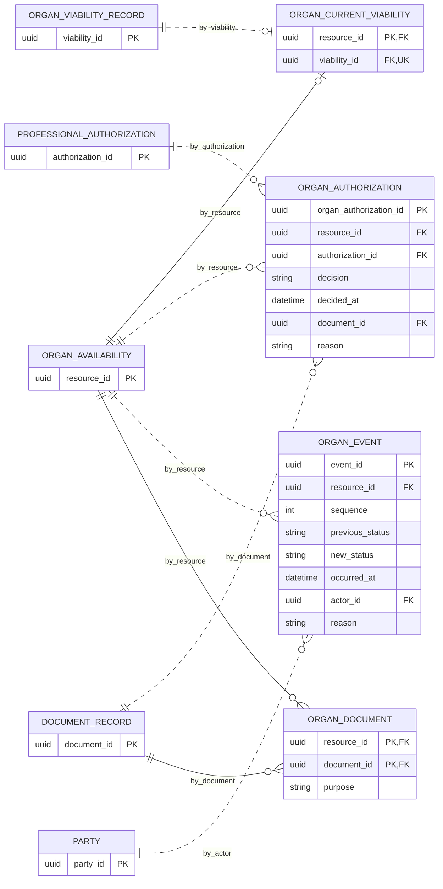
```mermaid
erDiagram
    direction LR
    organCurrentViability["ORGAN_CURRENT_VIABILITY"] {
        uuid resource_id PK, FK
        uuid viability_id FK, UK
    }
    organAuthorization["ORGAN_AUTHORIZATION"] {
        uuid organ_authorization_id PK
        uuid resource_id FK
        uuid authorization_id FK
        string decision
        datetime decided_at
        uuid document_id FK
        string reason
    }
    organEvent["ORGAN_EVENT"] {
        uuid event_id PK
        uuid resource_id FK
        int sequence
        string previous_status
        string new_status
        datetime occurred_at
        uuid actor_id FK
        string reason
    }
    organDocument["ORGAN_DOCUMENT"] {
        uuid resource_id PK, FK
        uuid document_id PK, FK
        string purpose
    }
    organAvailability["ORGAN_AVAILABILITY"] {
        uuid resource_id PK
    }
    organViabilityRecord["ORGAN_VIABILITY_RECORD"] {
        uuid viability_id PK
    }
    professionalAuthorization["PROFESSIONAL_AUTHORIZATION"] {
        uuid authorization_id PK
    }
    documentRecord["DOCUMENT_RECORD"] {
        uuid document_id PK
    }
    party["PARTY"] {
        uuid party_id PK
    }
    organAvailability ||--o| organCurrentViability : by_resource
    organViabilityRecord ||..o| organCurrentViability : by_viability
    organAvailability ||..o{ organAuthorization : by_resource
    professionalAuthorization ||..o{ organAuthorization : by_authorization
    documentRecord ||..o{ organAuthorization : by_document
    organAvailability ||..o{ organEvent : by_resource
    party ||..o{ organEvent : by_actor
    organAvailability ||--o{ organDocument : by_resource
    documentRecord ||--o{ organDocument : by_document
```

| Tabla | Claves candidatas | Referencias lógicas |
| --- | --- | --- |
| `ORGAN_CURRENT_VIABILITY` | `PK: (resource_id); CK1: (viability_id)` | `(resource_id) → ORGAN_AVAILABILITY(resource_id); (viability_id) → ORGAN_VIABILITY_RECORD(viability_id)` |
| `ORGAN_AUTHORIZATION` | `PK: (organ_authorization_id)` | `(resource_id) → ORGAN_AVAILABILITY(resource_id); (authorization_id) → PROFESSIONAL_AUTHORIZATION(authorization_id); (document_id) → DOCUMENT_RECORD(document_id)` |
| `ORGAN_EVENT` | `PK: (event_id); CK1: (resource_id, sequence)` | `(resource_id) → ORGAN_AVAILABILITY(resource_id); (actor_id) → PARTY(party_id)` |
| `ORGAN_DOCUMENT` | `PK: (resource_id, document_id)` | `(resource_id) → ORGAN_AVAILABILITY(resource_id); (document_id) → DOCUMENT_RECORD(document_id)` |


<a id="domain-09"></a>

### 09 — Solicitudes

#### Vista 1

Tablas desarrolladas: `RESOURCE_REQUEST`, `REQUEST_AUTHORSHIP`, `BLOOD_REQUIREMENT`, `ORGAN_REQUIREMENT`, `REQUEST_STUDY`, `REQUEST_URGENCY_EVENT`. Las otras cajas muestran solo claves de referencia; su definición completa está en el dominio correspondiente.

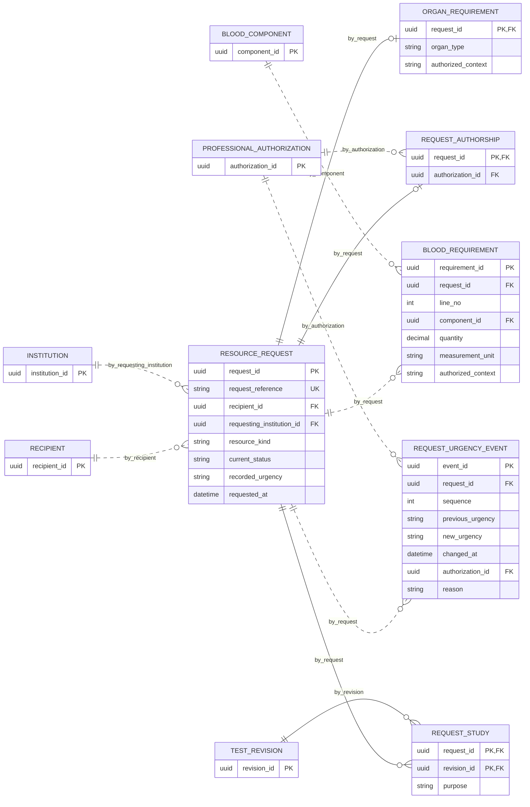
```mermaid
erDiagram
    direction LR
    resourceRequest["RESOURCE_REQUEST"] {
        uuid request_id PK
        string request_reference UK
        uuid recipient_id FK
        uuid requesting_institution_id FK
        string resource_kind
        string current_status
        string recorded_urgency
        datetime requested_at
    }
    requestAuthorship["REQUEST_AUTHORSHIP"] {
        uuid request_id PK, FK
        uuid authorization_id FK
    }
    bloodRequirement["BLOOD_REQUIREMENT"] {
        uuid requirement_id PK
        uuid request_id FK
        int line_no
        uuid component_id FK
        decimal quantity
        string measurement_unit
        string authorized_context
    }
    organRequirement["ORGAN_REQUIREMENT"] {
        uuid request_id PK, FK
        string organ_type
        string authorized_context
    }
    requestStudy["REQUEST_STUDY"] {
        uuid request_id PK, FK
        uuid revision_id PK, FK
        string purpose
    }
    requestUrgencyEvent["REQUEST_URGENCY_EVENT"] {
        uuid event_id PK
        uuid request_id FK
        int sequence
        string previous_urgency
        string new_urgency
        datetime changed_at
        uuid authorization_id FK
        string reason
    }
    recipient["RECIPIENT"] {
        uuid recipient_id PK
    }
    institution["INSTITUTION"] {
        uuid institution_id PK
    }
    professionalAuthorization["PROFESSIONAL_AUTHORIZATION"] {
        uuid authorization_id PK
    }
    bloodComponent["BLOOD_COMPONENT"] {
        uuid component_id PK
    }
    testRevision["TEST_REVISION"] {
        uuid revision_id PK
    }
    recipient ||..o{ resourceRequest : by_recipient
    institution ||..o{ resourceRequest : by_requesting_institution
    resourceRequest ||--o| requestAuthorship : by_request
    professionalAuthorization ||..o{ requestAuthorship : by_authorization
    resourceRequest ||..o{ bloodRequirement : by_request
    bloodComponent ||..o{ bloodRequirement : by_component
    resourceRequest ||--o| organRequirement : by_request
    resourceRequest ||--o{ requestStudy : by_request
    testRevision ||--o{ requestStudy : by_revision
    resourceRequest ||..o{ requestUrgencyEvent : by_request
    professionalAuthorization ||..o{ requestUrgencyEvent : by_authorization
```

| Tabla | Claves candidatas | Referencias lógicas |
| --- | --- | --- |
| `RESOURCE_REQUEST` | `PK: (request_id); CK1: (request_reference)` | `(recipient_id) → RECIPIENT(recipient_id); (requesting_institution_id) → INSTITUTION(institution_id)` |
| `REQUEST_AUTHORSHIP` | `PK: (request_id)` | `(request_id) → RESOURCE_REQUEST(request_id); (authorization_id) → PROFESSIONAL_AUTHORIZATION(authorization_id)` |
| `BLOOD_REQUIREMENT` | `PK: (requirement_id); CK1: (request_id, line_no)` | `(request_id) → RESOURCE_REQUEST(request_id); (component_id) → BLOOD_COMPONENT(component_id)` |
| `ORGAN_REQUIREMENT` | `PK: (request_id)` | `(request_id) → RESOURCE_REQUEST(request_id)` |
| `REQUEST_STUDY` | `PK: (request_id, revision_id)` | `(request_id) → RESOURCE_REQUEST(request_id); (revision_id) → TEST_REVISION(revision_id)` |
| `REQUEST_URGENCY_EVENT` | `PK: (event_id); CK1: (request_id, sequence)` | `(request_id) → RESOURCE_REQUEST(request_id); (authorization_id) → PROFESSIONAL_AUTHORIZATION(authorization_id)` |

#### Vista 2

Tablas desarrolladas: `REQUEST_STATUS_EVENT`. Las otras cajas muestran solo claves de referencia; su definición completa está en el dominio correspondiente.

```mermaid
erDiagram
    direction LR
    requestStatusEvent["REQUEST_STATUS_EVENT"] {
        uuid event_id PK
        uuid request_id FK
        int sequence
        string previous_status
        string new_status
        datetime changed_at
        uuid actor_id FK
        string reason
    }
    resourceRequest["RESOURCE_REQUEST"] {
        uuid request_id PK
    }
    party["PARTY"] {
        uuid party_id PK
    }
    resourceRequest ||..o{ requestStatusEvent : by_request
    party ||..o{ requestStatusEvent : by_actor
```

| Tabla | Claves candidatas | Referencias lógicas |
| --- | --- | --- |
| `REQUEST_STATUS_EVENT` | `PK: (event_id); CK1: (request_id, sequence)` | `(request_id) → RESOURCE_REQUEST(request_id); (actor_id) → PARTY(party_id)` |


<a id="domain-10"></a>

### 10 — Evaluaciones reproducibles

#### Vista 1

Tablas desarrolladas: `CANDIDATE_ASSESSMENT`, `ASSESSMENT_RULE`, `ASSESSMENT_INPUT`, `ASSESSMENT_ISSUE`, `ASSESSMENT_CANDIDATE`, `CANDIDATE_COMPATIBILITY`. Las otras cajas muestran solo claves de referencia; su definición completa está en el dominio correspondiente.

```mermaid
erDiagram
    direction LR
    candidateAssessment["CANDIDATE_ASSESSMENT"] {
        uuid assessment_id PK
        string assessment_reference UK
        uuid request_id FK
        uuid requesting_grant_id FK
        string assessment_status
        datetime generated_at
    }
    assessmentRule["ASSESSMENT_RULE"] {
        uuid assessment_id PK, FK
        uuid rule_version_id PK, FK
    }
    assessmentInput["ASSESSMENT_INPUT"] {
        uuid input_id PK
        uuid assessment_id FK
        int input_no
        string input_name
        string scalar_value
        string measurement_unit
        string source_record_type
        string source_record_reference
        string source_version
        datetime captured_at
    }
    assessmentIssue["ASSESSMENT_ISSUE"] {
        uuid issue_id PK
        uuid assessment_id FK
        int issue_no
        string field_name
        string issue_kind
        string explanation
    }
    assessmentCandidate["ASSESSMENT_CANDIDATE"] {
        uuid candidate_id PK
        uuid assessment_id FK
        int candidate_no
        uuid resource_id FK
        int ranking_position
        string explanation
    }
    candidateCompatibility["CANDIDATE_COMPATIBILITY"] {
        uuid candidate_id PK, FK
        string criterion_code PK
        string scalar_result
        uuid source_revision_id FK
        string explanation
    }
    resourceRequest["RESOURCE_REQUEST"] {
        uuid request_id PK
    }
    accessGrant["ACCESS_GRANT"] {
        uuid grant_id PK
    }
    ruleVersion["RULE_VERSION"] {
        uuid rule_version_id PK
    }
    resource["RESOURCE"] {
        uuid resource_id PK
    }
    testRevision["TEST_REVISION"] {
        uuid revision_id PK
    }
    resourceRequest ||..o{ candidateAssessment : by_request
    accessGrant ||..o{ candidateAssessment : by_requesting_grant
    candidateAssessment ||--o{ assessmentRule : by_assessment
    ruleVersion ||--o{ assessmentRule : by_rule_version
    candidateAssessment ||..o{ assessmentInput : by_assessment
    candidateAssessment ||..o{ assessmentIssue : by_assessment
    candidateAssessment ||..o{ assessmentCandidate : by_assessment
    resource ||..o{ assessmentCandidate : by_resource
    assessmentCandidate ||--o{ candidateCompatibility : by_candidate
    testRevision o|..o{ candidateCompatibility : by_source_revision
```

| Tabla | Claves candidatas | Referencias lógicas |
| --- | --- | --- |
| `CANDIDATE_ASSESSMENT` | `PK: (assessment_id); CK1: (assessment_reference)` | `(request_id) → RESOURCE_REQUEST(request_id); (requesting_grant_id) → ACCESS_GRANT(grant_id)` |
| `ASSESSMENT_RULE` | `PK: (assessment_id, rule_version_id)` | `(assessment_id) → CANDIDATE_ASSESSMENT(assessment_id); (rule_version_id) → RULE_VERSION(rule_version_id)` |
| `ASSESSMENT_INPUT` | `PK: (input_id); CK1: (assessment_id, input_no)` | `(assessment_id) → CANDIDATE_ASSESSMENT(assessment_id)` |
| `ASSESSMENT_ISSUE` | `PK: (issue_id); CK1: (assessment_id, issue_no)` | `(assessment_id) → CANDIDATE_ASSESSMENT(assessment_id)` |
| `ASSESSMENT_CANDIDATE` | `PK: (candidate_id); CK1: (assessment_id, candidate_no); CK2: (assessment_id, resource_id)` | `(assessment_id) → CANDIDATE_ASSESSMENT(assessment_id); (resource_id) → RESOURCE(resource_id)` |
| `CANDIDATE_COMPATIBILITY` | `PK: (candidate_id, criterion_code)` | `(candidate_id) → ASSESSMENT_CANDIDATE(candidate_id); (source_revision_id) → TEST_REVISION(revision_id) [opcional]` |

#### Vista 2

Tablas desarrolladas: `CANDIDATE_FACTOR`, `CANDIDATE_GEOGRAPHY`, `CANDIDATE_ISSUE`, `CANDIDATE_REVIEW`, `REVIEW_EVIDENCE`. Las otras cajas muestran solo claves de referencia; su definición completa está en el dominio correspondiente.

```mermaid
erDiagram
    direction LR
    candidateFactor["CANDIDATE_FACTOR"] {
        uuid candidate_id PK, FK
        string factor_name PK
        decimal factor_value
        string measurement_unit
        decimal applied_weight
        string source_reference
        uuid rule_version_id FK
    }
    candidateGeography["CANDIDATE_GEOGRAPHY"] {
        uuid candidate_id PK, FK
        uuid origin_site_id FK
        uuid destination_site_id FK
        decimal distance_km
        decimal duration_minutes
        string source_reference
        datetime calculated_at
        string limitations
    }
    candidateIssue["CANDIDATE_ISSUE"] {
        uuid candidate_id PK, FK
        int issue_no PK
        string field_name
        string explanation
    }
    candidateReview["CANDIDATE_REVIEW"] {
        uuid review_id PK
        uuid candidate_id FK
        uuid authorization_id FK
        string decision
        string reason
        datetime reviewed_at
    }
    reviewEvidence["REVIEW_EVIDENCE"] {
        uuid review_id PK, FK
        uuid document_version_id PK, FK
    }
    assessmentCandidate["ASSESSMENT_CANDIDATE"] {
        uuid candidate_id PK
    }
    ruleVersion["RULE_VERSION"] {
        uuid rule_version_id PK
    }
    site["SITE"] {
        uuid site_id PK
    }
    professionalAuthorization["PROFESSIONAL_AUTHORIZATION"] {
        uuid authorization_id PK
    }
    documentVersion["DOCUMENT_VERSION"] {
        uuid document_version_id PK
    }
    assessmentCandidate ||--o{ candidateFactor : by_candidate
    ruleVersion ||..o{ candidateFactor : by_rule_version
    assessmentCandidate ||--o| candidateGeography : by_candidate
    site ||..o{ candidateGeography : by_origin_site
    site ||..o{ candidateGeography : by_destination_site
    assessmentCandidate ||--o{ candidateIssue : by_candidate
    assessmentCandidate ||..o{ candidateReview : by_candidate
    professionalAuthorization ||..o{ candidateReview : by_authorization
    candidateReview ||--o{ reviewEvidence : by_review
    documentVersion ||--o{ reviewEvidence : by_document_version
```

| Tabla | Claves candidatas | Referencias lógicas |
| --- | --- | --- |
| `CANDIDATE_FACTOR` | `PK: (candidate_id, factor_name)` | `(candidate_id) → ASSESSMENT_CANDIDATE(candidate_id); (rule_version_id) → RULE_VERSION(rule_version_id)` |
| `CANDIDATE_GEOGRAPHY` | `PK: (candidate_id)` | `(candidate_id) → ASSESSMENT_CANDIDATE(candidate_id); (origin_site_id) → SITE(site_id); (destination_site_id) → SITE(site_id)` |
| `CANDIDATE_ISSUE` | `PK: (candidate_id, issue_no)` | `(candidate_id) → ASSESSMENT_CANDIDATE(candidate_id)` |
| `CANDIDATE_REVIEW` | `PK: (review_id)` | `(candidate_id) → ASSESSMENT_CANDIDATE(candidate_id); (authorization_id) → PROFESSIONAL_AUTHORIZATION(authorization_id)` |
| `REVIEW_EVIDENCE` | `PK: (review_id, document_version_id)` | `(review_id) → CANDIDATE_REVIEW(review_id); (document_version_id) → DOCUMENT_VERSION(document_version_id)` |


<a id="domain-11"></a>

### 11 — Reserva y asignación humana

#### Vista 1

Tablas desarrolladas: `ALLOCATION`, `ALLOCATION_ASSESSMENT`, `ALLOCATION_AUTHORIZATION`, `ALLOCATION_EVIDENCE`, `ALLOCATION_EVENT`, `ALLOCATION_OPERATION`. Las otras cajas muestran solo claves de referencia; su definición completa está en el dominio correspondiente.

```mermaid
erDiagram
    direction LR
    allocation["ALLOCATION"] {
        uuid allocation_id PK
        string allocation_reference UK
        uuid request_id FK
        uuid resource_id FK
        string operation_type
        string allocation_status
        datetime reservation_starts_at
        datetime reservation_ends_at
        datetime created_at
    }
    allocationAssessment["ALLOCATION_ASSESSMENT"] {
        uuid allocation_id PK, FK
        uuid candidate_id FK
    }
    allocationAuthorization["ALLOCATION_AUTHORIZATION"] {
        uuid allocation_authorization_id PK
        uuid allocation_id FK
        uuid authorization_id FK
        string decision
        datetime decided_at
        string reason
    }
    allocationEvidence["ALLOCATION_EVIDENCE"] {
        uuid allocation_authorization_id PK, FK
        uuid document_version_id PK, FK
    }
    allocationEvent["ALLOCATION_EVENT"] {
        uuid event_id PK
        uuid allocation_id FK
        int sequence
        string previous_status
        string new_status
        datetime occurred_at
        uuid actor_id FK
        string reason
    }
    allocationOperation["ALLOCATION_OPERATION"] {
        uuid operation_id PK, FK
        uuid allocation_id FK
    }
    resourceRequest["RESOURCE_REQUEST"] {
        uuid request_id PK
    }
    resource["RESOURCE"] {
        uuid resource_id PK
    }
    assessmentCandidate["ASSESSMENT_CANDIDATE"] {
        uuid candidate_id PK
    }
    professionalAuthorization["PROFESSIONAL_AUTHORIZATION"] {
        uuid authorization_id PK
    }
    documentVersion["DOCUMENT_VERSION"] {
        uuid document_version_id PK
    }
    party["PARTY"] {
        uuid party_id PK
    }
    syncOperation["SYNC_OPERATION"] {
        uuid operation_id PK
    }
    resourceRequest ||..o{ allocation : by_request
    resource ||..o{ allocation : by_resource
    allocation ||--o| allocationAssessment : by_allocation
    assessmentCandidate ||..o{ allocationAssessment : by_candidate
    allocation ||..o{ allocationAuthorization : by_allocation
    professionalAuthorization ||..o{ allocationAuthorization : by_authorization
    allocationAuthorization ||--o{ allocationEvidence : by_allocation_authorization
    documentVersion ||--o{ allocationEvidence : by_document_version
    allocation ||..o{ allocationEvent : by_allocation
    party ||..o{ allocationEvent : by_actor
    syncOperation ||--o| allocationOperation : by_operation
    allocation ||..o{ allocationOperation : by_allocation
```

| Tabla | Claves candidatas | Referencias lógicas |
| --- | --- | --- |
| `ALLOCATION` | `PK: (allocation_id); CK1: (allocation_reference)` | `(request_id) → RESOURCE_REQUEST(request_id); (resource_id) → RESOURCE(resource_id)` |
| `ALLOCATION_ASSESSMENT` | `PK: (allocation_id)` | `(allocation_id) → ALLOCATION(allocation_id); (candidate_id) → ASSESSMENT_CANDIDATE(candidate_id)` |
| `ALLOCATION_AUTHORIZATION` | `PK: (allocation_authorization_id)` | `(allocation_id) → ALLOCATION(allocation_id); (authorization_id) → PROFESSIONAL_AUTHORIZATION(authorization_id)` |
| `ALLOCATION_EVIDENCE` | `PK: (allocation_authorization_id, document_version_id)` | `(allocation_authorization_id) → ALLOCATION_AUTHORIZATION(allocation_authorization_id); (document_version_id) → DOCUMENT_VERSION(document_version_id)` |
| `ALLOCATION_EVENT` | `PK: (event_id); CK1: (allocation_id, sequence)` | `(allocation_id) → ALLOCATION(allocation_id); (actor_id) → PARTY(party_id)` |
| `ALLOCATION_OPERATION` | `PK: (operation_id)` | `(operation_id) → SYNC_OPERATION(operation_id); (allocation_id) → ALLOCATION(allocation_id)` |

#### Vista 2

Tablas desarrolladas: `ALLOCATION_ATTEMPT`. Las otras cajas muestran solo claves de referencia; su definición completa está en el dominio correspondiente.

```mermaid
erDiagram
    direction LR
    allocationAttempt["ALLOCATION_ATTEMPT"] {
        uuid attempt_id PK
        uuid operation_id FK
        int attempt_no
        datetime attempted_at
        string attempt_result
    }
    allocationOperation["ALLOCATION_OPERATION"] {
        uuid operation_id PK
    }
    allocationOperation ||..o{ allocationAttempt : by_operation
```

| Tabla | Claves candidatas | Referencias lógicas |
| --- | --- | --- |
| `ALLOCATION_ATTEMPT` | `PK: (attempt_id); CK1: (operation_id, attempt_no)` | `(operation_id) → ALLOCATION_OPERATION(operation_id)` |


<a id="domain-12"></a>

### 12 — Traslado y cadena de custodia

#### Vista 1

Tablas desarrolladas: `TRANSFER_ORDER`, `TRANSFER_STAFF`, `ROUTE_OPTION`, `ROUTE_SELECTION`, `SCAN_CHECK`, `CUSTODY_EVENT`. Las otras cajas muestran solo claves de referencia; su definición completa está en el dominio correspondiente.

```mermaid
erDiagram
    direction LR
    transferOrder["TRANSFER_ORDER"] {
        uuid transfer_id PK
        string transfer_reference UK
        uuid allocation_id FK
        uuid origin_site_id FK
        uuid destination_site_id FK
        string transfer_status
        datetime planned_collection_at
        datetime planned_delivery_at
        datetime collected_at
        datetime delivered_at
        datetime created_at
    }
    transferStaff["TRANSFER_STAFF"] {
        uuid assignment_id PK
        uuid transfer_id FK
        uuid party_id FK
        string responsibility
        datetime valid_from
        datetime valid_until
    }
    routeOption["ROUTE_OPTION"] {
        uuid route_id PK
        uuid transfer_id FK
        int option_no
        decimal origin_latitude
        decimal origin_longitude
        decimal destination_latitude
        decimal destination_longitude
        decimal distance_km
        decimal duration_minutes
        string source_reference
        datetime calculated_at
        string limitations
    }
    routeSelection["ROUTE_SELECTION"] {
        uuid selection_id PK
        uuid route_id FK
        datetime selected_at
        uuid selected_by FK
        string reason
    }
    scanCheck["SCAN_CHECK"] {
        uuid scan_id PK
        uuid transfer_id FK
        string expected_event
        string scanned_code
        uuid actor_id FK
        datetime occurred_at
        string result
    }
    custodyEvent["CUSTODY_EVENT"] {
        uuid event_id PK
        uuid transfer_id FK
        int sequence
        uuid operation_id FK, UK
        string event_type
        datetime occurred_at
        uuid previous_custodian_id FK
        uuid new_custodian_id FK
        uuid recorded_by FK
        string condition_report
        decimal latitude
        decimal longitude
        uuid corrects_event_id FK
    }
    allocation["ALLOCATION"] {
        uuid allocation_id PK
    }
    site["SITE"] {
        uuid site_id PK
    }
    party["PARTY"] {
        uuid party_id PK
    }
    syncOperation["SYNC_OPERATION"] {
        uuid operation_id PK
    }
    allocation ||..o{ transferOrder : by_allocation
    site ||..o{ transferOrder : by_origin_site
    site ||..o{ transferOrder : by_destination_site
    transferOrder ||..o{ transferStaff : by_transfer
    party ||..o{ transferStaff : by_party
    transferOrder ||..o{ routeOption : by_transfer
    routeOption ||..o{ routeSelection : by_route
    party ||..o{ routeSelection : by_selected_by
    transferOrder ||..o{ scanCheck : by_transfer
    party ||..o{ scanCheck : by_actor
    transferOrder ||..o{ custodyEvent : by_transfer
    syncOperation ||..o| custodyEvent : by_operation
    party o|..o{ custodyEvent : by_previous_custodian
    party ||..o{ custodyEvent : by_new_custodian
    party ||..o{ custodyEvent : by_recorded_by
    custodyEvent o|..o{ custodyEvent : by_corrects_event
```

| Tabla | Claves candidatas | Referencias lógicas |
| --- | --- | --- |
| `TRANSFER_ORDER` | `PK: (transfer_id); CK1: (transfer_reference)` | `(allocation_id) → ALLOCATION(allocation_id); (origin_site_id) → SITE(site_id); (destination_site_id) → SITE(site_id)` |
| `TRANSFER_STAFF` | `PK: (assignment_id)` | `(transfer_id) → TRANSFER_ORDER(transfer_id); (party_id) → PARTY(party_id)` |
| `ROUTE_OPTION` | `PK: (route_id); CK1: (transfer_id, option_no)` | `(transfer_id) → TRANSFER_ORDER(transfer_id)` |
| `ROUTE_SELECTION` | `PK: (selection_id)` | `(route_id) → ROUTE_OPTION(route_id); (selected_by) → PARTY(party_id)` |
| `SCAN_CHECK` | `PK: (scan_id)` | `(transfer_id) → TRANSFER_ORDER(transfer_id); (actor_id) → PARTY(party_id)` |
| `CUSTODY_EVENT` | `PK: (event_id); CK1: (transfer_id, sequence); CK2: (operation_id)` | `(transfer_id) → TRANSFER_ORDER(transfer_id); (operation_id) → SYNC_OPERATION(operation_id); (previous_custodian_id) → PARTY(party_id) [opcional]; (new_custodian_id) → PARTY(party_id); (recorded_by) → PARTY(party_id); (corrects_event_id) → CUSTODY_EVENT(event_id) [opcional]` |

#### Vista 2

Tablas desarrolladas: `CAPTURE_AUTHORIZATION`, `CUSTODY_EVIDENCE`, `TRANSFER_INCIDENT`, `INCIDENT_ACTION`, `TRANSFER_SYNC`, `TRANSFER_CONTACT`. Las otras cajas muestran solo claves de referencia; su definición completa está en el dominio correspondiente.

```mermaid
erDiagram
    direction LR
    captureAuthorization["CAPTURE_AUTHORIZATION"] {
        uuid capture_authorization_id PK
        uuid transfer_id FK
        uuid party_id FK
        string purpose
        datetime valid_from
        datetime valid_until
        uuid authorized_by FK
    }
    custodyEvidence["CUSTODY_EVIDENCE"] {
        uuid event_id PK, FK
        uuid document_version_id PK, FK
        uuid capture_authorization_id FK
        datetime captured_at
    }
    transferIncident["TRANSFER_INCIDENT"] {
        uuid incident_id PK
        uuid transfer_id FK
        datetime occurred_at
        string description
        string outcome
    }
    incidentAction["INCIDENT_ACTION"] {
        uuid action_id PK
        uuid incident_id FK
        uuid actor_id FK
        datetime acted_at
        string action_note
        string result
    }
    transferSync["TRANSFER_SYNC"] {
        uuid operation_id PK, FK
        uuid transfer_id FK
    }
    transferContact["TRANSFER_CONTACT"] {
        uuid transfer_id PK, FK
        uuid contact_id PK, FK
        string contact_purpose PK
    }
    transferOrder["TRANSFER_ORDER"] {
        uuid transfer_id PK
    }
    party["PARTY"] {
        uuid party_id PK
    }
    custodyEvent["CUSTODY_EVENT"] {
        uuid event_id PK
    }
    documentVersion["DOCUMENT_VERSION"] {
        uuid document_version_id PK
    }
    syncOperation["SYNC_OPERATION"] {
        uuid operation_id PK
    }
    contact["CONTACT"] {
        uuid contact_id PK
    }
    transferOrder ||..o{ captureAuthorization : by_transfer
    party ||..o{ captureAuthorization : by_party
    party ||..o{ captureAuthorization : by_authorized_by
    custodyEvent ||--o{ custodyEvidence : by_event
    documentVersion ||--o{ custodyEvidence : by_document_version
    captureAuthorization ||..o{ custodyEvidence : by_capture_authorization
    transferOrder ||..o{ transferIncident : by_transfer
    transferIncident ||..o{ incidentAction : by_incident
    party ||..o{ incidentAction : by_actor
    transferOrder ||..o{ transferSync : by_transfer
    syncOperation ||--o| transferSync : by_operation
    transferOrder ||--o{ transferContact : by_transfer
    contact ||--o{ transferContact : by_contact
```

| Tabla | Claves candidatas | Referencias lógicas |
| --- | --- | --- |
| `CAPTURE_AUTHORIZATION` | `PK: (capture_authorization_id)` | `(transfer_id) → TRANSFER_ORDER(transfer_id); (party_id) → PARTY(party_id); (authorized_by) → PARTY(party_id)` |
| `CUSTODY_EVIDENCE` | `PK: (event_id, document_version_id)` | `(event_id) → CUSTODY_EVENT(event_id); (document_version_id) → DOCUMENT_VERSION(document_version_id); (capture_authorization_id) → CAPTURE_AUTHORIZATION(capture_authorization_id)` |
| `TRANSFER_INCIDENT` | `PK: (incident_id)` | `(transfer_id) → TRANSFER_ORDER(transfer_id)` |
| `INCIDENT_ACTION` | `PK: (action_id)` | `(incident_id) → TRANSFER_INCIDENT(incident_id); (actor_id) → PARTY(party_id)` |
| `TRANSFER_SYNC` | `PK: (operation_id)` | `(transfer_id) → TRANSFER_ORDER(transfer_id); (operation_id) → SYNC_OPERATION(operation_id)` |
| `TRANSFER_CONTACT` | `PK: (transfer_id, contact_id, contact_purpose)` | `(transfer_id) → TRANSFER_ORDER(transfer_id); (contact_id) → CONTACT(contact_id)` |


<a id="domain-13"></a>

### 13 — Pronóstico y balanceo

#### Vista 1

Tablas desarrolladas: `METHOD_VERSION`, `INVENTORY_ANALYSIS`, `ANALYSIS_INSTITUTION`, `INVENTORY_INPUT`, `EXPIRY_FORECAST`, `BALANCING_PROPOSAL`. Las otras cajas muestran solo claves de referencia; su definición completa está en el dominio correspondiente.

```mermaid
erDiagram
    direction LR
    methodVersion["METHOD_VERSION"] {
        uuid method_version_id PK
        string method_reference
        string version_no
        string purpose
        string limitations
    }
    inventoryAnalysis["INVENTORY_ANALYSIS"] {
        uuid analysis_id PK
        string analysis_reference UK
        string analysis_type
        string analysis_status
        uuid method_version_id FK
        datetime period_starts_at
        datetime period_ends_at
        string source_reference
        boolean is_synthetic
        datetime generated_at
    }
    analysisInstitution["ANALYSIS_INSTITUTION"] {
        uuid analysis_id PK, FK
        uuid institution_id PK, FK
    }
    inventoryInput["INVENTORY_INPUT"] {
        uuid input_id PK
        uuid analysis_id FK
        int input_no
        uuid resource_id FK
        string recorded_availability
        string recorded_demand
        datetime captured_at
        string source_reference
    }
    expiryForecast["EXPIRY_FORECAST"] {
        uuid forecast_id PK
        uuid input_id FK
        string forecast_horizon
        string predicted_value
        string explanation
    }
    balancingProposal["BALANCING_PROPOSAL"] {
        uuid proposal_id PK
        uuid analysis_id FK
        uuid resource_id FK
        uuid origin_site_id FK
        uuid destination_site_id FK
        string explanation
    }
    institution["INSTITUTION"] {
        uuid institution_id PK
    }
    resource["RESOURCE"] {
        uuid resource_id PK
    }
    site["SITE"] {
        uuid site_id PK
    }
    methodVersion ||..o{ inventoryAnalysis : by_method_version
    inventoryAnalysis ||--o{ analysisInstitution : by_analysis
    institution ||--o{ analysisInstitution : by_institution
    inventoryAnalysis ||..o{ inventoryInput : by_analysis
    resource ||..o{ inventoryInput : by_resource
    inventoryInput ||..o{ expiryForecast : by_input
    inventoryAnalysis ||..o{ balancingProposal : by_analysis
    resource ||..o{ balancingProposal : by_resource
    site ||..o{ balancingProposal : by_origin_site
    site ||..o{ balancingProposal : by_destination_site
```

| Tabla | Claves candidatas | Referencias lógicas |
| --- | --- | --- |
| `METHOD_VERSION` | `PK: (method_version_id); CK1: (method_reference, version_no)` | `—` |
| `INVENTORY_ANALYSIS` | `PK: (analysis_id); CK1: (analysis_reference)` | `(method_version_id) → METHOD_VERSION(method_version_id)` |
| `ANALYSIS_INSTITUTION` | `PK: (analysis_id, institution_id)` | `(analysis_id) → INVENTORY_ANALYSIS(analysis_id); (institution_id) → INSTITUTION(institution_id)` |
| `INVENTORY_INPUT` | `PK: (input_id); CK1: (analysis_id, input_no)` | `(analysis_id) → INVENTORY_ANALYSIS(analysis_id); (resource_id) → RESOURCE(resource_id)` |
| `EXPIRY_FORECAST` | `PK: (forecast_id)` | `(input_id) → INVENTORY_INPUT(input_id)` |
| `BALANCING_PROPOSAL` | `PK: (proposal_id)` | `(analysis_id) → INVENTORY_ANALYSIS(analysis_id); (resource_id) → RESOURCE(resource_id); (origin_site_id) → SITE(site_id); (destination_site_id) → SITE(site_id)` |

#### Vista 2

Tablas desarrolladas: `BALANCING_FACTOR`, `ANALYSIS_REVIEW`. Las otras cajas muestran solo claves de referencia; su definición completa está en el dominio correspondiente.

```mermaid
erDiagram
    direction LR
    balancingFactor["BALANCING_FACTOR"] {
        uuid proposal_id PK, FK
        string factor_name PK
        decimal factor_value
        string measurement_unit
        decimal applied_weight
        string source_reference
    }
    analysisReview["ANALYSIS_REVIEW"] {
        uuid review_id PK
        uuid analysis_id FK
        uuid reviewer_id FK
        string decision
        datetime reviewed_at
        string reason
    }
    balancingProposal["BALANCING_PROPOSAL"] {
        uuid proposal_id PK
    }
    inventoryAnalysis["INVENTORY_ANALYSIS"] {
        uuid analysis_id PK
    }
    party["PARTY"] {
        uuid party_id PK
    }
    balancingProposal ||--o{ balancingFactor : by_proposal
    inventoryAnalysis ||..o{ analysisReview : by_analysis
    party ||..o{ analysisReview : by_reviewer
```

| Tabla | Claves candidatas | Referencias lógicas |
| --- | --- | --- |
| `BALANCING_FACTOR` | `PK: (proposal_id, factor_name)` | `(proposal_id) → BALANCING_PROPOSAL(proposal_id)` |
| `ANALYSIS_REVIEW` | `PK: (review_id)` | `(analysis_id) → INVENTORY_ANALYSIS(analysis_id); (reviewer_id) → PARTY(party_id)` |


<a id="domain-14"></a>

### 14 — Alertas y entregas

#### Vista 1

Tablas desarrolladas: `ALERT`, `ALERT_RECIPIENT`, `ALERT_DELIVERY`, `DELIVERY_ATTEMPT`, `DELIVERY_RECEIPT`, `ALERT_OCCURRENCE`. Las otras cajas muestran solo claves de referencia; su definición completa está en el dominio correspondiente.

```mermaid
erDiagram
    direction LR
    alert["ALERT"] {
        uuid alert_id PK
        string alert_reference UK
        string alert_type
        string operational_priority
        string alert_status
        string source_component
        string origin_record_type
        string origin_record_reference
        string origin_event_reference
        uuid rule_version_id FK
        string trigger_decision_reference
        datetime created_at
    }
    alertRecipient["ALERT_RECIPIENT"] {
        uuid recipient_id PK
        uuid alert_id FK
        uuid party_id FK
        uuid scope_id FK
        string attention_state
    }
    alertDelivery["ALERT_DELIVERY"] {
        uuid delivery_id PK
        uuid recipient_id FK
        string channel_code
        string destination_snapshot
    }
    deliveryAttempt["DELIVERY_ATTEMPT"] {
        uuid attempt_id PK
        uuid delivery_id FK
        int attempt_no
        datetime attempted_at
        string result
    }
    deliveryReceipt["DELIVERY_RECEIPT"] {
        uuid receipt_id PK
        uuid attempt_id FK
        datetime received_at
        string receipt_result
    }
    alertOccurrence["ALERT_OCCURRENCE"] {
        uuid occurrence_id PK
        uuid alert_id FK
        string related_event_reference
        datetime occurred_at
    }
    ruleVersion["RULE_VERSION"] {
        uuid rule_version_id PK
    }
    party["PARTY"] {
        uuid party_id PK
    }
    accessScope["ACCESS_SCOPE"] {
        uuid scope_id PK
    }
    ruleVersion o|..o{ alert : by_rule_version
    alert ||..o{ alertRecipient : by_alert
    party ||..o{ alertRecipient : by_party
    accessScope ||..o{ alertRecipient : by_scope
    alertRecipient ||..o{ alertDelivery : by_recipient
    alertDelivery ||..o{ deliveryAttempt : by_delivery
    deliveryAttempt ||..o{ deliveryReceipt : by_attempt
    alert ||..o{ alertOccurrence : by_alert
```

| Tabla | Claves candidatas | Referencias lógicas |
| --- | --- | --- |
| `ALERT` | `PK: (alert_id); CK1: (alert_reference)` | `(rule_version_id) → RULE_VERSION(rule_version_id) [opcional]` |
| `ALERT_RECIPIENT` | `PK: (recipient_id); CK1: (alert_id, party_id, scope_id)` | `(alert_id) → ALERT(alert_id); (party_id) → PARTY(party_id); (scope_id) → ACCESS_SCOPE(scope_id)` |
| `ALERT_DELIVERY` | `PK: (delivery_id); CK1: (recipient_id, channel_code, destination_snapshot)` | `(recipient_id) → ALERT_RECIPIENT(recipient_id)` |
| `DELIVERY_ATTEMPT` | `PK: (attempt_id); CK1: (delivery_id, attempt_no)` | `(delivery_id) → ALERT_DELIVERY(delivery_id)` |
| `DELIVERY_RECEIPT` | `PK: (receipt_id)` | `(attempt_id) → DELIVERY_ATTEMPT(attempt_id)` |
| `ALERT_OCCURRENCE` | `PK: (occurrence_id)` | `(alert_id) → ALERT(alert_id)` |

#### Vista 2

Tablas desarrolladas: `ALERT_ATTENTION`. Las otras cajas muestran solo claves de referencia; su definición completa está en el dominio correspondiente.

```mermaid
erDiagram
    direction LR
    alertAttention["ALERT_ATTENTION"] {
        uuid attention_id PK
        uuid recipient_id FK
        uuid actor_id FK
        datetime acted_at
        string action
        string result
    }
    alertRecipient["ALERT_RECIPIENT"] {
        uuid recipient_id PK
    }
    party["PARTY"] {
        uuid party_id PK
    }
    alertRecipient ||..o{ alertAttention : by_recipient
    party ||..o{ alertAttention : by_actor
```

| Tabla | Claves candidatas | Referencias lógicas |
| --- | --- | --- |
| `ALERT_ATTENTION` | `PK: (attention_id)` | `(recipient_id) → ALERT_RECIPIENT(recipient_id); (actor_id) → PARTY(party_id)` |


<a id="domain-15"></a>

### 15 — Documentos y reportes

#### Vista 1

Tablas desarrolladas: `DOCUMENT_RECORD`, `DOCUMENT_VERSION`, `DOCUMENT_CURRENT_VERSION`, `DOCUMENT_SCOPE`, `DOCUMENT_RELATION`, `DOCUMENT_ACCESS`. Las otras cajas muestran solo claves de referencia; su definición completa está en el dominio correspondiente.

```mermaid
erDiagram
    direction LR
    documentRecord["DOCUMENT_RECORD"] {
        uuid document_id PK
        string document_reference UK
        string document_purpose
        string document_status
        uuid owner_party_id FK
        uuid owner_institution_id FK
        string privacy_classification
        string retention_policy_reference
        datetime recorded_at
    }
    documentVersion["DOCUMENT_VERSION"] {
        uuid document_version_id PK
        uuid document_id FK
        string version_no
        string object_identifier UK
        string object_path
        string media_type
        int size_bytes
        string content_hash
        datetime created_at
        uuid author_id FK
        string reason
    }
    documentCurrentVersion["DOCUMENT_CURRENT_VERSION"] {
        uuid document_id PK, FK
        uuid document_version_id FK, UK
    }
    documentScope["DOCUMENT_SCOPE"] {
        uuid document_id PK, FK
        uuid scope_id PK, FK
    }
    documentRelation["DOCUMENT_RELATION"] {
        uuid document_id PK, FK
        string record_type PK
        string record_reference PK
        string relation_kind PK
    }
    documentAccess["DOCUMENT_ACCESS"] {
        uuid access_id PK
        uuid document_version_id FK
        uuid actor_id FK
        string purpose
        datetime accessed_at
        string result
    }
    party["PARTY"] {
        uuid party_id PK
    }
    institution["INSTITUTION"] {
        uuid institution_id PK
    }
    accessScope["ACCESS_SCOPE"] {
        uuid scope_id PK
    }
    party ||..o{ documentRecord : by_owner_party
    institution ||..o{ documentRecord : by_owner_institution
    documentRecord ||..o{ documentVersion : by_document
    party ||..o{ documentVersion : by_author
    documentRecord ||--o| documentCurrentVersion : by_document
    documentVersion ||..o| documentCurrentVersion : by_document_version
    documentRecord ||--o{ documentScope : by_document
    accessScope ||--o{ documentScope : by_scope
    documentRecord ||--o{ documentRelation : by_document
    documentVersion ||..o{ documentAccess : by_document_version
    party ||..o{ documentAccess : by_actor
```

| Tabla | Claves candidatas | Referencias lógicas |
| --- | --- | --- |
| `DOCUMENT_RECORD` | `PK: (document_id); CK1: (document_reference)` | `(owner_party_id) → PARTY(party_id); (owner_institution_id) → INSTITUTION(institution_id)` |
| `DOCUMENT_VERSION` | `PK: (document_version_id); CK1: (document_id, version_no); CK2: (object_identifier)` | `(document_id) → DOCUMENT_RECORD(document_id); (author_id) → PARTY(party_id)` |
| `DOCUMENT_CURRENT_VERSION` | `PK: (document_id); CK1: (document_version_id)` | `(document_id) → DOCUMENT_RECORD(document_id); (document_version_id) → DOCUMENT_VERSION(document_version_id)` |
| `DOCUMENT_SCOPE` | `PK: (document_id, scope_id)` | `(document_id) → DOCUMENT_RECORD(document_id); (scope_id) → ACCESS_SCOPE(scope_id)` |
| `DOCUMENT_RELATION` | `PK: (document_id, record_type, record_reference, relation_kind)` | `(document_id) → DOCUMENT_RECORD(document_id)` |
| `DOCUMENT_ACCESS` | `PK: (access_id)` | `(document_version_id) → DOCUMENT_VERSION(document_version_id); (actor_id) → PARTY(party_id)` |

#### Vista 2

Tablas desarrolladas: `REPORT_DEFINITION`, `REPORT_FILTER`, `REPORT_SOURCE`. Las otras cajas muestran solo claves de referencia; su definición completa está en el dominio correspondiente.

```mermaid
erDiagram
    direction LR
    reportDefinition["REPORT_DEFINITION"] {
        uuid document_id PK, FK
        uuid template_version_id FK
        datetime period_starts_at
        datetime period_ends_at
        uuid requested_by FK
    }
    reportFilter["REPORT_FILTER"] {
        uuid document_id PK, FK
        string filter_name PK
        int value_no PK
        string scalar_value
    }
    reportSource["REPORT_SOURCE"] {
        uuid document_id PK, FK
        int source_no PK
        string source_reference
        string source_version
    }
    documentRecord["DOCUMENT_RECORD"] {
        uuid document_id PK
    }
    documentTemplateVersion["DOCUMENT_TEMPLATE_VERSION"] {
        uuid template_version_id PK
    }
    party["PARTY"] {
        uuid party_id PK
    }
    documentRecord ||--o| reportDefinition : by_document
    documentTemplateVersion ||..o{ reportDefinition : by_template_version
    party ||..o{ reportDefinition : by_requested_by
    reportDefinition ||--o{ reportFilter : by_document
    reportDefinition ||--o{ reportSource : by_document
```

| Tabla | Claves candidatas | Referencias lógicas |
| --- | --- | --- |
| `REPORT_DEFINITION` | `PK: (document_id)` | `(document_id) → DOCUMENT_RECORD(document_id); (template_version_id) → DOCUMENT_TEMPLATE_VERSION(template_version_id); (requested_by) → PARTY(party_id)` |
| `REPORT_FILTER` | `PK: (document_id, filter_name, value_no)` | `(document_id) → REPORT_DEFINITION(document_id)` |
| `REPORT_SOURCE` | `PK: (document_id, source_no)` | `(document_id) → REPORT_DEFINITION(document_id)` |


<a id="domain-16"></a>

### 16 — Auditoría y cambios mínimos

#### Vista 1

Tablas desarrolladas: `AUDIT_EVENT`, `AUDIT_RECORD`, `AUDIT_FIELD_CHANGE`, `AUDIT_RELATION`. Las otras cajas muestran solo claves de referencia; su definición completa está en el dominio correspondiente.

```mermaid
erDiagram
    direction LR
    auditEvent["AUDIT_EVENT"] {
        uuid event_id PK
        string event_reference UK
        string correlation_reference
        string source_component
        uuid actor_id FK
        string performed_role_code
        string performed_scope_reference
        string action
        string result
        datetime occurred_at
    }
    auditRecord["AUDIT_RECORD"] {
        uuid event_id PK, FK
        int record_no PK
        string record_type
        string record_reference
        string permitted_context
    }
    auditFieldChange["AUDIT_FIELD_CHANGE"] {
        uuid event_id PK, FK
        int record_no PK, FK
        string field_name PK
        string permitted_previous_value
        string permitted_new_value
        string redaction_state
    }
    auditRelation["AUDIT_RELATION"] {
        uuid event_id PK, FK
        uuid related_event_id PK, FK
        string relation_kind PK
    }
    party["PARTY"] {
        uuid party_id PK
    }
    party ||..o{ auditEvent : by_actor
    auditEvent ||--o{ auditRecord : by_event
    auditRecord ||--o{ auditFieldChange : by_event_id_and_record_no
    auditEvent ||--o{ auditRelation : by_event
    auditEvent ||--o{ auditRelation : by_related_event
```

| Tabla | Claves candidatas | Referencias lógicas |
| --- | --- | --- |
| `AUDIT_EVENT` | `PK: (event_id); CK1: (event_reference)` | `(actor_id) → PARTY(party_id)` |
| `AUDIT_RECORD` | `PK: (event_id, record_no)` | `(event_id) → AUDIT_EVENT(event_id)` |
| `AUDIT_FIELD_CHANGE` | `PK: (event_id, record_no, field_name)` | `(event_id, record_no) → AUDIT_RECORD(event_id, record_no)` |
| `AUDIT_RELATION` | `PK: (event_id, related_event_id, relation_kind)` | `(event_id) → AUDIT_EVENT(event_id); (related_event_id) → AUDIT_EVENT(event_id)` |


<a id="domain-17"></a>

### 17 — Dispositivos y sincronización

#### Vista 1

Tablas desarrolladas: `MOBILE_DEVICE`, `DEVICE_REGISTRATION`, `DEVICE_CAPABILITY_GRANT`, `SYNC_OPERATION`, `DEVICE_OPERATION`, `SYNC_CONFLICT`. Las otras cajas muestran solo claves de referencia; su definición completa está en el dominio correspondiente.

```mermaid
erDiagram
    direction LR
    mobileDevice["MOBILE_DEVICE"] {
        uuid device_id PK
        string device_reference UK
        string registration_status
        string operating_system
        string application_version
        datetime registered_at
        datetime last_activity_at
    }
    deviceRegistration["DEVICE_REGISTRATION"] {
        uuid registration_id PK
        uuid device_id FK
        uuid account_role_id FK
        uuid scope_id FK
        datetime registered_at
        datetime revoked_at
    }
    deviceCapabilityGrant["DEVICE_CAPABILITY_GRANT"] {
        uuid capability_grant_id PK
        uuid registration_id FK
        string capability_code
        string purpose
        datetime valid_from
        datetime valid_until
    }
    syncOperation["SYNC_OPERATION"] {
        uuid operation_id PK
        string operation_reference UK
        string operation_type
        string target_record_type
        string target_record_reference
        datetime submitted_at
        string result
        string confirmation_reference
    }
    deviceOperation["DEVICE_OPERATION"] {
        uuid registration_id PK, FK
        uuid operation_id PK, FK
    }
    syncConflict["SYNC_CONFLICT"] {
        uuid conflict_id PK
        uuid operation_id FK
        string reason
        datetime detected_at
        datetime resolved_at
        string resolution
        uuid resolved_by FK
    }
    accountRole["ACCOUNT_ROLE"] {
        uuid account_role_id PK
    }
    accessScope["ACCESS_SCOPE"] {
        uuid scope_id PK
    }
    party["PARTY"] {
        uuid party_id PK
    }
    mobileDevice ||..o{ deviceRegistration : by_device
    accountRole ||..o{ deviceRegistration : by_account_role
    accessScope ||..o{ deviceRegistration : by_scope
    deviceRegistration ||..o{ deviceCapabilityGrant : by_registration
    deviceRegistration ||--o{ deviceOperation : by_registration
    syncOperation ||--o{ deviceOperation : by_operation
    syncOperation ||..o{ syncConflict : by_operation
    party o|..o{ syncConflict : by_resolved_by
```

| Tabla | Claves candidatas | Referencias lógicas |
| --- | --- | --- |
| `MOBILE_DEVICE` | `PK: (device_id); CK1: (device_reference)` | `—` |
| `DEVICE_REGISTRATION` | `PK: (registration_id)` | `(device_id) → MOBILE_DEVICE(device_id); (account_role_id) → ACCOUNT_ROLE(account_role_id); (scope_id) → ACCESS_SCOPE(scope_id)` |
| `DEVICE_CAPABILITY_GRANT` | `PK: (capability_grant_id)` | `(registration_id) → DEVICE_REGISTRATION(registration_id)` |
| `SYNC_OPERATION` | `PK: (operation_id); CK1: (operation_reference)` | `—` |
| `DEVICE_OPERATION` | `PK: (registration_id, operation_id)` | `(registration_id) → DEVICE_REGISTRATION(registration_id); (operation_id) → SYNC_OPERATION(operation_id)` |
| `SYNC_CONFLICT` | `PK: (conflict_id)` | `(operation_id) → SYNC_OPERATION(operation_id); (resolved_by) → PARTY(party_id) [opcional]` |

#### Vista 2

Tablas desarrolladas: `CREDENTIAL_CLEANUP`. Las otras cajas muestran solo claves de referencia; su definición completa está en el dominio correspondiente.

```mermaid
erDiagram
    direction LR
    credentialCleanup["CREDENTIAL_CLEANUP"] {
        uuid cleanup_id PK
        uuid registration_id FK
        datetime cleaned_at
        string local_removal_result
    }
    deviceRegistration["DEVICE_REGISTRATION"] {
        uuid registration_id PK
    }
    deviceRegistration ||..o{ credentialCleanup : by_registration
```

| Tabla | Claves candidatas | Referencias lógicas |
| --- | --- | --- |
| `CREDENTIAL_CLEANUP` | `PK: (cleanup_id)` | `(registration_id) → DEVICE_REGISTRATION(registration_id)` |


## Restricciones de integridad que acompañan al modelo

Estas restricciones no son pruebas de normalización ni reglas clínicas nuevas; evitan que las asociaciones pierdan el significado que tenían en la 0FN. Su traducción a FK compuestas, restricciones diferidas, transacciones y autorización se decidirá en el modelo físico.

1. **Recurso y sujeto.** Cada `RESOURCE` tiene exactamente un subtipo sanguíneo u órgano acorde con `resource_kind`. Cada `STUDY_SUBJECT` tiene exactamente uno de `DONOR_SUBJECT`, `RECIPIENT_SUBJECT` o `RESOURCE_SUBJECT`. Los resultados sanguíneos y de órganos corresponden al `study_kind` de la prueba; HLA no impone por sí mismo elegibilidad o compatibilidad.
2. **Solicitud, candidato y asignación.** El candidato referido por `ALLOCATION_ASSESSMENT` debe pertenecer a una evaluación de la misma solicitud y al mismo recurso de `ALLOCATION`. Su ausencia no permite omitir la autorización humana requerida. La cantidad de unidades se representa por varias asignaciones a recursos individuales; su suma y los estados activos se validan transaccionalmente. Un recurso no puede tener asignaciones activas incompatibles (RN-LOG-002).
3. **Permisos.** `ACCESS_GRANT` autoriza un permiso en un ámbito para una asignación de rol concreta y con vigencia. No se generan permisos efectivos uniendo libremente listas de roles, permisos y sitios. Los subtipos de `ACCESS_SCOPE` son excluyentes; la habilitación de un rol no reemplaza `PROFESSIONAL_AUTHORIZATION`. La cuenta del donante se vinculará únicamente tras verificar su identidad; no se deduce por nombre o correo de contacto.
4. **Campañas.** `APPOINTMENT_CAMPAIGN` es opcional. Cuando existe, su slot pertenece a una campaña publicada y la sede coincide con la de la cita. Los cambios de slot conservan referencias anterior y nueva. El cálculo de cupos no cuenta estados cancelados como citas activas; los estados concretos siguen pendientes de validación.
5. **Ubicación y custodia.** La institución actual de una unidad se obtiene desde `STORAGE_LOCATION → SITE → INSTITUTION`. No se guarda de nuevo en `BLOOD_UNIT`. Los traslados conservan su asignación y extremos; cambiar un extremo no reescribe eventos confirmados. La corrección de un evento pertenece al mismo traslado y referencia un evento previo. Captura y evidencia corresponden al mismo traslado, finalidad y periodo autorizados.
6. **Versiones y correcciones.** Cada `TEST_REVISION.corrects_revision_id` refiere una revisión anterior de la misma prueba. El documento o viabilidad señalado como vigente pertenece al mismo propietario de su puntero; las versiones de documentos, reglas, métodos y parámetros ya usadas permanecen inmutables. `object_identifier` identifica una versión concreta del objeto, no solo una ruta reutilizable. Las actualizaciones de estado vigente se realizan junto con su evento histórico.
7. **Vínculos contextualizados.** Las entradas afectadas por un cambio pertenecen a la versión de catálogo del cambio. Un profesional asignado a una atención tiene facultades para ese ámbito; una autorización de solicitud no se supone válida solo porque exista. Una condición de slot pertenece a su campaña. `AUDIT_FIELD_CHANGE` referencia el par exacto (evento, registro afectado).
8. **Alertas y sincronización.** Intentos y acuses quedan unidos a una entrega y destinatario; el destino observado no cambia al editar el contacto. Una operación idempotente conserva un único resultado confirmado y rechaza reuso de su referencia para otra acción o contenido. `ALLOCATION_ATTEMPT` conserva los intentos de esa operación, no varias asignaciones confirmadas. `SYNC_OPERATION` registra operaciones de cualquier cliente autorizado, no obliga a operar sin conexión.
9. **Referencias entre propietarios.** Los pares tipo/referencia de auditoría, reportes, entradas históricas, origen de alertas y sincronización son localizadores de hechos o snapshots, no FK polimórficas hacia cualquier tabla. Se validan con su propietario y conservan contexto mínimo si el acceso se restringe. No se utilizan para saltarse FK en las asignaciones, solicitudes o custodia. Las FK del catálogo son lógicas; si los datos se separan por servicios, su cumplimiento requiere contratos y consistencia explícita, no acceso directo del cliente.
10. **Claves y mínimos propuestos.** Los códigos institucionales y de trazabilidad se consideran únicos en la red del ejercicio; las referencias de muestra/prueba son únicas dentro de su institución emisora. Una cuenta por actor y un registro local activo por par donante–institución son hipótesis registradas, no requisitos regulatorios. Si el levantamiento exige otra cardinalidad, se versiona el identificador o la asociación y se vuelve a comprobar el modelo. En el MVP una unidad puede conservar un origen externo documentado en `BLOOD_ORIGIN` sin inventar un donante o implementar el flujo clínico completo.

## 3. Fronteras de almacenamiento e implementación gradual

- La normalización se aplica al **perfil relacional lógico** de los hechos estructurados. No convierte MongoDB, Redis o Storage en tablas normalizadas. Eventos, telemetría o explicaciones extensas pueden tener una representación documental posterior; antes de trasladar un grupo se definirá su propietario y su referencia autoritativa. Los registros de control estructurados y las referencias de este modelo no autorizan duplicar escritores.
- `DOCUMENT_VERSION` conserva metadatos de versiones de objetos privados en Google Cloud Storage; nunca el binario, una contraseña, un JWT completo ni una URL firmada reutilizable. La evidencia extendida conserva acceso mínimo y referencias auditables.
- Redis continúa reservado para sesiones, revocación, caché, límites y bloqueos temporales desde el segundo parcial. Sus TTL y estructuras no forman parte de este ejercicio. Los clientes siguen accediendo solo mediante API.
- Primer parcial: seleccionar el subconjunto de cuentas/ámbitos iniciales, instituciones, catálogo de componentes, unidades ficticias y auditoría. No desplegar las 169 relaciones solo porque aparecen en el alcance semestral. No se crearon SQL, migraciones, bases instaladas ni datos reales.
- La siguiente etapa es revisar el modelo lógico y sus restricciones para definir el modelo físico incremental; la documentación de 1FN–4FN queda desarrollada, no confundida con funcionalidad terminada.

## Verificación reproducible

Desde la raíz del proyecto:

```sh
node documentation/database-diagrams/normalization/validate.mjs
```

El verificador comprueba los cuatro esquemas, claves declaradas y su minimalidad respecto de las DF proporcionadas, FK y tipos, redundancias parciales y transitivas, trazabilidad de los 208 atributos iniciales, cobertura de todas las tablas finales, reconstrucciones de ejemplo y sintaxis Mermaid. También detecta divergencias entre la especificación y los Markdown.

Las pruebas usan datos DEMO sin significado clínico. No descubren dependencias de negocio, no prueban todas las instancias posibles y no sustituyen la justificación algebraica ni la revisión funcional. Una DF o DMV nueva obliga a volver a evaluar la forma normal. El analizador Mermaid se carga de la instalación local de VS Code; en otro entorno se puede indicar un módulo ya instalado mediante `NORMALIZATION_MERMAID_MODULE`, sin instalar dependencias automáticamente.
