# Diseño arquitectónico

> **Proyecto:** Red regional de bancos de sangre y donación de órganos — Equipo 01.  
> **Versión:** diseño arquitectónico inicial del semestre.  
> **Fecha:** 7 de septiembre de 2026.  
> **Cobertura:** arquitectura objetivo de todo el semestre, con implementación gradual por parciales.  
> **Notación:** vistas de contexto, contenedores y componentes inspiradas en C4; secuencias y topologías expresadas con Mermaid.

## 1. Propósito y alcance

La arquitectura organiza una plataforma regional compuesta por un sistema web empresarial, un módulo independiente de microservicios, una aplicación móvil Android y una aplicación de escritorio. Los cuatro productos comparten contratos, identidad, reglas y fuentes de información autorizadas, pero conservan responsabilidades y ciclos de despliegue separados.

El diseño cubre el alcance completo del semestre. Su implementación será incremental: el primer parcial establecerá una base web ejecutable y la infraestructura local mínima; los componentes distribuidos, las aplicaciones cliente, el despliegue en Google Cloud, los algoritmos y las pruebas de volumen se incorporarán en etapas posteriores. Los diagramas representan la arquitectura objetivo y la sección 15 delimita la incorporación prevista de cada componente.

La plataforma apoyará la coordinación, la compatibilidad, la priorización, la asignación y el traslado, sin sustituir las decisiones médicas, éticas o normativas. Las reglas clínicas y regulatorias deberán validarse, versionarse y auditarse antes de utilizarse con datos o procesos reales.

### 1.1 Alcance por fase

| Fase | Alcance arquitectónico |
| --- | --- |
| Primer parcial | Sistema web modular con página pública y portal privado; autenticación JWT básica; Administrador, Operador de banco de sangre y Auditor; menú y panel principal básico por perfil inicial; administración de instituciones y tipos de componentes sanguíneos; inventario sanguíneo ficticio con caducidad demostrativa; PostgreSQL y auditoría básica en un entorno local documentado sin contenedores. |
| Posterior — segundo parcial | Microservicios Flask REST versionados; respuestas JSON y XML; OpenAPI/Swagger y XSD; perfiles restantes; ampliación web; aplicación Android; aplicación de escritorio; diseño detallado y uso funcional de MongoDB y Redis; Dockerfiles, Docker Compose y contenedores independientes; contratos y seguridad distribuida. |
| Posterior — tercer parcial | Despliegue en Google Compute Engine; Google Cloud Storage; monitoreo; algoritmos explicables; tres flujos integrales; datos de volumen; Locust; pruebas de fallos, rendimiento y recuperación. |
| Transversal | Separación de responsabilidades, autorización por perfil y ámbito, protección de datos, trazabilidad, auditoría, manejo seguro de errores, contratos versionados, pruebas y documentación coherente con cada incremento. |

## 2. Impulsores y principios arquitectónicos

| Impulsor | Respuesta arquitectónica |
| --- | --- |
| Alcance funcional y tecnológico amplio | Construcción por cortes verticales, reutilización de contratos y un núcleo inicial ejecutable; los servicios opcionales se incorporan únicamente cuando una necesidad comprobada los justifica. |
| Cuatro productos desacoplados | Interfaces explícitas y versionadas; el sistema web no depende de las aplicaciones móvil o de escritorio y cada cliente conserva su propio ciclo de publicación. |
| Consumidores con formatos distintos | Semántica común con representación JSON para Android y XML validado con XSD para escritorio; los microservicios producen ambos formatos. |
| Información personal y clínica sensible | Autenticación central, autorización por perfil, acción, recurso y ámbito institucional; mínimo privilegio, minimización y auditoría de accesos sensibles. |
| Recursos perecederos y asignaciones concurrentes | Estados controlados, historial, restricciones transaccionales y bloqueos temporales para evitar inventarios contradictorios o doble asignación. |
| Decisiones clínicas y logísticas explicables | Reglas y resultados versionados, factores visibles, evidencia de la intervención humana y conservación del cálculo original. |
| Integración regional y fallos parciales | Servicios con límites claros, timeouts, reintentos seguros, idempotencia cuando corresponda, health checks y degradación controlada. |
| Datos con estructuras y ciclos de vida diferentes | PostgreSQL para transacciones, MongoDB para documentos e historiales flexibles, Redis para información temporal y Google Cloud Storage para archivos. |
| Sangre y órganos con reglas distintas | Modelos, estados y reglas especializados dentro de fronteras explícitas; no se reutilizan automáticamente criterios de un recurso en el otro. |

Los principios aplicables a todas las vistas son:

- Ninguna aplicación cliente accede directamente a PostgreSQL, MongoDB o Redis.
- Los microservicios no dependen de vistas, plantillas ni sesiones internas del sistema web.
- Cada dato tiene un único propietario autoritativo, aunque varias aplicaciones puedan consultarlo con autorización.
- La autorización se aplica en cada petición protegida; el punto de entrada no reemplaza los controles de cada servicio.
- Las reglas clínicas o regulatorias pendientes solo pueden representarse mediante configuraciones demostrativas claramente identificadas y no constituyen criterios autorizados para procesos sanitarios.
- La observabilidad no debe detener las operaciones que supervisa ni exponer información sensible.

## 3. Estilo arquitectónico y decisiones principales

| ID | Decisión | Justificación y condición |
| --- | --- | --- |
| DA-01 | Utilizar una arquitectura incremental: sistema web modular en el primer parcial y servicios distribuidos en etapas posteriores. | Permite disponer de un núcleo operativo temprano sin duplicar desde el inicio toda la infraestructura. Los límites internos del web coinciden con los dominios que después expondrán servicios. |
| DA-02 | Mantener el sistema web como núcleo administrativo y de coordinación. | El navegador recibe HTML generado con Flask y Jinja2; el web conserva sitio público, administración, navegación, paneles, reportes y orquestación de la experiencia. No depende de que Android o escritorio estén disponibles. |
| DA-03 | Exponer las capacidades compartidas mediante microservicios Flask REST versionados y contenedores independientes. | Móvil, escritorio y web posterior utilizan la misma lógica de negocio autorizada sin replicarla. Cada servicio puede probarse, desplegarse y actualizarse por separado. |
| DA-04 | Conservar las diez responsabilidades de dominio indicadas y agrupar inicialmente priorización y geografía en una sola unidad de despliegue. | La distancia y el tiempo son entradas directas del ranking. La agrupación reduce la complejidad operativa inicial, mantiene módulos y contratos distinguibles y puede separarse si las mediciones lo justifican. |
| DA-05 | Incorporar identidad y acceso como capacidad técnica compartida. | Las aplicaciones cliente no pueden utilizar la sesión interna del web. El componente emite y renueva JWT, administra sesiones y revocaciones en Redis y proporciona una validación común. |
| DA-06 | Usar REST síncrono como mecanismo base de integración. | Proporciona comunicación directa y contratos verificables con una infraestructura inicial acotada. Una cola o Pub/Sub se evaluará cuando las alertas, la telemetría o los reintentos durables requieran desacoplamiento asíncrono. |
| DA-07 | Compartir inicialmente las instancias de datos, pero separar propiedad lógica, esquemas, colecciones, claves y credenciales por servicio. | Reduce costo y operación sin permitir escrituras cruzadas. Compartir infraestructura no equivale a compartir la propiedad del dato. |
| DA-08 | Desplegar una línea base contenida en Google Compute Engine. | Tres grupos de cómputo —entrada/web, servicios y datos— proporcionan separación suficiente para el proyecto; la alta disponibilidad y el clúster quedan condicionados a resultados de carga y riesgo. |
| DA-09 | Mantener decisiones clínicas y asignaciones definitivas bajo intervención humana autorizada. | Los servicios calculan y explican alternativas; no confirman automáticamente elegibilidad, urgencia, compatibilidad clínica o asignación cuando se requiere autorización. |
| DA-10 | Versionar contratos y reglas sin alterar operaciones históricas. | Cada evaluación, ranking, asignación y evento auditable conserva la versión aplicada, los factores pertinentes y su relación con la decisión humana. |

La tecnología de Android se seleccionará entre Java y Kotlin, y la aplicación de escritorio empleará una de las alternativas autorizadas para el proyecto. Ambas selecciones se formalizarán antes del desarrollo de los clientes y no modifican los límites, contratos ni responsabilidades definidos en la arquitectura.

## 4. Diagrama de contexto

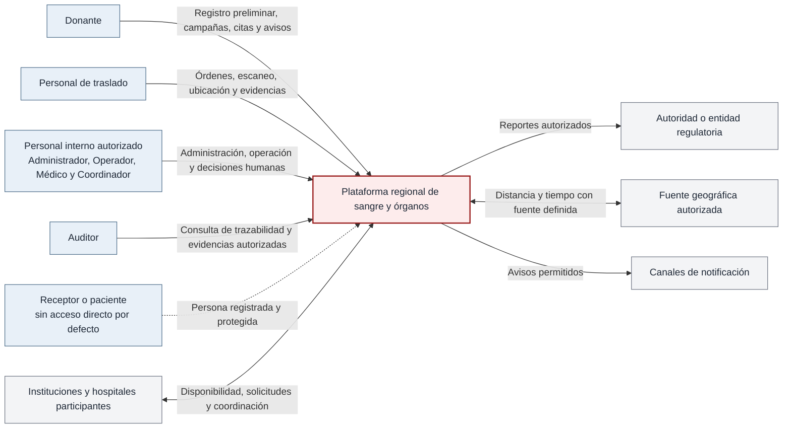

**Figura 1. Diagrama de contexto de la plataforma regional.**

El receptor o paciente es una persona central del dominio, pero no constituye por defecto un usuario con acceso directo. Su información es administrada por personal autorizado y cualquier acceso futuro deberá definirse expresamente. Las instituciones participan como ámbitos de operación y como fuente de disponibilidad; su información se administra una sola vez y se utiliza como referencia en los demás procesos.

La vista mantiene abstractas la fuente geográfica y los canales de notificación. Su selección precederá a la integración y deberá respetar los contratos, la protección de datos y las reglas validadas, sin presuponer proveedores ni métodos de cálculo.

## 5. Diagrama de contenedores

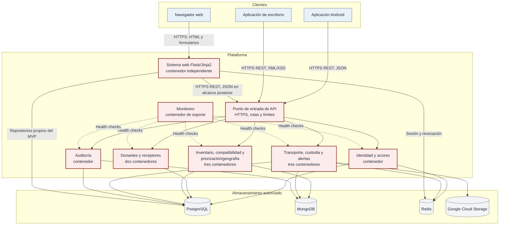

**Figura 2. Diagrama de contenedores y relaciones principales.**

La agrupación visual no fusiona contenedores: donantes y receptores se despliegan por separado; inventario, compatibilidad y priorización/geografía son tres unidades; transporte, custodia y alertas son tres unidades. El servicio de monitoreo consulta a los demás, pero su indisponibilidad no interrumpe las operaciones de negocio.

La configuración ejecutable del primer parcial comprende el sistema web y PostgreSQL instalados localmente mediante dependencias y variables documentadas, sin MongoDB, Redis ni contenedores Docker. A partir del segundo parcial se incorporan Docker Compose, los almacenes complementarios y los contenedores independientes. Cuando una responsabilidad se publique como microservicio, el web utilizará su contrato y dejará de ser un segundo escritor de esos datos.

## 6. Diagrama de componentes

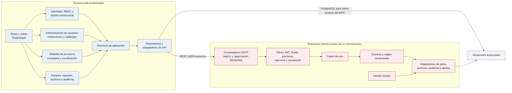

**Figura 3. Componentes internos del sistema web y patrón común de los microservicios.**

### 6.1 Responsabilidades del sistema web

| Componente | Responsabilidad | Fase |
| --- | --- | --- |
| Sitio público y portal privado | Presentar información pública, autenticación, navegación y contenido conforme al perfil. | Primer parcial y Transversal |
| Identidad y autorización web | Aplicar JWT, sesión, revocación, perfil, acción, recurso y ámbito institucional. En etapas posteriores delegará la emisión y validación común al componente de identidad sin compartir la sesión interna. | Primer parcial y Transversal |
| Administración | Gestionar usuarios, perfiles, instituciones, sedes, catálogos y configuración autorizada. La institución es una entidad administrable y la fuente de referencia para otros procesos. | Primer parcial y Posterior |
| Procesos operativos | Ofrecer las pantallas de inventario del MVP y, posteriormente, donantes, receptores, solicitudes, estudios, asignaciones, traslados y custodia mediante servicios compartidos. | Primer parcial y Posterior |
| Paneles y reportes | Mostrar un panel básico por perfil inicial y evolucionar hacia el panel regional, reportes, filtros y gráficas Highcharts. | Primer parcial y Posterior |
| Archivos y evidencias | Solicitar cargas o descargas autorizadas y administrar sus metadatos; los binarios privados permanecen en Google Cloud Storage. | Posterior |
| Auditoría y supervisión | Permitir búsquedas de solo lectura para el Auditor y vistas autorizadas de actividad, sin modificar los eventos. | Primer parcial y Posterior |
| Adaptadores | Encapsular el acceso a repositorios propios y a contratos REST, evitando que las vistas contengan reglas o consultas directas. | Transversal |

### 6.2 Catálogo de servicios y propietarios

| Unidad de despliegue | Responsabilidad principal | Datos autoritativos |
| --- | --- | --- |
| `ms-identidad-acceso` | Autenticación, renovación, revocación, perfiles, permisos, ámbitos y referencia institucional. | Credenciales protegidas, usuarios, perfiles, permisos, sesiones y ámbitos; administración institucional después de su transición desde el MVP. |
| `ms-donantes` | Registro preliminar y expediente autorizado del donante; campañas, citas y estados relacionados con su flujo. | Donantes, consentimientos estructurados, campañas y citas autorizadas. |
| `ms-receptores` | Expediente del receptor y ciclo de vida de solicitudes ordinarias o urgentes. | Receptores, participación en listas y solicitudes. |
| `ms-inventario` | Inventario sanguíneo, disponibilidad especializada de órganos, movimientos, caducidad, reservas, asignaciones y análisis operativo de caducidad o balanceo. | Recursos, unidades, existencias, estados, movimientos, reservas y asignaciones. |
| `ms-compatibilidad` | Evaluaciones de compatibilidad sanguínea o HLA con reglas validadas, datos faltantes, versión y explicación. | Ejecuciones y resultados de compatibilidad; no es propietario de los expedientes fuente. |
| `ms-priorizacion-geografia` | Ranking multicriterio y comparación u optimización por distancia y tiempo; mantiene módulos y contratos lógicos diferenciados. | Ejecuciones de ranking, factores, versiones y cálculos geográficos con su procedencia. |
| `ms-transporte` | Órdenes, planeación, asignación logística, incidencias, ubicación reciente y seguimiento. | Órdenes de traslado, estado logístico, incidencias y telemetría autorizada. |
| `ms-custodia` | Eventos inmutables de recolección, entrega y transferencia, con responsable, tiempo, condición y evidencia. | Secuencia de custodia y referencias a evidencias. |
| `ms-alertas` | Generación, destinatarios, deduplicación, entrega y cierre de alertas autorizadas. | Alertas, destinatarios y estados de atención. |
| `ms-auditoria` | Recepción, normalización y consulta de eventos de autenticación, acceso, cambios, algoritmos y decisiones. | Registro auditable y referencias de correlación, sin convertirse en propietario del hecho de negocio original. |
| `servicio-monitoreo` | Consulta periódica de salud, cálculo de disponibilidad y avisos de caída, degradación o recuperación. | Historial técnico de verificaciones y estado operativo. |

Las diez responsabilidades de dominio del proyecto permanecen representadas. Priorización y geografía comparten inicialmente una unidad por su cohesión; transporte y cadena de custodia continúan separados porque una orden logística puede cambiar mientras los eventos de custodia deben conservarse sin modificación.

Cada servicio accede únicamente a sus esquemas, colecciones, prefijos y claves. La consulta de datos administrados por otro servicio se realiza mediante un contrato, no mediante escrituras en su almacenamiento.

## 7. Diagrama de comunicación entre aplicaciones

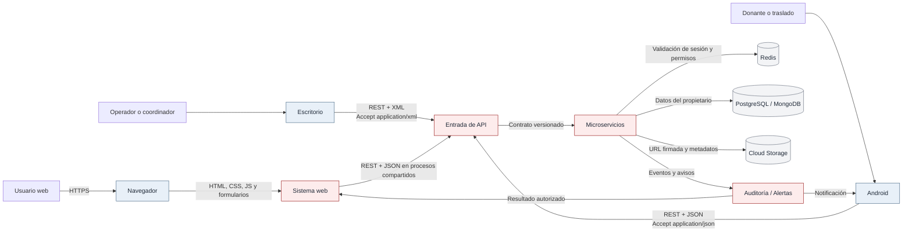

**Figura 4. Comunicación entre aplicaciones, servicios y almacenes.**

| Emisor y receptor | Contrato | Restricción principal |
| --- | --- | --- |
| Navegador y sistema web | HTTPS; HTML generado con Jinja2, formularios y JavaScript. | El navegador no conoce credenciales de bases ni consulta almacenes directamente. |
| Android y microservicios | HTTPS REST versionado; solicitudes y respuestas JSON. | Android consume exclusivamente JSON, valida la respuesta y no comparte la sesión interna del web. |
| Escritorio y microservicios | HTTPS REST versionado; solicitudes y respuestas XML. | XML se valida con XSD donde corresponda y el parser deshabilita entidades externas para prevenir XXE. |
| Sistema web y microservicios | HTTPS REST versionado; representación JSON para las capacidades compartidas. | El web conserva su interfaz y orquestación; no duplica la lógica publicada por los servicios. |
| Entre microservicios | Contratos internos versionados, autenticados y correlacionados. | No se permiten dependencias circulares ni escrituras directas en datos ajenos. |
| Servicios y Google Cloud Storage | HTTPS y URLs firmadas de vigencia limitada. | El binario no atraviesa ni se almacena innecesariamente en la base; se conserva referencia, hash y metadatos. |

| Aplicación | Servicios de consumo directo previstos | Cobertura |
| --- | --- | --- |
| Android | `ms-identidad-acceso`, `ms-donantes`, `ms-transporte`, `ms-custodia` y `ms-alertas`. | Integra los flujos diferenciados del Donante y del Personal de traslado y utiliza únicamente JSON. |
| Escritorio | `ms-identidad-acceso`, `ms-inventario`, `ms-compatibilidad`, `ms-priorizacion-geografia`, `ms-transporte` y `ms-custodia`. | Integra captura intensiva, revisión, impresión, custodia y reportes, y utiliza únicamente XML validado. |
| Sistema web posterior | `ms-identidad-acceso` y los servicios de dominio requeridos por cada pantalla o proceso autorizado. | Mantiene la experiencia administrativa y regional sin depender de las aplicaciones cliente ni duplicar reglas publicadas. |

Los microservicios deberán producir respuestas tanto en JSON como en XML. Una misma operación tendrá significado equivalente en ambas representaciones. Los nombres, tipos, campos requeridos, estados, errores y códigos HTTP se definirán en OpenAPI/Swagger; la representación XML añadirá el XSD verificable. Un formato no habilitará operaciones o datos que el otro consumidor no pueda obtener con la misma autorización.

## 8. Diagrama de autenticación y autorización

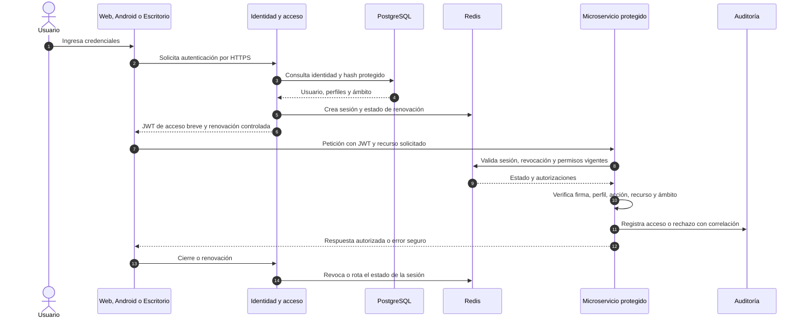

**Figura 5. Flujo común de autenticación, autorización, renovación y revocación.**

Durante el primer parcial, el componente de identidad reside dentro del sistema web y aplica hash seguro, JWT básico con expiración y autorización por perfil y ámbito, sin depender de Redis. A partir del segundo parcial se publica como servicio común e incorpora sesiones, renovación y revocación mediante Redis para que Android y escritorio no dependan de las sesiones privadas del web.

La autorización se deniega por defecto y exige la combinación de identidad activa, perfil, acción, recurso y ámbito institucional. El Administrador no obtiene acceso clínico por administrar cuentas; las decisiones médicas requieren el perfil y la acreditación definidos. Los intentos fallidos, accesos sensibles, cambios de permisos, renovaciones y revocaciones se auditan sin registrar contraseñas, tokens completos ni secretos.

| Cliente | Protección local prevista |
| --- | --- |
| Sistema web | Token o identificador de sesión mediante mecanismo seguro del navegador, con atributos de seguridad apropiados y sin exposición a scripts cuando no sea necesaria. |
| Android | Almacenamiento seguro provisto por el sistema operativo; eliminación de credenciales locales al cerrar sesión. |
| Escritorio | Almacenamiento protegido por el sistema operativo o mecanismo equivalente de la tecnología seleccionada; limpieza al cerrar sesión. |

Los parámetros de duración para acceso, renovación, bloqueo y revocación se definirán en la especificación de seguridad conforme al riesgo y a las políticas aprobadas. La arquitectura establece los mecanismos y reserva sus valores concretos para dicha especificación.

## 9. Diagramas de secuencia de los procesos principales

### 9.1 Proceso del primer parcial: inventario sanguíneo ficticio

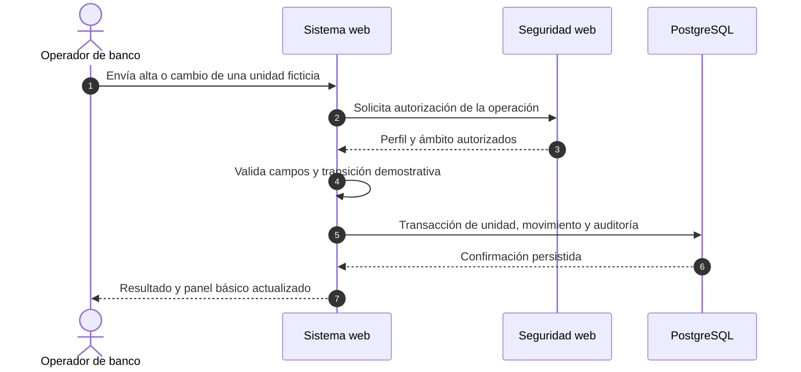

**Figura 6. Secuencia del proceso principal demostrable en el primer parcial.**

La caducidad del MVP utiliza un parámetro demostrativo identificado y datos ficticios. El proceso no evalúa compatibilidad clínica, HLA, órganos ni asignaciones reales. La transacción conserva el estado de la unidad, el movimiento y el evento básico de auditoría de forma consistente.

### 9.2 Flujo integral FI-01: donante, campaña, cita y aviso

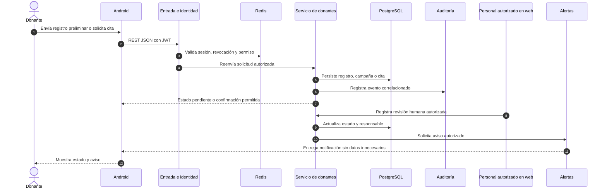

**Figura 7. Secuencia objetivo del registro preliminar, cita y aviso al donante.**

El registro preliminar no equivale a elegibilidad. La aplicación muestra el estado emitido después de la revisión autorizada y evita presentar una decisión automática como evaluación profesional.

### 9.3 Flujo integral FI-02: solicitud, compatibilidad y priorización

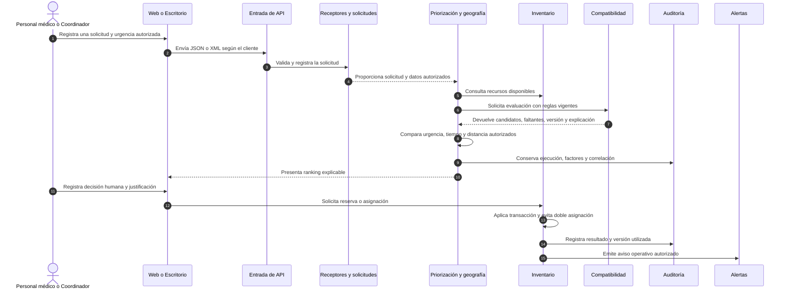

**Figura 8. Secuencia objetivo de solicitud, evaluación, ranking y decisión humana.**

La urgencia procede de personal autorizado. Compatibilidad y priorización conservan sus cálculos originales y exponen datos faltantes, versión, factores y explicación. La reserva o asignación solo ocurre después de una acción humana permitida y de una comprobación transaccional del inventario.

### 9.4 Flujo integral FI-03: asignación, traslado y cadena de custodia

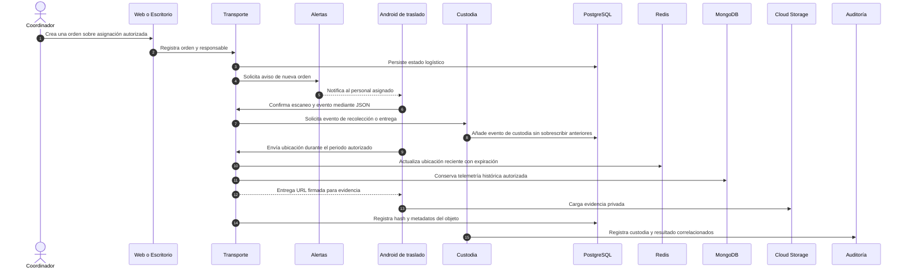

**Figura 9. Secuencia objetivo de traslado, custodia, ubicación y evidencia.**

La ubicación reciente es temporal; la telemetría histórica solo se conserva cuando existe finalidad y retención autorizadas. La evidencia se carga de forma privada mediante una URL firmada y la base almacena únicamente sus metadatos y referencia. Las operaciones sin conexión se limitan a eventos previamente definidos como seguros y se sincronizan con una clave idempotente; una asignación o decisión clínica no se confirma fuera de línea.

## 10. Diagrama de almacenamiento de datos

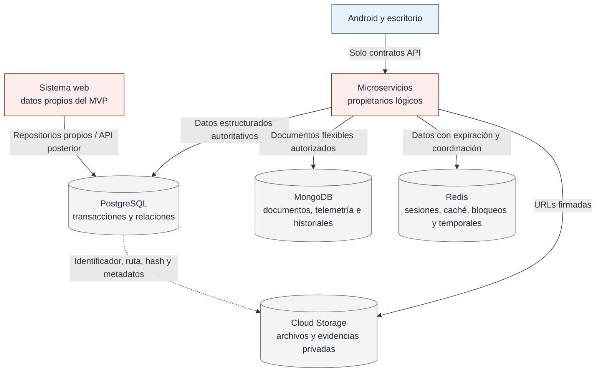

**Figura 10. Distribución y acceso a los almacenes de datos.**

### 10.1 Distribución por tecnología

| Almacén | Información prevista | Justificación y límites |
| --- | --- | --- |
| PostgreSQL | Instituciones y sedes; usuarios, perfiles y ámbitos; donantes y receptores; campañas y citas; inventarios separados de sangre y órganos; solicitudes; pruebas estructuradas; reservas y asignaciones; estado de traslados; eventos estructurados de custodia; alertas; auditoría básica; referencias de archivos. | La información es transaccional, relacionada y requiere restricciones, claves, historial y consistencia. Las reservas y asignaciones deben protegerse mediante transacciones, restricciones o bloqueos. |
| MongoDB | Telemetría autorizada de traslados; documentos e historiales extensos; resultados semiestructurados y explicaciones versionadas; eventos técnicos y de monitoreo cuyo crecimiento o forma flexible lo justifiquen. | Permite documentos evolutivos e historiales con distinta estructura. No sustituye el estado transaccional ni duplica la fuente autoritativa de una entidad relacional. |
| Redis | Sesiones distribuidas; tokens revocados; permisos y caché autorizada; rate limiting; bloqueos de asignación; contadores y deduplicación; estado temporal de alertas; ubicación reciente y datos temporales de sincronización cuando correspondan. | Los datos tienen vigencia corta o apoyan coordinación. Cada familia de claves tendrá prefijo, propietario y expiración; Redis no es sistema de registro. |
| Google Cloud Storage | Evidencia fotográfica; documentos y estudios autorizados; reportes, comprobantes y archivos generados; otros binarios cuyo tamaño o ciclo de vida no corresponda a las bases. | Los objetos permanecen privados. PostgreSQL conserva identificador, ruta, tipo, tamaño, propietario, fecha, hash, nivel de privacidad, estado y metadatos pertinentes; la entrega se realiza mediante URL firmada. |

### 10.2 Propiedad autoritativa y transición del MVP

| Información | Propietario en el primer parcial | Propietario posterior |
| --- | --- | --- |
| Instituciones, usuarios, perfiles y ámbitos | Módulos de administración y seguridad del sistema web | `ms-identidad-acceso`; el web actúa como interfaz administrativa. |
| Tipos de componentes sanguíneos | Módulo de catálogos del sistema web | `ms-inventario`, que los expone como referencia sin duplicar la entidad institucional. |
| Unidades, movimientos y estados de inventario | Módulo de inventario web | `ms-inventario`; el web consume su API. |
| Auditoría básica | Módulo de auditoría web en PostgreSQL | `ms-auditoria`, manteniendo referencias a los hechos de cada propietario. |
| Datos posteriores del dominio | No se implementan en el MVP | Servicio correspondiente según la tabla de la sección 6.2. |

La transición se realizará sin dos escritores simultáneos: se conservarán identificadores, se suspenderán temporalmente las escrituras del módulo anterior, se verificará la migración y el web cambiará al contrato del servicio. Las instituciones continuarán siendo una sola entidad administrable y se consumirán como catálogo de referencia, no como una copia independiente.

## 11. Diagrama de despliegue

### 11.1 Entorno local reproducible por etapas

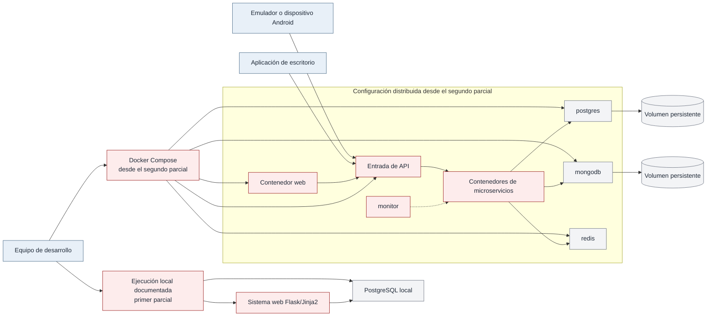

**Figura 11. Despliegue local reproducible por etapas.**

Durante el primer parcial, el web y PostgreSQL se ejecutan localmente con versiones, dependencias y variables documentadas. A partir del segundo parcial, Docker Compose incorpora PostgreSQL, MongoDB, Redis, el web, el punto de entrada, los microservicios implementados y el monitor, y permite ejecutar únicamente el conjunto relacionado con la capacidad en desarrollo.

### 11.2 Línea base en Google Cloud

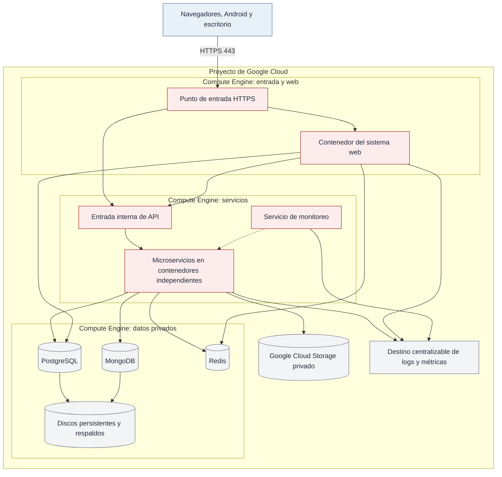

**Figura 12. Línea base de despliegue en Google Compute Engine.**

| Destino | Componentes | Motivo |
| --- | --- | --- |
| Compute Engine de entrada y web | Terminación HTTPS o proxy inverso, enrutamiento y contenedor del sistema web. | Aísla el acceso público de los servicios y mantiene el núcleo web desplegable de forma independiente. |
| Compute Engine de servicios | Punto de entrada interno, microservicios en contenedores separados y servicio de monitoreo. | Permite actualizar servicios de forma individual sin asumir desde el inicio un orquestador de clúster. |
| Compute Engine de datos | PostgreSQL, MongoDB y Redis en red privada, con credenciales separadas y persistencia cuando corresponda. | Proporciona una distribución inicial controlable y mantiene los almacenes fuera de la zona pública; la alta disponibilidad requiere una evolución posterior sustentada en riesgos y mediciones. |
| Google Cloud Storage | Objetos privados, evidencias, documentos y reportes. | Evita almacenar binarios grandes en las bases y permite accesos temporales mediante URLs firmadas. |
| Destino de logs y métricas | Registros centralizables de web, servicios y monitoreo. | Facilita correlación y diagnóstico; el producto concreto se seleccionará según disponibilidad y alcance. |

A partir del segundo parcial, el sistema web, el punto de entrada, cada microservicio y el monitor tendrán Dockerfile. PostgreSQL, MongoDB y Redis se ejecutarán en contenedores dentro de los entornos de desarrollo y evaluación, con volúmenes y procedimientos de respaldo. Android y escritorio se distribuyen como aplicaciones cliente y no se despliegan en contenedores de backend.

## 12. Diagrama de red

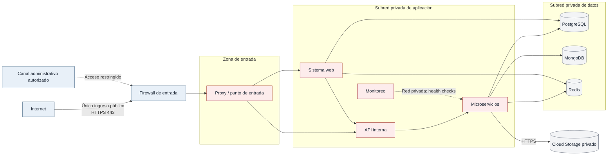

**Figura 13. Segmentación de red y rutas de comunicación permitidas.**

| Origen | Destino | Política |
| --- | --- | --- |
| Internet | Punto de entrada | Solo HTTPS en el puerto público definido; las bases y los contenedores internos no se publican. |
| Punto de entrada | Web y API | Enrutamiento a destinos conocidos, límites de consumo, tamaño máximo y encabezado de correlación. |
| Web y microservicios | PostgreSQL, MongoDB y Redis | Acceso por red privada, credencial de mínimo privilegio y únicamente al almacenamiento propio. |
| Microservicios | Google Cloud Storage | Salida HTTPS para generar o utilizar accesos firmados; los objetos permanecen privados. |
| Monitor | Endpoints de salud | Comunicación privada de solo consulta; no puede ejecutar operaciones de negocio. |
| Administración | Máquinas de Compute Engine | Canal restringido a personal autorizado y registrado; no se habilita administración general desde Internet. |

Las reglas de firewall aplican denegación por defecto. Los puertos internos concretos se documentarán en la configuración de despliegue, pero nunca se expondrán públicamente PostgreSQL, MongoDB o Redis. Los secretos y certificados permanecerán fuera del código y de los archivos versionados.

## 13. Seguridad, resiliencia y observabilidad

### 13.1 Controles de seguridad

| Área | Diseño |
| --- | --- |
| Credenciales | Contraseñas con hash seguro y configuración vigente; ningún secreto o valor real en el repositorio. |
| Tokens y sesiones | JWT de acceso de corta duración, renovación controlada, rotación o control equivalente, revocación y estado de sesión en Redis. |
| Autorización | Denegación por defecto y validación de perfil, acción, recurso y ámbito institucional en cada petición protegida. |
| Entradas | Validación de formularios, JSON, XML/XSD y archivos; consultas parametrizadas y protección del procesamiento XML contra XXE. |
| Datos sensibles | Minimización y ocultamiento en pantallas, respuestas, errores, logs y reportes; segregación institucional y trazabilidad de accesos. |
| Archivos | Validación de tipo, tamaño, finalidad y permiso; objetos privados, hash, metadatos y URLs firmadas de vigencia limitada. |
| Auditoría | Eventos con actor, tiempo, acción, entidad, resultado y correlación; las correcciones generan nuevos eventos y no sobrescriben el historial. |

### 13.2 Resiliencia y consistencia

- Los clientes aplican timeouts y muestran errores de red sin asumir que una operación fallida no fue procesada.
- Los reintentos se limitan a operaciones seguras o idempotentes; las confirmaciones sensibles utilizan identificadores que permiten detectar duplicados.
- Reservas y asignaciones se protegen mediante transacciones, restricciones o bloqueos con expiración para impedir doble asignación.
- La caída de un servicio se registra y degrada únicamente los procesos que dependen de él; no debe corromper información ni ocultar el estado al usuario.
- La sincronización móvil conserva operaciones permitidas, muestra conflictos y no confirma decisiones clínicas o asignaciones sin validación del servidor.
- Los respaldos y la restauración se comprobarán con evidencia; conservar una copia no equivale a demostrar recuperación.
- La operación web no depende de la disponibilidad de Android o escritorio. La indisponibilidad del monitor tampoco detiene los servicios supervisados.

### 13.3 Observabilidad y salud

Cada microservicio expondrá los endpoints aplicables:

| Endpoint | Propósito |
| --- | --- |
| `/health/live` | Confirmar que el proceso está en ejecución. |
| `/health/ready` | Confirmar que el servicio está preparado para atender solicitudes. |
| `/health/database` | Comprobar la dependencia relacional utilizada por el servicio. |
| `/health/redis` | Comprobar sesión, revocación o datos temporales cuando sean dependencia. |
| `/health/mongodb` | Comprobar MongoDB cuando el servicio lo utilice. |
| `/health/storage` | Comprobar Google Cloud Storage cuando el flujo dependa de objetos. |

El servicio de monitoreo consultará estos endpoints y presentará estado disponible, degradado o caído; tiempo promedio; último error; dependencia causante; versión; fecha de verificación; cantidad de errores e historial de disponibilidad. Los estados distinguirán proceso detenido, dependencia inaccesible, respuesta inválida y timeout.

Los logs incluirán timestamp, servicio, versión, resultado, duración e identificador de correlación. No contendrán tokens completos, contraseñas, datos clínicos, fotografías, ubicaciones precisas ni identificadores personales innecesarios. La auditoría de negocio y el log técnico son registros distintos, aunque compartan correlación.

### 13.4 Ubicación de las capacidades algorítmicas

| Capacidad | Componente | Salida y límite |
| --- | --- | --- |
| Matching sanguíneo y HLA | `ms-compatibilidad` | Candidatos, datos faltantes, versión y explicación; requiere reglas autorizadas y no decide la asignación. |
| Ranking, urgencia, tiempo y distancia | `ms-priorizacion-geografia` | Orden y factores utilizados; la urgencia es registrada por personal autorizado y la fuente geográfica queda identificada. |
| Pronóstico de caducidad y balanceo regional | `ms-inventario` | Riesgo o sugerencia demostrativa con limitaciones; no ejecuta transferencias automáticamente. |
| Detección de inconsistencias | Servicio propietario y `ms-alertas` | Hallazgo explicable y alerta dirigida; no corrige silenciosamente el dato. |

La arquitectura reserva componentes y mecanismos de trazabilidad para estas capacidades, sin establecer fórmulas, ponderaciones ni reglas clínicas. La especificación de cada algoritmo incluirá entradas, salidas, restricciones, pseudocódigo, métricas, casos de prueba, versión, limitaciones y autoridad de validación antes de su implementación.

## 14. Escalabilidad y posible uso de clúster

La línea base no requiere un clúster en el primer ni en el segundo parcial. Desde el segundo parcial, los servicios permanecen desacoplados y contenerizados para permitir una evolución posterior sin convertir el clúster en una dependencia anticipada.

| Proceso candidato | Señal que justificaría distribución o clúster | Decisión prevista |
| --- | --- | --- |
| Compatibilidad y ranking sobre conjuntos grandes | Saturación sostenida, crecimiento del tiempo p95/p99 o incumplimiento del objetivo definido para un flujo real. | Escalar horizontalmente servicios sin estado; evaluar GKE o grupos administrados únicamente después de medir. |
| Pronóstico de caducidad y balanceo regional | Ventanas de procesamiento que no concluyen con el volumen objetivo o compiten con las operaciones transaccionales. | Separar ejecución por lotes y evaluar procesamiento distribuido sin mover la decisión clínica al clúster. |
| Ingesta de telemetría, auditoría o alertas | Acumulación de trabajo, pérdida de eventos ante fallos o necesidad comprobada de desacoplamiento durable. | Evaluar una cola o Pub/Sub y consumidores escalables; no forma parte de la línea base. |
| Pruebas Locust | Una sola máquina generadora no alcanza la concurrencia planificada. | Distribuir generadores de carga de forma temporal y separar su infraestructura de la plataforma medida. |
| Servicios web y API | Demanda concurrente que supera una instancia y justifica balanceo. | Añadir réplicas y balanceador; mantener sesiones y revocación fuera del proceso mediante Redis. |

La adopción de un clúster se condiciona a un conjunto de datos, concurrencia, objetivos de respuesta, costo y evidencia de una limitación vigente. La evaluación comprende primero consultas, índices, caché, serialización y límites de recursos; la tecnología se seleccionará a partir de los resultados de las pruebas.

## 15. Evolución por parciales

| Componente | Primer parcial | Posterior | Control transversal |
| --- | --- | --- | --- |
| Sistema web | Página pública, portal, identidad inicial, tres perfiles funcionales, dos catálogos, institución administrable, inventario sanguíneo ficticio, panel básico y auditoría. | Perfiles restantes, procesos completos, panel regional, Highcharts, reportes, archivos, notificaciones y consumo de servicios compartidos. | Responsive, persistencia real, autorización, errores seguros y pruebas. |
| Microservicios | Definición arquitectónica de límites, contratos y estrategia futura de despliegue. | Servicios Flask independientes y contenerizados, JSON/XML, OpenAPI, XSD, salud, correlación, límites y pruebas. | Versionamiento, seguridad y propietarios de datos. |
| Android | Incluido en contexto, contratos y secuencias; sin funcionalidad requerida en el MVP. | Donante y Personal de traslado; JSON, JWT, cámara, escaneo, ubicación, notificaciones y sincronización permitida. | Sin acceso directo a datos ni lógica principal replicada. |
| Escritorio | Incluido en contexto, contratos y secuencias; tecnología aún no seleccionada. | Operación interna mediante XML/XSD, inventario, pruebas, revisión, etiquetas, custodia y reportes. | Desacoplado del web y sin acceso directo a almacenes. |
| Datos | PostgreSQL local con datos ficticios; MongoDB y Redis solo como tecnologías investigadas y elementos de la arquitectura futura. | Diseño detallado y uso funcional de MongoDB y Redis; Google Cloud Storage, separación completa por propietarios, índices, retención y respaldos. | Una fuente autoritativa y ciclos de vida documentados. |
| Infraestructura | Dependencias, variables y ejecución local reproducible del web y PostgreSQL, sin contenedores. | Dockerfiles, Docker Compose, contenedor por servicio, Compute Engine, red privada, firewall, almacenamiento y logs centralizables. | Variables y secretos protegidos, integración continua y recuperación. |
| Monitoreo y algoritmos | Diseño completo, sin anticipar reglas clínicas. | Health checks, panel técnico, carga, algoritmos priorizados, mediciones y fallos. | Explicabilidad, correlación, auditoría y ausencia de datos sensibles. |

## 16. Validación arquitectónica

### 16.1 Relación con los requerimientos consolidados

| Grupo | Secciones que lo materializan |
| --- | --- |
| RF/RNF del sistema web | 5, 6.1, 8, 9.1, 11 y 15 |
| RF/RNF de microservicios | 5, 6.2, 7, 8, 9, 13 y 14 |
| RF/RNF de Android | 4, 7, 8, 9.2, 9.4 y 15 |
| RF/RNF de escritorio | 4, 7, 8, 9.3, 9.4 y 15 |
| RF/RNF de datos y almacenamiento | 6.2, 9, 10, 11 y 13 |
| RNF de infraestructura e integración | 3, 5, 7, 9, 11, 12, 14 y 15 |
| RF/RNF de seguridad | 2, 7, 8, 10, 12 y 13 |
| RF/RNF de monitoreo | 5, 11 y 13.3 |

La tabla resume la cobertura arquitectónica por grupo. La relación detallada entre requerimientos, historias, reglas, casos de uso, pruebas y evidencias corresponde a la matriz de trazabilidad integral.

### 16.2 Escenarios de comprobación

| ID | Escenario | Evidencia esperada |
| --- | --- | --- |
| VA-01 | El sistema web se utiliza mientras Android y escritorio están fuera de servicio. | Las funciones propias del web continúan disponibles y la ausencia de los clientes no altera sus datos. |
| VA-02 | Android y escritorio consultan una misma operación autorizada. | Android recibe JSON y escritorio XML válido contra XSD, con significado, versión, códigos y restricciones equivalentes. |
| VA-03 | Un cliente intenta acceder a una base o a un recurso de otra institución. | La red impide el acceso directo y el servicio deniega el recurso por ámbito, registrando el intento sin exponer detalles. |
| VA-04 | Se revoca una sesión con un JWT aún no vencido. | Redis refleja la revocación y la siguiente petición protegida es rechazada por web o microservicio. |
| VA-05 | Dos solicitudes intentan reservar el mismo recurso. | Solo una transición válida se confirma; la otra recibe un conflicto controlado y ambas acciones quedan auditadas. |
| VA-06 | PostgreSQL, MongoDB, Redis, Storage o un servicio deja de responder. | Se distingue la dependencia afectada, se aplica timeout, no se corrompen datos y la operación se recupera al restablecerla. |
| VA-07 | Se carga y consulta una evidencia privada. | El binario queda en Storage, los metadatos y hash en el propietario, el acceso usa URL firmada y la acción se audita. |
| VA-08 | Se genera un ranking y una persona registra una decisión distinta. | Se conservan cálculo, versión, factores, explicación, decisión humana y justificación sin sobrescribir el resultado. |
| VA-09 | El monitor deja de funcionar. | Los servicios supervisados continúan operando; al volver el monitor se reanudan las verificaciones sin modificar procesos de negocio. |
| VA-10 | Se ejecuta el MVP del primer parcial en el entorno local documentado. | Inicio de sesión, perfiles iniciales, panel básico, dos catálogos, inventario ficticio, consulta, PostgreSQL y auditoría funcionan con persistencia real sin depender de MongoDB, Redis o Docker. |

Los escenarios constituyen criterios de validación arquitectónica y se aplicarán a los incrementos ejecutables correspondientes, con evidencia reproducible.

## 17. Conclusión

La arquitectura propuesta integra los cuatro productos mediante contratos explícitos, mantiene una fuente autoritativa por dato y separa las responsabilidades de presentación, negocio, almacenamiento, seguridad y monitoreo. El MVP del primer parcial permanece acotado a una base web real y verificable, mientras los límites necesarios para microservicios, aplicaciones cliente, nube, algoritmos y operación regional quedan definidos para su incorporación gradual.

La solución prioriza trazabilidad, seguridad, consistencia y explicación de resultados sin convertir los cálculos en decisiones clínicas automáticas. Su crecimiento hacia réplicas, clústeres o servicios adicionales dependerá de evidencia de volumen, rendimiento y riesgo, conservando una implementación viable para el alcance y los recursos previstos durante el semestre.
