# Reporte Técnico del Primer Avance

## 1. Portada

**Universidad de Monterrey**  
**Integración de Aplicaciones Computacionales**  
**Red House — Red regional de bancos de sangre y donación de órganos**  
Proyecto 6 · Equipo 01  
Profesor: Dr. Raúl Morales Salcedo  
San Pedro Garza García, Nuevo León · 13 de septiembre de 2026  
Versión 2.0 · Ampliación del monolito previa a microservicios

Este reporte presenta un incremento académico con datos ficticios. La entrega integra análisis, requisitos, diseño, operación comprobada y limitaciones. La arquitectura del semestre y la configuración ejecutable actual se identifican por separado.

## 2. Integrantes

| Integrante | Matrícula |
| --- | --- |
| Galia Sejudo Mireles | 647144 |
| Alejandra Morón Rdz. | 587823 |
| Victor Emiliano Berlanga Mendoza | 646278 |
| Alberto Reyna Ramirez | 602720 |

## 3. Control de versiones

| Versión | Fecha | Contenido y condición |
| --- | --- | --- |
| 1.0 | 7 de septiembre de 2026 | Línea base: administración, instituciones, inventario sanguíneo y auditoría; documentación especializada y reporte integral antecedente. |
| 2.0 | 13 de septiembre de 2026 | Respuesta a retroalimentación: flujo sanguíneo regional dentro del monolito, reporte autosuficiente, diagramas actuales/futuros y evidencia nueva. |

La retroalimentación docente exige demostrar el proceso regional antes de extraer microservicios. Esta secuencia sustituye, para el incremento actual, la dependencia anterior que posponía esos procesos hasta la etapa distribuida. El cierre histórico del MVP se conserva como antecedente, sin confundirlo con la aceptación de esta revisión.

## 4. Introducción

Red House aborda la coordinación de recursos sanguíneos entre instituciones de una región. Su propósito empresarial consiste en relacionar necesidades de pacientes con disponibilidad autorizada de recursos, conservar las decisiones humanas y documentar su traslado y recepción. La solución semestral también contempla órganos, estudios HLA y clientes independientes, con procesos diferenciados.

El incremento actual permite recorrer un caso sanguíneo desde el expediente de donante hasta el cierre de una solicitud de otra institución. El monolito mantiene una única aplicación Flask desplegable, PostgreSQL real, vistas Jinja2 y auditoría transaccional. Los diagramas y resultados de este reporte permiten evaluar su alcance sin inspeccionar el código.

## 5. Contexto empresarial

La red reúne hospitales, bancos de sangre, centros de trasplantes y coordinación. Cada institución conserva responsabilidad sobre sus expedientes y recursos; la coordinación regional requiere visibilidad operativa minimizada para identificar necesidades y alternativas entre instituciones. El caso académico utiliza la región ficticia DEMO-NORTE, el Banco Regional Norte y el Hospital del Valle.

La operación clínica real, las reglas de intercambio, la región definitiva y los acuerdos entre organizaciones necesitan levantamiento y validación especializada. Los escenarios documentales de este reporte no se presentan como entrevistas u observaciones realizadas en hospitales.

## 6. Planteamiento del problema

Una institución puede necesitar un componente sanguíneo mientras otra dispone de una unidad potencialmente compatible y con vigencia suficiente para el traslado. La información fragmentada dificulta localizarla oportunamente, explicar la elección y reconstruir quién autorizó, preparó, transportó y recibió el recurso.

El problema de software es integrar disponibilidad, demanda, factores de comparación, revisión humana, exclusividad de reserva y trazabilidad. Mostrar un inventario aislado no demuestra por sí solo la resolución de esa necesidad interinstitucional.

## 7. Organizaciones involucradas

| Organización | Participación en el proceso | Información compartida necesaria |
| --- | --- | --- |
| Banco de sangre | Registra donantes, donaciones y componentes; prepara recursos | Disponibilidad, ubicación institucional y trazabilidad de la unidad |
| Hospital solicitante | Registra receptor y solicitud; revisa alternativas y recibe | Necesidad, grupo registrado, componente, cantidad y urgencia autorizada |
| Coordinación regional | Consulta demanda/oferta, registra rutas y programa traslados | Folios, instituciones, disponibilidad, tiempos y autorizaciones |
| Centro de trasplantes | Institución administrable; proceso de órganos posterior | Capacidades e información institucional; no inventario sanguíneo genérico de órganos |
| Personal logístico | Ejecuta la orden asignada desde el monolito | Recurso, origen/destino, vehículo, fechas, eventos y evidencia documental |

## 8. Proceso actual AS-IS de referencia

El modelo de referencia parte de registros institucionales independientes: se registra una necesidad, se consulta disponibilidad por canales separados, se intercambia información, una persona autorizada decide y se coordina la entrega. Después deben conciliarse registros y evidencias dispersos. Esta representación es documental; el levantamiento de campo permanece pendiente.

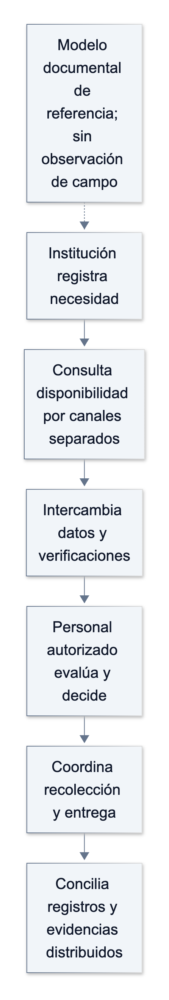

## 9. Problemas detectados

| Problema | Consecuencia | Respuesta comprobable del incremento |
| --- | --- | --- |
| Disponibilidad y necesidades separadas | Búsqueda manual de alternativas | Solicitud vinculada a candidatos regionales |
| Caducidad y tiempo de traslado desconectados | Proponer unidades sin vigencia suficiente | Filtro temporal con ruta registrada y revalidación al reservar |
| Decisión sin explicación conservada | Dificultad de auditoría | Evaluación, factores, versión y autorización registrada |
| Escrituras simultáneas | Doble compromiso de una unidad | Bloqueo de fila e índice único de asignación vigente |
| Custodia incompleta | Dificultad de reconstruir responsables | Eventos secuenciales con actor y fecha del servidor |
| Permisos demasiado amplios | Exposición clínica innecesaria | Expedientes institucionales y consultas operativas minimizadas |

## 10. Proceso propuesto TO-BE

La institución registra al donante y el consentimiento ficticio. Personal médico documenta la revisión; el Operador registra donación, recolección y procesamiento. Personal médico libera unidades con referencia de pruebas y fecha de caducidad capturada. En otra institución se registra un receptor y una solicitud. El sistema propone candidatos demostrativos; el médico selecciona y autoriza una reserva. El Coordinador asigna personal y programa el traslado. Origen, transportista y destino registran sus eventos. La solicitud solo se cierra después de recibir la cantidad completa.

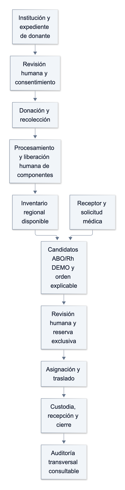

La aceptación logística no representa una transfusión ni una conclusión clínica. Las etapas clínicas registran decisiones humanas del ejercicio, sin inferir aptitud o resultados de laboratorio.

## 11. Objetivos

**Objetivo general:** demostrar una coordinación regional trazable de recursos sanguíneos mediante un monolito empresarial con persistencia, permisos y revisión humana.

| Objetivo específico | Indicador de aceptación |
| --- | --- |
| Vincular donación e inventario | Unidad consultable con donación de origen y eventos previos |
| Relacionar oferta y demanda regional | Solicitud del Hospital del Valle con candidato del Banco Regional Norte |
| Explicar la propuesta | ABO/Rh, urgencia, espera, distancia, tiempo, caducidad y versión conservados |
| Evitar doble asignación | Solo una reserva aceptada ante competencia concurrente por la misma unidad |
| Mantener custodia | Secuencia de preparación, recolección, tránsito, entrega y recepción |
| Restringir información sensible | Auditor, Coordinador y Transportista no reciben el expediente clínico completo |
| Facilitar evaluación académica | Reporte con diagramas renderizados y evidencias del recorrido ejecutado |

## 12. Alcance de esta revisión

Se incluyen instituciones y catálogos, seis perfiles habilitados, expedientes de donantes/receptores, consentimiento documentado, revisión humana, donaciones, recolección, procesamiento, liberación de unidades, inventario, solicitudes, motor demostrativo de concentrados eritrocitarios, priorización explicable, reserva exclusiva, asignación, traslado, custodia, recepción, cierre, panel regional y auditoría.

El alcance de la revisión se delimitó el 13 de septiembre: flujo sanguíneo completo; sección separada de órganos pendiente; motor inicial limitado a concentrados eritrocitarios, criterios demostrativos y autorización humana. La tabla de compatibilidad se vincula al código de catálogo RBC-DEMO, sin deducir el componente a partir de un nombre libre.

## 13. Exclusiones y límites

No se implementan órganos/HLA, pruebas cruzadas automatizadas, evaluación médica real de elegibilidad, excepciones transfusionales, ponderaciones clínicas, cálculo de vida útil, transfusión, predicción estadística de demanda ni optimización clínica. Plasma y plaquetas pueden registrarse, pero no reciben candidatos del motor de eritrocitos ni una asignación automática por esa tabla.

Microservicios, Android, escritorio, MongoDB, Redis, Docker y nube continúan como etapas posteriores. Recuperación por correo, refresh tokens, carga de archivos/estudios y URLs firmadas no se declaran implementados. La evidencia de custodia actual es una referencia documental registrada e inmutable; no acredita existencia o integridad de un archivo externo.

Las unidades del inventario inicial se conservan sin inventarles un donante ni una donación retrospectivos. Su detalle indica el origen DEMO inicial. Las nuevas unidades del flujo de donación sí conservan su vínculo de origen. Un receptor con solicitudes registradas no se reescribe, incluso después del cierre; las correcciones mediante episodios versionados requieren una ampliación posterior.

## 14. Actores

Administrador: administra la red y cuentas. Operador: captura donantes y donaciones, procesa y prepara recursos y recibe los de su institución. Personal médico: mantiene receptores, registra decisiones de elegibilidad/liberación y autoriza solicitudes y reservas. Coordinador: observa la región, registra estimaciones y programa traslados. Transportista: registra eventos de sus órdenes. Auditor: consulta evidencia y trazabilidad sin modificarlas. Donante: actor del negocio registrado, sin cuenta habilitada de autoservicio en este incremento.

## 15. Matriz de perfiles y permisos

| Operación | Administrador | Operador | Médico | Coordinador | Traslado | Auditor |
| --- | --- | --- | --- | --- | --- | --- |
| Instituciones y cuentas | Administrar ámbito | No | No | No | No | No |
| Expediente de donante | No | Su institución | Su institución | No | No | No |
| Decisión de elegibilidad | No | No | Su institución | No | No | No |
| Donación y procesamiento | No | Su institución | Consultar | No | No | No |
| Liberación de unidad derivada | No | No | Su institución | No | No | No |
| Receptor y justificación clínica | No | No | Su institución | No | No | No |
| Inventario y solicitudes minimizadas | No | Su ámbito | Su ámbito | Región/ámbito | No | Su ámbito |
| Evaluar candidatos DEMO | No | No | Solicitudes propias | Su ámbito | No | No |
| Autorizar reserva | No | No | Institución solicitante | No | No | No |
| Programar/cancelar antes de recolección | No | No | No | Su ámbito | No | No |
| Preparar recurso | No | Institución de origen | No | No | No | No |
| Recolectar, transportar y entregar | No | No | No | No | Orden asignada | No |
| Aceptar recepción | No | Institución de destino | Institución de destino | No | No | No |
| Cerrar solicitud | No | No | Institución solicitante | No | No | No |
| Consultar custodia | No | Origen/destino | Origen/destino | Su ámbito | Orden asignada | Su ámbito |
| Consultar bitácora | No | No | No | No | No | Su ámbito |

Los permisos no son jerárquicos: administrar cuentas no concede acceso clínico. La autorización se comprueba en el servidor, además del menú. Cada cuenta mantiene una asignación de perfil y ámbito; concesiones múltiples simultáneas requieren una migración posterior.

## 16. Requerimientos funcionales

Se conservan los identificadores de la línea base; se adelanta al monolito el subconjunto sanguíneo de los requisitos antes clasificados como posteriores.

| ID | Requisito evaluable en esta entrega |
| --- | --- |
| RF-WEB-001/002 | Página pública, acceso JWT, cierre y revocación; recuperación por correo pendiente |
| RF-WEB-003/004 | Cuentas, seis perfiles operativos, catálogos y parámetro DEMO de aviso |
| RF-WEB-005 | Red con instituciones, tipos, sedes, contactos, capacidades, horarios y estado |
| RF-WEB-006 | Donante ficticio con revisión humana identificada |
| RF-WEB-007 | Receptor institucional independiente y restringido |
| RF-WEB-008 | Unidades, disponibilidad, caducidad y movimientos trazables |
| RF-WEB-010 | Solicitudes con receptor, componente, cantidad y urgencia registrada |
| RF-WEB-011 | Referencias documentales de estudios y liberación; laboratorio estructurado completo pendiente |
| RF-WEB-012 | Candidatos de eritrocitos DEMO con explicación, factores y versión |
| RF-WEB-013 | Autorización humana, reserva exclusiva y cancelación controlada |
| RF-WEB-014 | Traslado y eventos de custodia con recepción |
| RF-WEB-015 | Panel regional con datos persistidos |
| RF-WEB-018 | Bitácora de operaciones y consultas sensibles |
| AM-F-001 | Vincular donación, recolección, procesamiento y unidades resultantes |
| AM-F-002 | Exigir recepción completa antes del cierre de la solicitud |

RF-WEB-009 (órganos), RF-WEB-016 (exportación regulatoria completa) y RF-WEB-017 (archivos en objetos) permanecen pendientes. La cobertura parcial se identifica expresamente y no equivale a satisfacer todos sus criterios semestrales.

## 17. Requerimientos no funcionales

| Requisito | Criterio verificable |
| --- | --- |
| RNF-WEB-001/002 | Flask/Jinja2/Highcharts; ejecución del monolito sin clientes independientes |
| RNF-WEB-003 | Formularios etiquetados, navegación responsive y tablas con desplazamiento interno |
| RNF-WEB-004 | Persistencia PostgreSQL; errores sin trazas ni credenciales |
| Consistencia | Reserva concurrente exclusiva, versiones optimistas e historial atómico |
| Confidencialidad | Pruebas de rechazo por perfil e institución y ausencia de datos clínicos en vistas de auditoría/logística |
| Reproducibilidad | Instalación nueva, migración versionada y pruebas sobre bases temporales |
| Trazabilidad | Referencias entre evaluación, unidad, solicitud, autorización y eventos |
| Rendimiento | Tiempo de evaluación registrado; no se afirma capacidad de carga sin Locust y volumen |

## 18. Historias de usuario

| Historia | Como / quiero / para |
| --- | --- |
| AM-HU-01 | Como Operador, quiero registrar una donación de un donante revisado, para conservar el origen de sus componentes. |
| AM-HU-02 | Como Médico, quiero documentar elegibilidad y liberación, para que el sistema conserve mi decisión sin inferirla. |
| AM-HU-03 | Como Médico solicitante, quiero registrar la necesidad de un receptor, para buscar alternativas regionales autorizadas. |
| AM-HU-04 | Como Coordinador, quiero consultar candidatos y factores, para explicar opciones sin acceder al expediente completo. |
| AM-HU-05 | Como Médico, quiero autorizar una unidad vigente, para reservarla sin duplicar su compromiso. |
| AM-HU-06 | Como Coordinador, quiero programar el traslado, para asignar origen, destino, responsable y tiempos. |
| AM-HU-07 | Como Transportista, quiero registrar mis eventos, para documentar la custodia de mi orden. |
| AM-HU-08 | Como personal de destino, quiero registrar la recepción, para permitir el cierre verificable de la solicitud. |
| AM-HU-09 | Como Auditor, quiero consultar la evidencia, para verificar responsables sin modificarla ni leer el expediente clínico. |

Estas historias concretan el incremento autorizado y se relacionan con las historias semestrales HU-WEB existentes. Sus prefijos AM evitan sustituir identificadores anteriores.

## 19. Criterios de aceptación

| ID | Dado / cuando / entonces |
| --- | --- |
| AM-CA-01 | Dado un donante pendiente, cuando el Operador intenta crear una donación, se rechaza hasta existir revisión humana favorable. |
| AM-CA-02 | Dada una donación recolectada, cuando el Operador registra procesamiento y el Médico libera un componente, la unidad conserva el vínculo y las etapas. |
| AM-CA-03 | Dada una solicitud O− de eritrocitos, cuando se evalúa, solo se proponen unidades admitidas por la tabla DEMO, disponibles y viables para una ruta registrada. |
| AM-CA-04 | Dado un resultado, cuando se muestra, incluye urgencia, espera, distancia, tiempo, caducidad, explicación y versión. |
| AM-CA-05 | Dadas dos solicitudes que compiten por una unidad, cuando ambas intentan reservarla, solo una operación confirma. |
| AM-CA-06 | Dada una ruta o unidad modificada, cuando se usa un candidato antiguo, se rechaza y se solicita reevaluación. |
| AM-CA-07 | Dado un transportista, cuando intenta preparar como origen o aceptar como destino, se rechaza por perfil. |
| AM-CA-08 | Dada una solicitud sin recepción completa, cuando se intenta cerrarla, se rechaza. |
| AM-CA-09 | Dado un evento de custodia confirmado, cuando se intenta actualizarlo o borrarlo, PostgreSQL rechaza la mutación ordinaria. |
| AM-CA-10 | Dado un auditor o coordinador, cuando consulta el proceso, no recibe antecedentes, estudios ni justificación clínica del receptor. |
| AM-CA-11 | Dado un fallo al registrar auditoría de reserva, cuando la transacción termina, no queda reserva ni cambio parcial de disponibilidad. |

## 20. Casos de uso

| Caso | Actor / precondición | Secuencia principal | Alternativas y resultado |
| --- | --- | --- | --- |
| AM-CU-01 Donación trazable | Operador y Médico institucionales | Expediente, revisión, donación, recolección, procesamiento, liberación | Donante pendiente/diferido, referencias inválidas o ausencia de confirmación bloquean la etapa |
| AM-CU-02 Atender solicitud regional | Médico y Coordinador | Receptor, solicitud, ruta, evaluación, revisión y reserva | Componente no soportado, ruta ausente, caducidad o conflicto dejan la solicitud sin reserva nueva |
| AM-CU-03 Trasladar y recibir | Coordinador, Operador, Transportista, destino | Programar, preparar, recolectar, transitar, entregar, aceptar | Incidencia conserva estado; cancelación ordinaria solo antes de recolección |
| AM-CU-04 Cerrar y auditar | Médico y Auditor | Comprobar cantidad recibida, cerrar, consultar eventos | Recepción incompleta bloquea cierre; Auditor no modifica historial |

## 21. Reglas de negocio y algoritmo demostrativo

La identificación de elegibilidad, la liberación y la autorización de reserva pertenecen a personas habilitadas. El sistema valida estructura, referencias, ámbito, estados y concurrencia. Las fechas de caducidad se capturan y no se calculan mediante vidas útiles inventadas.

El filtro RBC-DEMO-1.0 utiliza la compatibilidad ABO de eritrocitos: O recibe O; A recibe A u O; B recibe B u O; AB admite los cuatro grupos. Para el ejercicio, un receptor RhD negativo solo recibe candidatos RhD negativos; uno positivo admite ambos. Se excluyen deliberadamente las excepciones clínicas y los grupos desconocidos. La fuente de referencia es Australian Red Cross Lifeblood, actualización de abril de 2026; no constituye una validación clínica mexicana.

Las solicitudes se ordenan por urgencia registrada y antigüedad dentro de cada nivel. Dentro de una solicitud, las unidades potenciales se ordenan por caducidad capturada, tiempo estimado de traslado, distancia y UUID estable. Urgencia y espera son comunes a los candidatos de una misma solicitud y se muestran como contexto; no se inventa una variación entre ellos ni se convierte el orden logístico en prioridad médica.

Entradas: receptor y versión, solicitud y versión, componente, inventario, rutas y fecha del servidor. Salidas: evaluación inmutable y candidatos con factores. Complejidad orientativa: filtro O(n) y ordenamiento O(n log n); se conserva el tiempo de evaluación. Esta versión es un filtro con orden logístico demostrativo, no acredita por sí sola el algoritmo no trivial exigido para la entrega semestral.

Pseudocódigo: validar solicitud y componente; consultar unidades disponibles con ruta; descartar las que no llegan antes de caducar; filtrar ABO/RhD; ordenar con criterios DEMO; conservar factores y versión; mostrar revisión humana obligatoria; al reservar, bloquear y revalidar todos los datos operativos.

La reserva exige confirmación humana, motivo, cantidad pendiente y unidad vigente. Las reservas canceladas se conservan; las unidades recibidas no vuelven a proponerse como disponibles para otra solicitud. La custodia solo agrega eventos con fecha del servidor; no permite reescribir eventos previos.

## 22. Matriz de trazabilidad del incremento

| Paquete | Requisitos / historia | Criterio | Caso | Evidencia automatizada |
| --- | --- | --- | --- | --- |
| Donantes y donaciones | RF-WEB-006/008/011; AM-F-001; AM-HU-01/02 | AM-CA-01/02 | AM-CU-01 | Recorrido completo en tests/test_regional.py y regional_browser.cjs |
| Solicitudes y candidatos | RF-WEB-007/010/012; AM-HU-03/04 | AM-CA-03/04/06 | AM-CU-02 | Tabla ABO/Rh, componente no soportado, ruta desactualizada y unidad vencida |
| Reserva | RF-WEB-013; AM-HU-05 | AM-CA-05/11 | AM-CU-02 | Competencia entre dos solicitudes y rollback por fallo de auditoría |
| Traslado y custodia | RF-WEB-014; AM-HU-06/07 | AM-CA-07/09 | AM-CU-03 | Estados por perfil e historial append-only |
| Recepción y cierre | AM-F-002; AM-HU-08 | AM-CA-08 | AM-CU-04 | Flujo completo y rechazo de cierre prematuro |
| Privacidad y auditoría | RF-WEB-003/018; AM-HU-09 | AM-CA-10 | AM-CU-04 | Pruebas de ámbito y ausencia de marcadores clínicos en vistas minimizadas |
| Panel | RF-WEB-015 | Datos persistidos y responsive | AM-CU-02/04 | Capturas de escritorio/móvil y Highcharts en Chrome |
| Migración | RNF-WEB-004 | Conservar base inicial y aplicar una vez | Instalación/actualización | Pruebas de instalador, idempotencia y comprobación de migración |

Los documentos semestrales especializados conservan la cobertura del resto del proyecto. La matriz presente permite evaluar la entrega actual sin asumir que esas capacidades posteriores ya existen.

## 23. Arquitectura

La aplicación actual es un monolito modular: rutas y Jinja2 presentan la interfaz; servicios de negocio validan estados y permisos; repositorios y transacciones utilizan psycopg; PostgreSQL mantiene el estado autoritativo. Autenticación, inventario, nuevos módulos y auditoría pertenecen al mismo proceso desplegable.

La separación interna permite extraer servicios posteriormente, pero aún no hay APIs JSON/XML para clientes, sesiones distribuidas ni contenedores de servicio. La futura extracción debe asignar un único propietario de escritura por agregado y conservar contratos y controles transaccionales, evitando dos escritores independientes sobre un recurso.

## 24. Diagramas

Las figuras 1 a 8 y 12 cubren los tipos de diagramas solicitados. AS-IS, TO-BE y modelo conceptual completan el contexto funcional. Se conservan fuentes Mermaid y exportaciones SVG/PNG reproducibles; el reporte incorpora imágenes, no solo código de diagramación.

### Contexto actual y actores

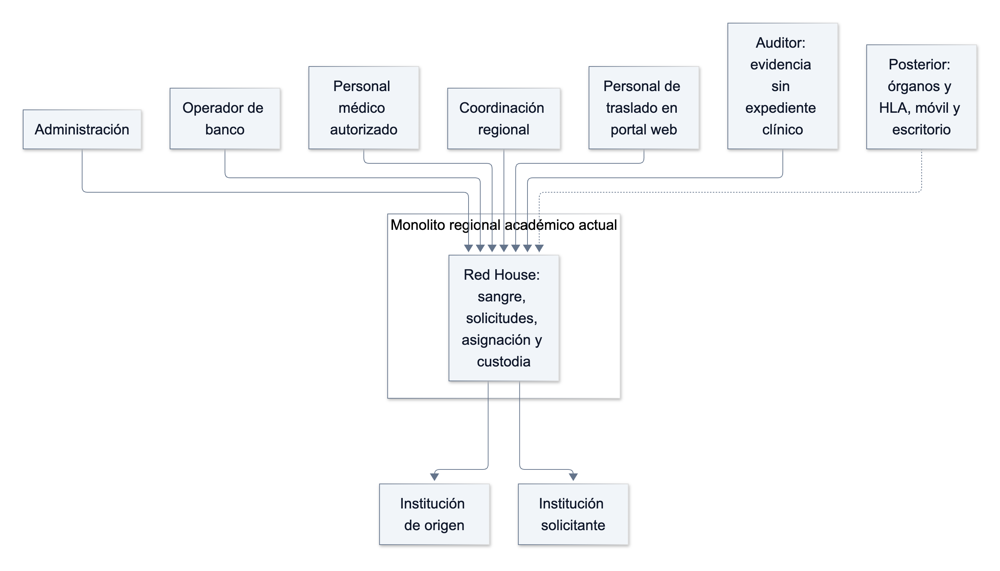

### Contenedores actuales y arquitectura objetivo

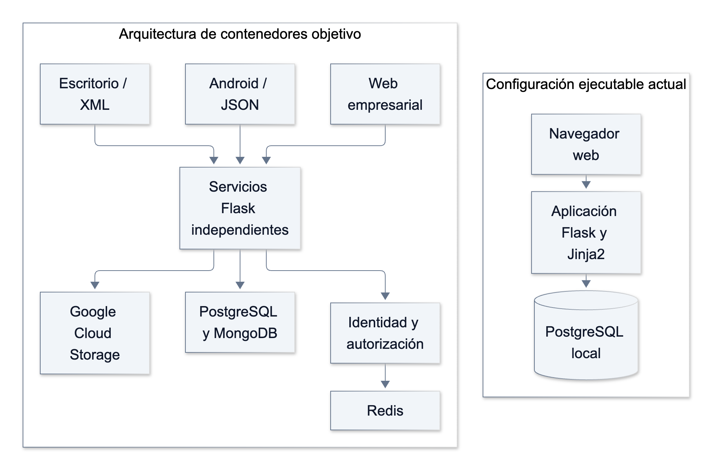

### Componentes del monolito

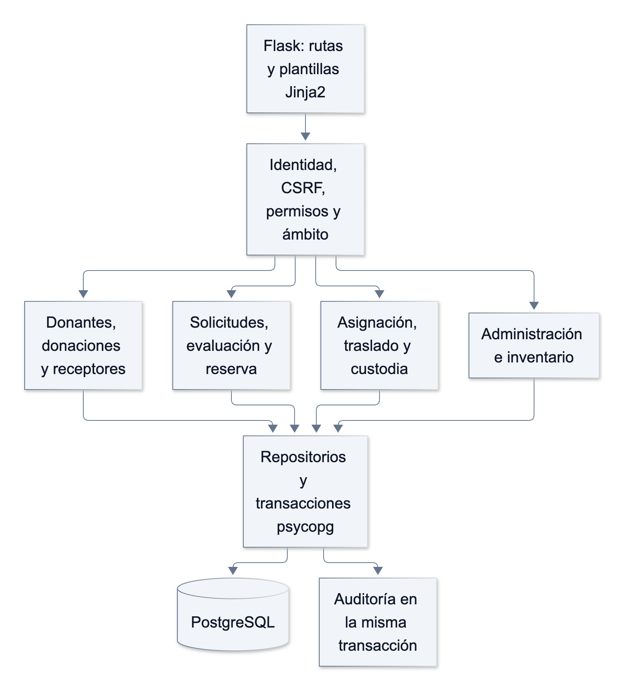

### Despliegue local y objetivo de nube

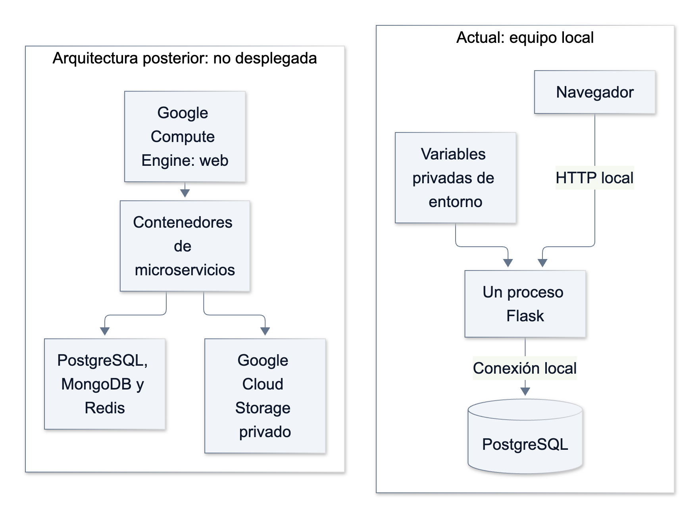

### Red y puertos

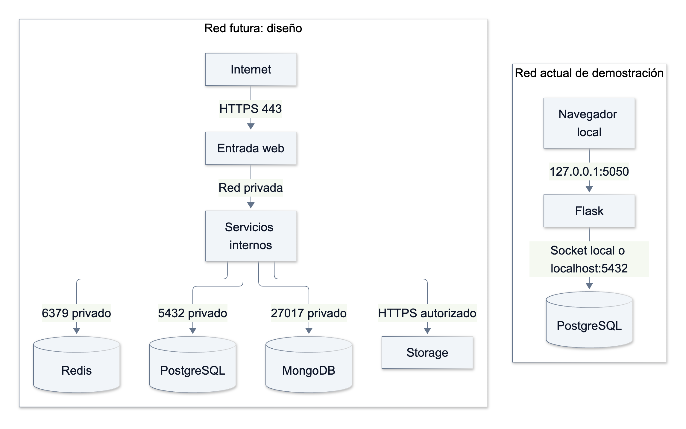

### Secuencia de autorización y reserva

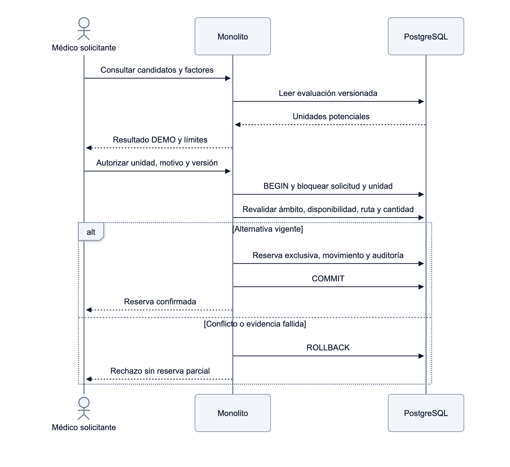

### Comunicación entre aplicaciones

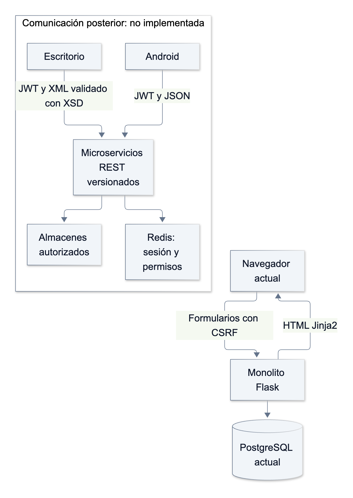

### Autenticación del monolito actual

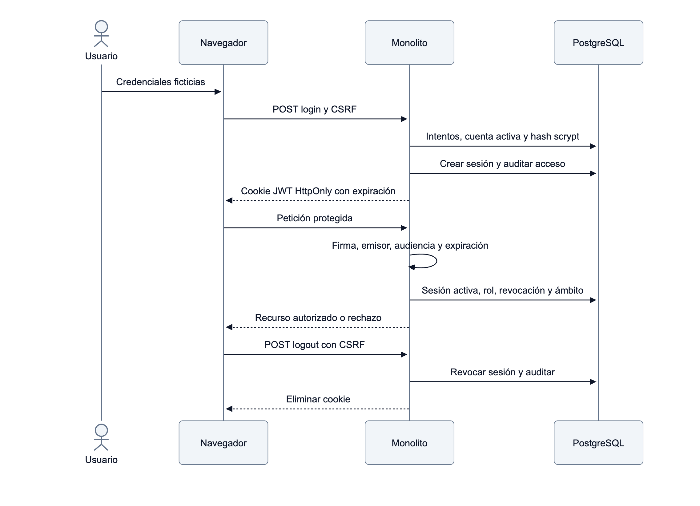

### Almacenamiento actual y futuro

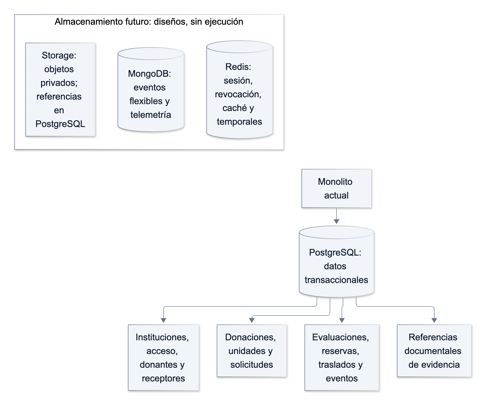

## 25. Diseño PostgreSQL

El modelo conceptual del incremento especializa sangre y relaciona instituciones, personas, donaciones, unidades, solicitudes, evaluaciones, asignaciones y custodia. No representa órganos como unidades de este inventario.

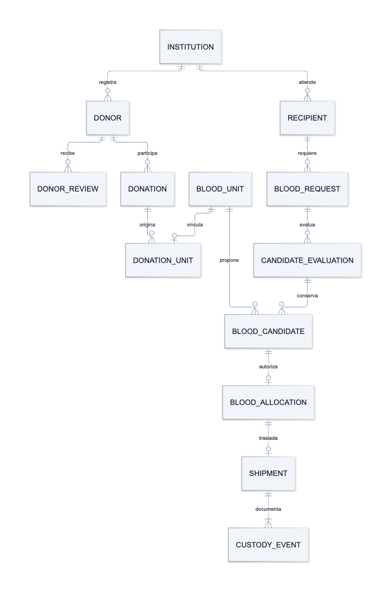

La base inicial tiene 23 tablas. La migración 002_regional.sql añade 14 tablas de negocio y la tabla técnica schema_migration: 38 tablas en total, además de la vista blood_inventory. El modelo lógico semestral de 169 relaciones permanece como antecedente; no se instala completo ni se presenta como equivalente al subconjunto físico.

| Agregado | Tablas nuevas y claves principales |
| --- | --- |
| Donante | donor: UUID, folio único e institución; donor_review: revisión, decisión, actor y fecha |
| Donación | donation: folio único, donante y revisión; donation_event: etapas; donation_unit: una relación de origen por unidad |
| Receptor | recipient: UUID, folio único, institución y responsable |
| Solicitud | blood_request: folio único, receptor, componente, cantidad, urgencia y estado; request_event: historial |
| Ruta | regional_route: par origen/destino único, distancia, minutos, procedencia y versión |
| Evaluación | candidate_evaluation: solicitud y versiones; blood_candidate: unidad, posición y factores inmutables |
| Asignación | blood_allocation: solicitud, candidato, unidad, origen/destino y autorización; índice único por recurso no cancelado |
| Traslado | shipment: una orden por asignación, responsable, vehículo y tiempos; custody_event: secuencia única por traslado |
| Migración | schema_migration: nombre de versión, hash SHA-256 y fecha |

Todas las tablas mantienen PK; las referencias entre agregados utilizan FK. CHECK valida grupos, estados, cantidades y tiempos. El índice parcial de asignación y los bloqueos de solicitud/unidad impiden doble compromiso y exceso de cantidad; la auditoría se confirma en la misma transacción. Los eventos y evaluaciones tienen triggers que rechazan UPDATE/DELETE ordinarios.

La migración usa un bloqueo asesor y verifica el hash de versiones aplicadas; se ejecuta explícitamente con migrate-db, sin reinicializar la base. La aplicación no migra al arrancar. Las pruebas de instalación y actualización se ejecutan sobre bases independientes. Un propietario PostgreSQL conserva capacidad administrativa; los triggers no constituyen protección frente a ese propietario.

## 26. Diseño MongoDB — fase posterior

MongoDB no está instalado ni requerido por el monolito actual. Su diseño propuesto se centra en información flexible y de crecimiento elevado; no reemplaza transacciones de reserva ni duplica un estado clínico autoritativo.

| Colección propuesta | Documento mínimo | Índices y consistencia |
| --- | --- | --- |
| transport_telemetry | event_id, shipment_id, actor_id, recorded_at, coordinates, schema_version | Único event_id; shipment_id + recorded_at. Ubicación únicamente durante orden autorizada. |
| evaluation_documents | evaluation_id, ruleset_version, source_refs, explanation, schema_version | evaluation_id único; referencias a identidades PostgreSQL; inmutabilidad lógica. |
| operational_events | event_id, correlation_id, component, occurred_at, sanitized_payload, schema_version | event_id único; correlación y fecha; sin credenciales ni expedientes completos. |

Las retenciones, el tamaño esperado, el mecanismo de entrega y la reconciliación deben validarse antes de implementar. Las reservas siguen en PostgreSQL y no dependen de una escritura distribuida sin estrategia de consistencia definida.

## 27. Diseño Redis — fase posterior

Redis permanece como diseño futuro. En la ejecución actual, web_session y login_attempt residen en PostgreSQL. Su futura adopción exige migrar la validación de sesión sin permitir accesos durante una falla de la dependencia.

| Familia propuesta | Valor / finalidad | Expiración propuesta |
| --- | --- | --- |
| session:{id} | Cuenta, perfil, ámbito y estado de sesión | Acotada a la expiración autorizada de la sesión |
| revoked:{jti} | Revocación de un token | Hasta su expiración; nunca indefinida por defecto |
| permissions:{account}:{version} | Permisos derivados y versión | Invalidar ante cambio; TTL concreto pendiente |
| rate:{actor}:{window} | Contador de peticiones | Ventana de consumo configurada y documentada |
| cache:inventory:{scope}:{query} | Resultado autorizado y versión | Corto; revalidar disponibilidad en PostgreSQL al reservar |
| lock:{resource} | Coordinación temporal opcional | TTL y propietario explícitos; no sustituye la restricción transaccional |

Las claves incorporarán ámbito y versión cuando corresponda. Un resultado de caché no autoriza una reserva. Tokens de renovación, rotación, invalidación y fallos de Redis necesitan contratos y pruebas del incremento distribuido.

## 28. Diseño de almacenamiento de archivos

Google Cloud Storage es el destino semestral previsto para documentos, fotografías y evidencias privadas. Se conservarán en PostgreSQL identificador, clave del objeto, tipo, tamaño, propietario, fecha, hash, privacidad, estado y relación con el proceso. Las descargas privadas utilizarán URLs firmadas de vigencia limitada tras comprobar permisos.

El flujo propuesto valida tamaño, tipo y contenido, registra un objeto pendiente, confirma la carga, verifica integridad y publica la referencia autorizada; un fallo debe poder reconciliar archivos huérfanos y referencias incompletas. Retención, eliminación y autorización de fotografías se definirán por finalidad. No se guardarán binarios grandes en las bases.

Actualmente custody_event.evidence_reference conserva una referencia documental ficticia. Su texto no demuestra que un archivo exista en un bucket. La carga binaria y su verificación permanecen pendientes y se distinguen de las capturas de pruebas incluidas en este reporte.

## 29. Seguridad

Las contraseñas usan hash scrypt. El JWT tiene emisor/audiencia, validación de firma y expiración; su sesión y revocación se comprueban en PostgreSQL. La cookie es HttpOnly y SameSite; la configuración de producción exige transporte seguro. Los formularios usan CSRF; las consultas parametrizadas y Jinja2 evitan concatenación de valores SQL y salida HTML sin escape.

Los perfiles se validan por acción y recurso. Receptor, estudios, restricciones y justificación clínica quedan en el ámbito institucional médico. Transportista accede únicamente a sus órdenes. Auditor y Coordinador reciben folios, responsables y datos operativos sin el expediente completo. Los cambios de acceso revocan sesiones existentes.

No se declara preparación productiva: faltan despliegue WSGI/TLS verificado, refresh tokens, credenciales PostgreSQL de mínimo privilegio, controles distribuidos, gestión de archivos y validación clínica/regulatoria. No se usan datos sanitarios reales para esta demostración.

## 30. Auditoría

Cada operación crítica conserva actor, fecha, acción, entidad, referencia, ámbito, resultado y correlación. Se registran acceso, consulta sensible, altas, cambios, revisiones, evaluaciones, autorización, reserva, asignación, traslado y recepción. Los valores clínicos libres no se copian automáticamente a audit_change ni a logs.

La custodia añade secuencia, ubicación declarada, observación y referencia de evidencia. Los campos libres se destinan a datos ficticios y observaciones operativas, no a diagnósticos. La bitácora se consulta mediante búsqueda, filtros y paginación. Las pruebas comprueban tanto la consulta minimizada como el rechazo de mutaciones de eventos.

## 31. Interfaces

La navegación separa Banco de sangre, Logística, Donación/trasplante de órganos, Auditoría y Administración. Los módulos funcionales tienen formularios reales; las rutas antiguas de vistas futuras sanguíneas redirigen a sus módulos. Órganos conserva una vista explícitamente pendiente.

El portal incluye expedientes institucionales, etapas de donación, liberación de unidades, solicitudes, factores de candidatos, autorización, programación y eventos de custodia. Las tablas grandes se desplazan dentro de su contenedor. Los controles de cada etapa solo se ofrecen al perfil correspondiente; el servidor vuelve a comprobar la autorización.

## 32. Evidencias del sistema funcionando

La evidencia nueva se conserva en documentation/evidence/ampliacion-monolito. El recorrido de navegador usa datos ficticios y siete cuentas: Operador origen, Médico origen, Médico solicitante, Coordinador, Transportista, Operador destino y Auditor. Comprueba escritura mediante formularios, recarga de pantallas, cierre y ausencia de errores JavaScript o recursos locales faltantes.

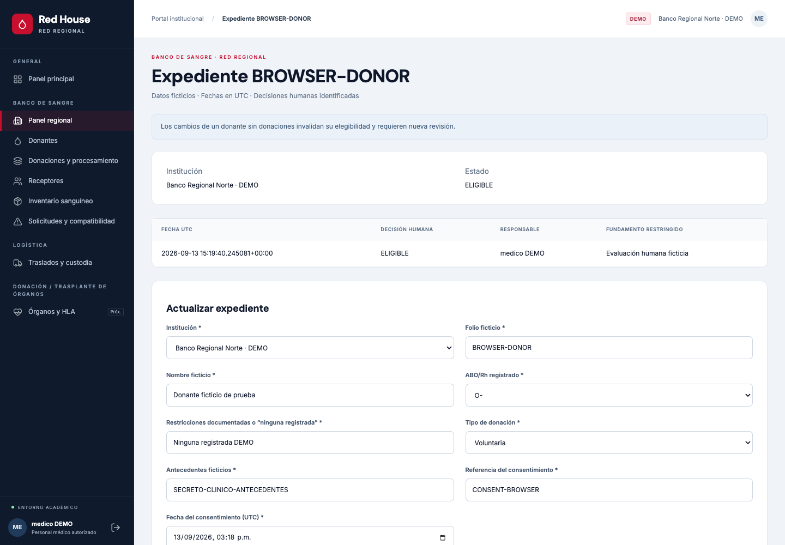

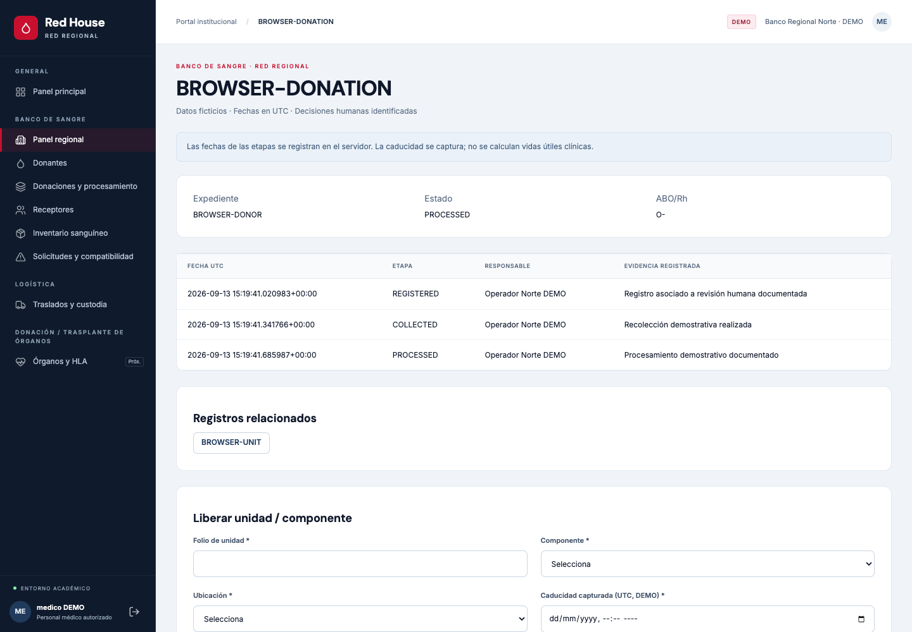

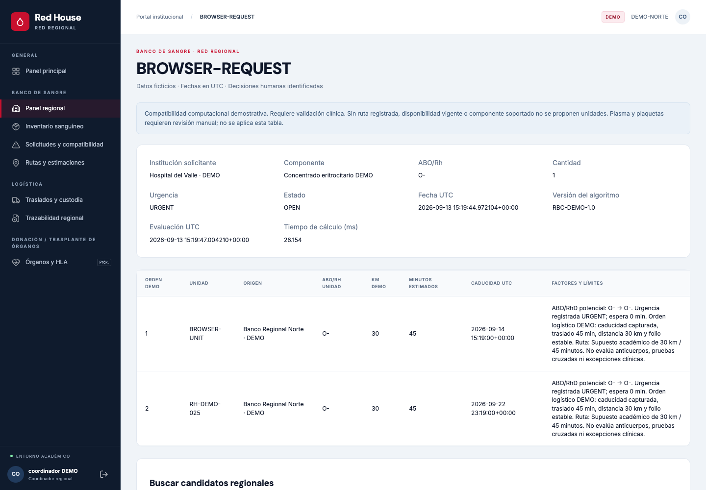

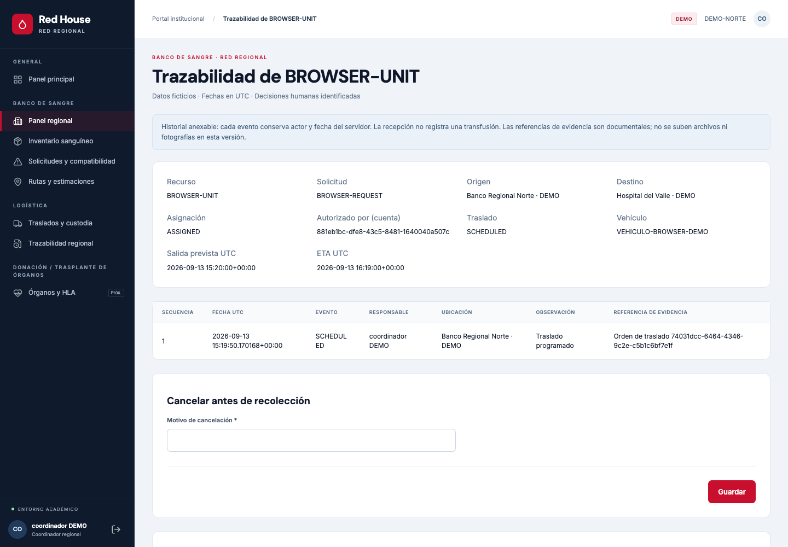

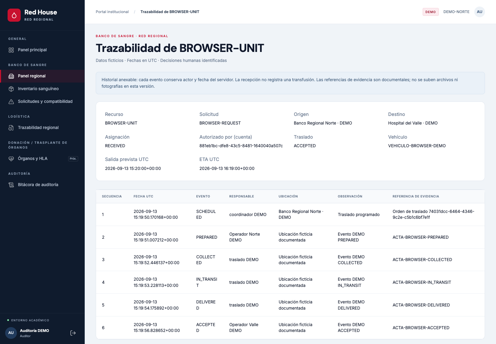

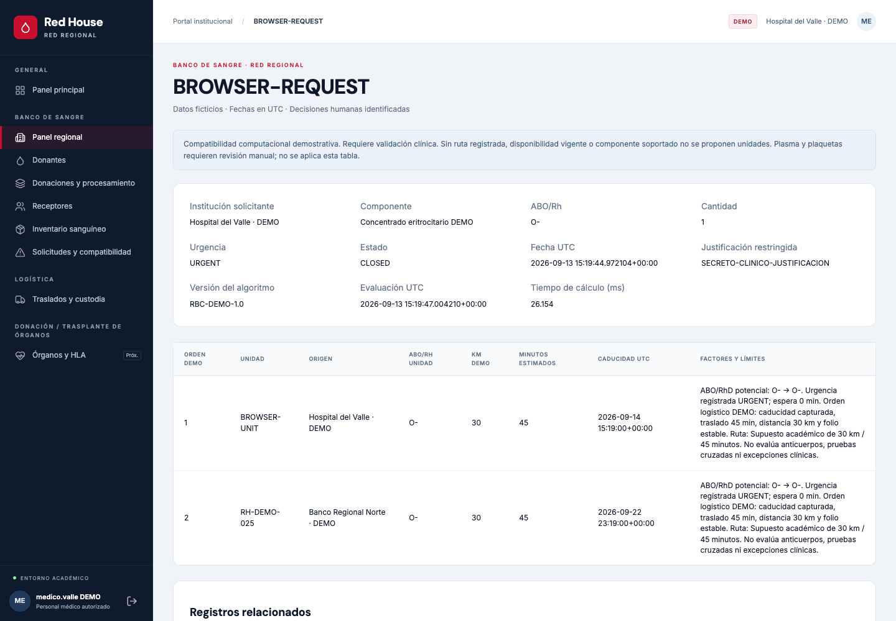

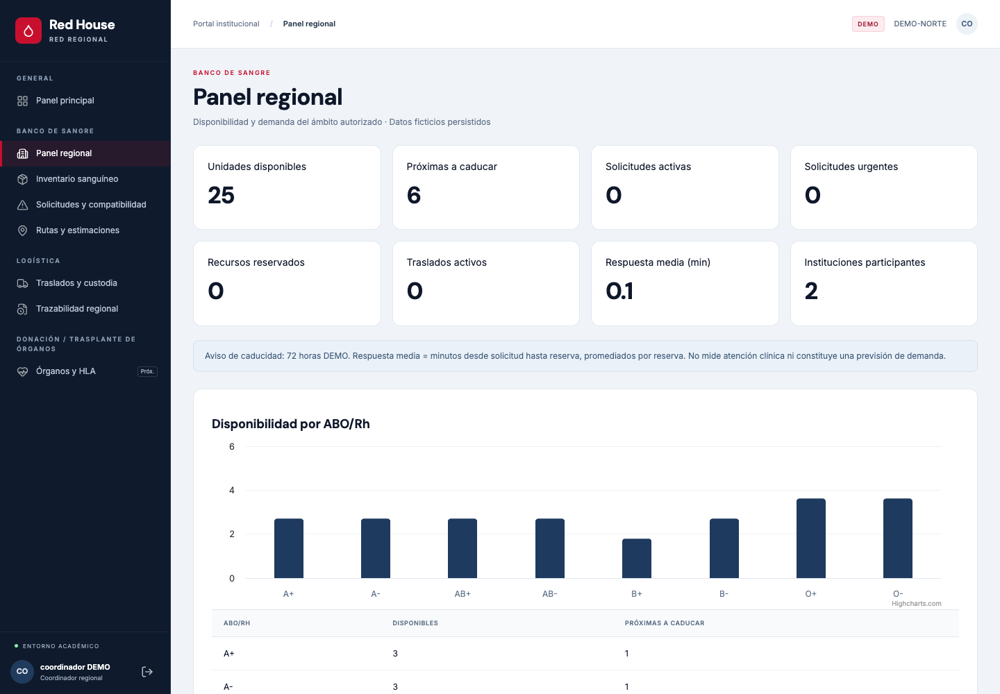

Las capturas describen una ejecución concreta, no mediciones de demanda real. Las versiones móviles y la bitácora completa se conservan junto a estas imágenes. Los informes históricos del primer parcial se mantienen en su directorio original y no sustituyen la evidencia del flujo nuevo.

## 33. Plan y resultados de pruebas

| Nivel | Escenarios | Condición de aprobación |
| --- | --- | --- |
| Unitario | Tabla de compatibilidad, validadores y permisos | Casos positivos y negativos coinciden con la especificación DEMO |
| Integración | Donación, solicitud, reserva, recepción y cierre PostgreSQL | Relaciones y estados persistidos sin operación parcial |
| Concurrencia | Dos solicitudes reservan la misma unidad | Una confirma y otra recibe conflicto |
| Privacidad | Perfil no clínico e institución ajena | Rechazo o respuesta minimizada, sin marcadores clínicos |
| Historial | Actualizar/borrar custodia o evaluación | Restricción PostgreSQL rechaza la mutación |
| Fallos | Auditoría interrumpida, ruta modificada, unidad vencida | Rollback o reevaluación; sin disponibilidad falsa |
| Migración | Esquema anterior, repetición y preservación | Datos previos conservados y versión aplicada una vez |
| Navegador | Flujo completo y pantallas a 1440/390 px | Formularios operativos, gráficos, sin errores ni desbordamiento de página |
| Regresión | Suite anterior del monolito e instalador | Funciones anteriores siguen aprobando |

La evidencia automatizada final y su duración exacta se incorporan en el bloque de resultados generado al construir el reporte. No se declaran pruebas de Windows de este incremento, Locust, volumen, GCP, Redis o MongoDB. La prueba histórica de Windows del primer parcial fue comunicada por el equipo y no forma parte de esta ejecución.

## 34. Riesgos

| Riesgo | Tratamiento y límite |
| --- | --- |
| Confundir DEMO con decisión clínica | Advertencia visible, ámbito restringido, referencia de fuente y autorización humana |
| Alcance mayor al incremento | Órganos/HLA y componentes distribuidos señalados como posteriores |
| Dos instituciones comprometen la misma unidad | Restricción única y bloqueo transaccional probado |
| Ruta o disponibilidad obsoletas | Versiones y revalidación antes de reserva |
| Migración rompe datos existentes | Copia previa, prueba separada y transacción versionada |
| Referencias documentales sin objeto verificable | Limitación explícita; almacenamiento privado posterior |
| Fuga por texto libre | Datos ficticios, permisos, no duplicación de campos clínicos en auditoría |
| Cancelación después de recolección | Incidencias conservadas; devolución/reasignación posterior necesita flujo especializado |
| Rendimiento regional no dimensionado | Consultas y límites visibles; carga masiva y pronósticos pendientes |
| Reporte y código divergen | Fuente editable, generación reproducible y resultados asociados a la versión revisada |

## 35. Plan de trabajo

| Orden | Entregable | Dependencia / cierre |
| --- | --- | --- |
| 1 | Confirmar alcance sanguíneo y límite de órganos | Alcance delimitado el 13 de septiembre |
| 2 | Migración y módulos de origen | Preservación de datos y trazabilidad de donación |
| 3 | Solicitudes, candidatos y reserva | Reglas DEMO documentadas y concurrencia comprobada |
| 4 | Traslado, custodia, recepción y panel | Recorrido regional completo desde el monolito |
| 5 | Regresión, navegador y actualización local | Evidencia nueva, instalación y migración comprobadas |
| 6 | Reporte Técnico del Primer Avance | Apartados, diagramas, capturas, resultados y límites incluidos |
| 7 | Retomar microservicios y clientes | Contratos JSON/XML, propiedad de datos y decisiones tecnológicas antes de extraer módulos |

La asignación nominal del plan semestral se mantiene como antecedente; la participación y revisión individual se documentan en la bitácora. El plazo docente de dos semanas debe vincularse con una fecha de inicio confirmada. Las tareas de microservicios no se declaran ejecutadas por haber modularizado el monolito.

## 36. Conclusiones

El incremento amplía la base administrativa hacia una demostración de coordinación entre instituciones. La unidad sanguínea puede relacionarse con su donación y con una solicitud regional; la reserva exige intervención humana y exclusividad transaccional; el traslado conserva custodia y recepción antes del cierre. El reporte integra el contenido necesario para evaluar ese avance y señala la cobertura pendiente.

La evidencia permite valorar una implementación académica concreta. No acredita operación sanitaria real, cumplimiento normativo, un motor HLA ni una arquitectura distribuida terminada. La siguiente etapa deberá estabilizar los contratos y propietarios antes de extraer microservicios, conservar los controles verificados y ampliar algoritmos, archivos, infraestructura y pruebas de volumen según el plan del semestre.

## 37. Referencias

1. Equipo 01. Documentos fuente del proyecto: Análisis del problema, Requerimientos funcionales y no funcionales, Historias de usuario, Reglas de negocio, Matriz de perfiles y permisos, Casos de uso, Matriz de trazabilidad, Diseño arquitectónico, Plan de trabajo, Sprint Backlog y Tecnologías. Repositorio Red House, documentación Markdown/Word, septiembre de 2026.
2. Equipo 01. Modelo 0FN–4FN y trazabilidad; esquema físico PostgreSQL y README de datos. Repositorio Red House. El modelo semestral y el subconjunto ejecutable se distinguen en el capítulo 25.
3. Material de la asignatura: arquitectura.txt, entregas.txt y proyecto.txt, consultados en el directorio superior el 13 de septiembre de 2026. Retroalimentación docente y delimitación de alcance del 13 de septiembre de 2026.
4. Australian Red Cross Lifeblood. (2026, abril). [Component compatibility](https://www.lifeblood.com.au/health-professionals/products/component-compatibility). Consultado el 13 de septiembre de 2026. Referencia del filtro de eritrocitos; no sustituye validación clínica local.
5. PostgreSQL Global Development Group. [Explicit locking](https://www.postgresql.org/docs/14/explicit-locking.html) y [Partial indexes](https://www.postgresql.org/docs/14/indexes-partial.html). Referencias técnicas de bloqueo y unicidad parcial.
6. Equipo 01. Evidencias históricas del primer parcial y evidencias nuevas de ampliación del monolito. Informes JUnit y capturas de navegador conservados con el código.

El reporte integral anterior y los documentos especializados se conservan como fuentes y antecedentes. La versión presente es la entrega consolidada de esta revisión; no requiere abrir esos archivos para comprender los capítulos principales.
